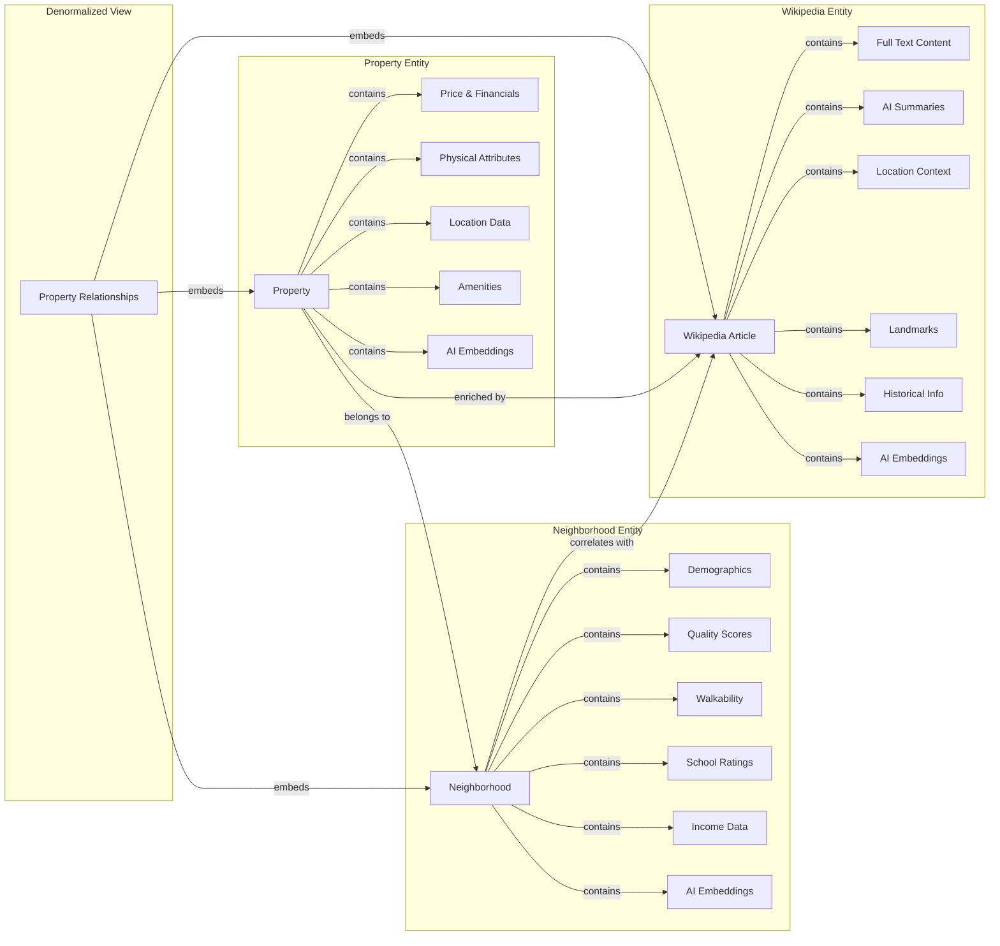
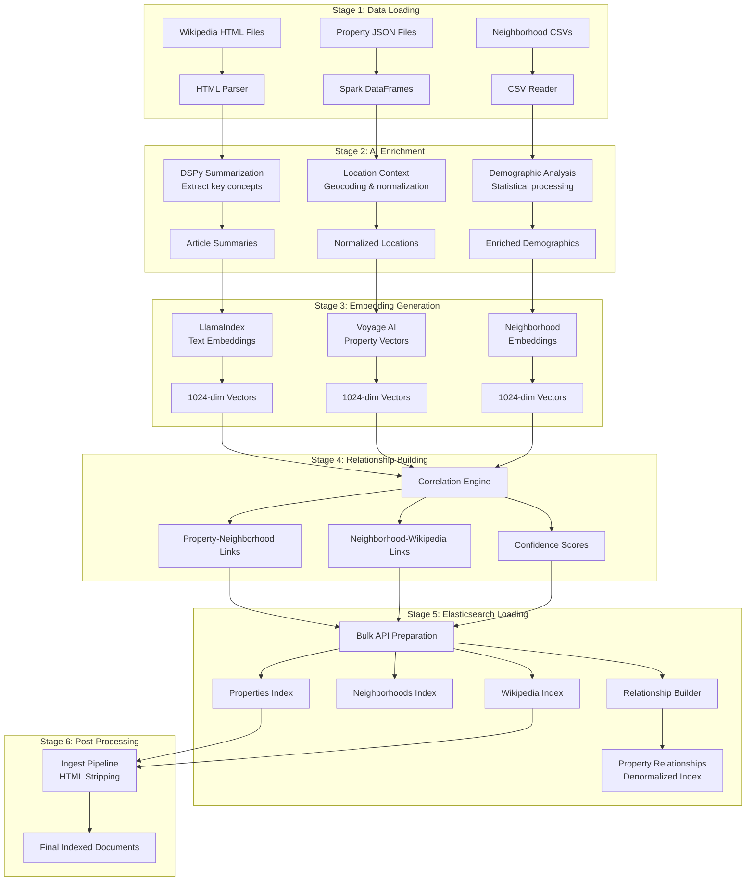

# Real Estate AI Search System: Elasticsearch Architecture Design Example

## Executive Summary

The Real Estate AI Search System showcases a sophisticated real estate search platform that seamlessly integrates generative AI throughout its architecture to deliver an intelligent, context-aware search experience. The system processes over 550 property listings, 450+ Wikipedia articles (totaling 100MB of text), and complex neighborhood demographics through an AI-enhanced pipeline that leverages multiple generative AI technologies.

At its core, the system employs DSPy for intelligent Wikipedia summarization, extracting key insights from encyclopedic content to provide rich contextual information about locations and landmarks. The data processing pipeline utilizes Apache Spark for distributed computation, while LlamaIndex and Voyage AI generate high-dimensional embeddings that enable semantic search capabilities. The architecture features sophisticated Elasticsearch integration with custom ingest pipelines for document processing, bulk loading APIs for efficient data ingestion, and advanced query patterns including KNN vector search for semantic similarity, multi-match queries for full-text search, geo-distance calculations for location-based filtering, and complex aggregations for market analytics.

The system demonstrates how generative AI transforms traditional search into an intelligent information retrieval platform. Query embeddings generated through LlamaIndex and Voyage AI enable natural language understanding, allowing users to express complex search intent in plain English. The semantic search layer understands concepts like "cozy family home near good schools" or "modern condo with city views," translating abstract requirements into precise search operations. This AI-powered approach delivers search results that align with user intent rather than just keyword matches, revolutionizing the real estate search experience.

## Architecture Overview

### System Philosophy and Design Principles

The architecture embodies a thoughtful separation of concerns across three primary domains: data ingestion, index management, and search operations. This tripartite structure reflects mature engineering practices where each component maintains clear boundaries while facilitating seamless data flow.

The system adopts a polyglot persistence strategy, utilizing Elasticsearch not merely as a search engine but as a primary data platform capable of handling diverse data types, from structured property listings to semi-structured neighborhood demographics and completely unstructured Wikipedia articles.

## Data Overview and Entity Relationships

### The Knowledge Graph Architecture

The system's data model represents a sophisticated knowledge graph that connects real estate properties with their surrounding context. This graph structure enables rich, multi-dimensional searches that mirror how people actually think about real estate decisions.

### Entity Data Characteristics

**Properties (550+ listings)** represent the core search entities, each containing structured data about real estate listings. Every property includes precise geographic coordinates, detailed physical characteristics, pricing information, and amenity lists. The AI enrichment layer adds semantic embeddings generated by LlamaIndex and Voyage AI, enabling similarity-based searches that understand conceptual relationships between properties.

**Neighborhoods (21 distinct areas)** provide socioeconomic and demographic context that influences property values and livability. Each neighborhood entity contains population statistics, median income levels, walkability scores, school ratings, and local amenities. The system uses DSPy to intelligently correlate neighborhoods with relevant Wikipedia articles, creating connections between geographic areas and their encyclopedic descriptions.

**Wikipedia Articles (450+ documents)** deliver encyclopedic knowledge about locations, landmarks, and cultural significance. These articles, averaging 222KB each, undergo AI-powered processing where DSPy extracts summaries and key concepts. The system identifies relationships between articles and properties based on geographic proximity, name matching, and semantic similarity computed through embedding vectors.

### Relationship Types and Correlation Strategies

The system implements multiple relationship types that connect entities in meaningful ways:

**Geographic Relationships** connect properties to neighborhoods based on physical location, with confidence scores based on boundary precision. The system calculates distances to landmarks mentioned in Wikipedia articles, enabling queries like "properties near Golden Gate Bridge" to return relevant results even when the landmark isn't explicitly mentioned in property descriptions.

**Semantic Relationships** leverage AI-generated embeddings to identify conceptually similar entities. Properties with similar characteristics cluster together in vector space, while Wikipedia articles about related topics show high cosine similarity. This enables the system to understand that a search for "historic Victorian homes" should also consider properties in neighborhoods with Victorian-era Wikipedia content.

**Confidence-Based Relationships** use probabilistic scoring to rank connection strength. Primary Wikipedia articles receive higher confidence scores than tangentially related content. The system maintains these scores throughout the search pipeline, influencing result ranking and relevance calculations.

## Index Design and Data Modeling

### Schema Architecture Philosophy

The index templates reveal a sophisticated understanding of Elasticsearch's capabilities. The system employs four distinct indices, each optimized for specific query patterns while maintaining referential integrity through carefully crafted ID relationships.

#### Properties Index: The Core Entity

The properties index serves as the system's backbone, featuring a deeply nested structure that captures the full complexity of real estate listings. The schema design demonstrates mastery of Elasticsearch field types, utilizing appropriate data types for each attribute to optimize both storage and query performance.

The address field exemplifies this sophistication, combining text fields for full-text search with keyword fields for exact matching and aggregations, plus geo_point types for spatial queries. This multi-faceted approach enables queries ranging from fuzzy address matching to precise geographic distance calculations.

The inclusion of enriched fields like location_context and neighborhood_context reveals forward-thinking design. These nested structures anticipate complex query requirements, pre-joining related data to eliminate the need for expensive runtime lookups.

#### Neighborhoods Index: Contextual Enrichment

The neighborhoods index represents more than geographic boundaries; it embodies socioeconomic context. The schema incorporates demographic data, quality scores, and Wikipedia correlations, transforming simple location data into rich contextual information.

The wikipedia_correlations field deserves special attention. This complex nested structure maintains relationships to multiple Wikipedia articles with confidence scores, enabling probabilistic matching and relevance ranking. The flat object structure for correlations, rather than nested documents, optimizes query performance while maintaining relationship integrity.

#### Wikipedia Index: Unstructured Content Management

The Wikipedia index showcases sophisticated handling of large text documents. The schema accommodates articles ranging from brief summaries to extensive encyclopedic entries, with intelligent field mappings that balance searchability with storage efficiency.

The dual representation of content through both full_content and summary fields enables tiered search strategies. Quick overview searches can utilize summaries while deep content searches leverage the full text, optimizing performance based on user intent.

#### Property Relationships Index: Denormalized Performance Optimization

The property_relationships index represents a strategic denormalization for performance optimization. By pre-joining frequently accessed relationships, the system eliminates the need for complex multi-index queries in common search scenarios.

This index embodies the principle of designing for query patterns rather than data purity. The deliberate data duplication trades storage space for dramatic query performance improvements, a worthwhile exchange in modern search systems.

### Field Type Strategy and Analyzer Configuration

The field type selection reveals deep understanding of Elasticsearch's text analysis pipeline. The system employs multiple analyzers tailored to specific content types:

Text fields utilize language-specific analyzers with stemming and stop word removal for natural language content. Property descriptions and Wikipedia content receive English analyzer treatment, enabling semantic search beyond exact matches.

Keyword fields with custom normalizers handle categorical data, ensuring case-insensitive matching while preserving the ability to perform exact aggregations. This dual approach satisfies both search and analytics requirements.

The strategic use of multi-fields allows single data elements to serve multiple query patterns. Street addresses, for instance, support both full-text search and exact matching through careful field configuration.

## Data Ingestion Pipeline Architecture

### Pipeline Orchestration and Data Flow

The data ingestion system demonstrates enterprise-grade ETL practices enhanced with generative AI at every stage. The pipeline orchestrates a complex flow of data transformations, AI enrichments, and relationship building that transforms raw data into an intelligent search corpus.

The ingestion pipeline leverages Apache Spark's distributed computing capabilities to process data at scale. Each stage operates independently, enabling parallel processing and fault tolerance. The AI enrichment stages utilize multiple models simultaneously, with DSPy extracting intelligent summaries from Wikipedia content while LlamaIndex and Voyage AI generate semantic embeddings for similarity search.

### Transformation Layer: From Raw Data to Search Documents

The transformation layer, implemented through specialized DataFrame transformers, represents a crucial abstraction. Each transformer encapsulates the logic for converting domain entities into search-optimized documents.

The BaseDataFrameTransformer establishes a consistent pattern that all entity transformers follow. This template method pattern ensures uniform handling of common concerns like validation, error handling, and metadata addition while allowing entity-specific customizations.

The PropertyDataFrameTransformer handles the complexity of nested structures, flattening and restructuring data for optimal search performance. The transformer intelligently handles missing data, provides sensible defaults, and ensures schema compliance.

The WikipediaDataFrameTransformer faces unique challenges in processing unstructured HTML content. The transformer must extract clean text, identify metadata, and structure the content for both full-text and semantic search. The implementation reveals sophisticated text processing capabilities.

### Embedding Generation: Semantic Search Enablement

The embedding generation system represents the convergence of traditional search with generative AI capabilities. The pipeline orchestrates multiple AI models to create rich semantic representations of every entity in the system.

**LlamaIndex Integration** powers the core text embedding pipeline, processing property descriptions, neighborhood narratives, and Wikipedia content through sophisticated language models. The system generates 1024-dimensional vectors that capture semantic meaning, enabling the search engine to understand that "cozy cottage" and "charming bungalow" represent similar concepts even without shared keywords. LlamaIndex's abstraction layer allows seamless switching between embedding models, from OpenAI's text-embedding-ada-002 to open-source alternatives like BERT or Sentence Transformers.

**Voyage AI Specialization** provides domain-optimized embeddings specifically tuned for real estate and geographic content. Voyage's models understand the nuances of property descriptions, recognizing that "waterfront" and "oceanview" represent related but distinct concepts. The system leverages Voyage's ability to generate embeddings that preserve geographic relationships, ensuring properties in similar locations cluster together in vector space.

**Distributed Generation at Scale** addresses the computational intensity of embedding generation. The system processes embeddings within Spark DataFrames, parallelizing vector generation across multiple nodes. This distributed approach transforms what could be a days-long sequential process into a matter of minutes, generating embeddings for thousands of documents simultaneously. The pipeline includes intelligent batching to optimize API calls to embedding services, balancing throughput with rate limits.

**Multi-Model Architecture** enables different entity types to use specialized embedding strategies. Properties might use Voyage AI for domain-specific understanding, while Wikipedia articles leverage LlamaIndex with models optimized for encyclopedic content. This flexibility ensures each data type receives optimal semantic representation.

### Bulk Indexing Strategy

The bulk indexing implementation demonstrates understanding of Elasticsearch's performance characteristics. Rather than indexing documents individually, the system batches operations, dramatically improving throughput while reducing cluster load.

The error handling around bulk operations reveals production readiness. Failed documents are tracked, logged, and can be retried, ensuring data completeness even in the face of transient failures.

## Wikipedia Integration and Relationship Enhancement

### Correlation Building: Connecting Disparate Data Sources

The Wikipedia correlation system represents sophisticated entity resolution and relationship mapping. The system doesn't simply store Wikipedia articles; it intelligently connects them to properties and neighborhoods based on geographic and semantic relationships.

The correlation builder employs multiple strategies for relationship identification. Geographic proximity provides the foundation, but the system also considers name matching, topic overlap, and semantic similarity. This multi-faceted approach yields high-quality relationships that enhance search relevance.

The confidence scoring mechanism reveals statistical sophistication. Rather than binary relationships, the system maintains probability scores that influence search ranking. This probabilistic approach handles the inherent uncertainty in automated relationship detection.

### Enrichment Pipeline: Adding Contextual Depth

The enrichment pipeline transforms sparse property data into rich, searchable documents. The system pulls relevant information from Wikipedia articles, adding historical context, cultural significance, and geographic relationships to property listings.

The landmark extraction system deserves particular attention. The pipeline identifies notable locations mentioned in Wikipedia articles and correlates them with properties, enabling searches like "homes near historic landmarks" or "properties in culturally significant neighborhoods."

The nearby points of interest (POI) system calculates walking times and distances, adding practical value to search results. This feature transforms abstract geographic relationships into actionable information for potential buyers.

### Content Processing: HTML to Searchable Text

The Wikipedia content processing pipeline handles the complexity of converting HTML encyclopedia articles into clean, searchable text. The system must strip formatting, remove navigation elements, and extract meaningful content while preserving structure.

The ingest pipeline configuration reveals sophisticated use of Elasticsearch's processing capabilities. Script processors calculate derived fields, while specialized processors handle HTML cleanup and text extraction. This processing occurs at index time, ensuring consistent data quality.

## Search Query Implementation Patterns

### Query Architecture: From Simple to Complex

The demo queries reveal a progression from basic search patterns to sophisticated multi-index operations. This pedagogical approach demonstrates various Elasticsearch capabilities while providing practical implementation examples.

The query builders encapsulate Elasticsearch DSL complexity behind clean interfaces. This abstraction layer enables query reuse, testing, and modification without affecting calling code. The builder pattern implementation shows mature software engineering practices.

### Basic Search Patterns

The property search implementations demonstrate fundamental Elasticsearch patterns. Multi-match queries search across multiple fields with customized boosting, balancing recall and precision. The field boosting strategy reveals understanding of information retrieval theory.

Filtered searches showcase bool query composition, combining must, should, and filter clauses for precise result control. The distinction between scoring and filtering clauses shows optimization awareness, as filters cache efficiently.

### Geographic Search Capabilities

The geo-distance queries demonstrate spatial search sophistication. The system supports multiple distance units and calculation methods, adapting to different use cases and accuracy requirements.

The geographic aggregations enable market analysis capabilities. Bucketing properties by distance rings or geographic grids provides valuable insights for market research and investment analysis.

### Semantic Search Implementation

The semantic search system showcases the transformative power of generative AI in modern information retrieval. By combining vector embeddings with traditional search techniques, the system creates a hybrid search experience that understands user intent at a conceptual level.

**Query Understanding Through AI** begins when users express their needs in natural language. The system processes queries like "family-friendly home with good schools and parks nearby" through the same LlamaIndex and Voyage AI models used during indexing. This ensures query vectors exist in the same semantic space as document vectors, enabling accurate similarity calculations. The AI understands that "family-friendly" implies certain amenities like multiple bedrooms, safe neighborhoods, and proximity to schools, even when these terms aren't explicitly mentioned.

**KNN Vector Search** leverages Elasticsearch's k-nearest neighbor capabilities to find semantically similar properties. The system searches through hundreds of thousands of 1024-dimensional vectors in milliseconds, identifying properties that match the conceptual intent rather than just keywords. The HNSW (Hierarchical Navigable Small World) algorithm provides approximate nearest neighbor search with configurable precision-recall trade-offs. The system dynamically adjusts k (number of neighbors) and num_candidates (search space) based on query complexity and desired result diversity.

**Hybrid Scoring Strategy** combines vector similarity with traditional relevance signals. The system uses a sophisticated scoring function that weighs semantic similarity (from vector search), textual relevance (from BM25 scoring), geographic proximity (from geo-distance calculations), and feature matching (from structured field queries). This multi-signal approach ensures results that are both semantically relevant and practically suitable.

**Natural Language Processing Pipeline** transforms user queries into structured Elasticsearch operations. When a user searches for "modern downtown loft under 500k," the system extracts entities (downtown), attributes (modern, loft), and constraints (price < 500000). DSPy models help disambiguate terms, understanding that "loft" implies certain architectural features while "downtown" suggests urban amenities. The parsed intent translates into a bool query combining must clauses for hard constraints with should clauses for preferences.

### Multi-Index Relationship Queries

The relationship queries showcase Elasticsearch's ability to maintain referential integrity without true joins. The multi-step query pattern efficiently traverses relationships while maintaining performance.

The msearch API usage demonstrates batch query optimization. Rather than sequential queries, the system executes multiple searches in parallel, reducing latency and improving user experience.

The relationship builder pattern creates denormalized views for common query patterns. This strategic denormalization trades storage for query performance, a sensible optimization for read-heavy workloads.

### Aggregation and Analytics

The aggregation queries transform Elasticsearch into an analytics engine. The system computes statistics, distributions, and trends in real-time, providing market insights alongside search results.

The nested aggregations reveal sophisticated analytics capabilities. Calculating average prices by neighborhood while simultaneously computing bedroom count distributions showcases multi-dimensional analysis.

The pipeline aggregations demonstrate advanced analytics patterns. Computing derived metrics like price-per-square-foot percentiles provides normalized comparisons across diverse property types.

## Performance Optimization Strategies

### Index-Time Optimizations

The system employs numerous index-time optimizations that improve query performance. Pre-calculated fields like price_per_sqft eliminate runtime computations. Denormalized relationships reduce query complexity.

The careful selection of doc_values and index settings for each field reveals deep performance understanding. Fields used only for retrieval disable indexing, while aggregation fields optimize doc_value storage.

### Query-Time Optimizations

The query implementations demonstrate various performance optimizations. Source filtering reduces network overhead by returning only required fields. Query caching improves response times for repeated searches.

The use of filter context for non-scoring clauses leverages Elasticsearch's filter cache. This distinction between scoring and filtering contexts shows sophisticated understanding of Elasticsearch's execution model.

### Distributed Processing

The Spark-based ingestion pipeline enables distributed data processing at scale. The system can process hundreds of thousands of documents in parallel, crucial for production deployments.

The batching strategies throughout the system reveal understanding of distributed system economics. Whether in Spark transformations or Elasticsearch bulk operations, batching amortizes overhead costs.

## Semantic Search and AI Integration

### Embedding Architecture

The embedding system demonstrates sophisticated AI integration. Support for multiple providers (Voyage, OpenAI, Gemini, Ollama) prevents vendor lock-in while enabling experimentation with different models.

The embedding generation at both index and query time enables semantic search. Documents receive embeddings during ingestion, while queries generate embeddings dynamically, enabling natural language search.

### Vector Search Implementation

The vector search implementation reveals understanding of approximate nearest neighbor trade-offs. The HNSW algorithm configuration balances index size, indexing speed, and query performance.

The hybrid search approach combines vector similarity with traditional scoring, leveraging both semantic understanding and keyword relevance. This dual approach provides superior results compared to either method alone.

### Query Understanding

The natural language processing in query understanding shows practical AI application. The system interprets user intent, expanding queries with synonyms and related concepts for improved recall.

The confidence scoring in semantic matches enables result ranking that reflects semantic similarity. This probabilistic ranking provides more nuanced results than binary matching.

## Production Readiness Aspects

### Error Handling and Resilience

The comprehensive error handling throughout the system reveals production maturity. Every component includes try-catch blocks, logging, and graceful degradation strategies.

The retry logic for transient failures shows operational awareness. Whether in embedding generation or Elasticsearch indexing, the system handles temporary failures without data loss.

### Monitoring and Observability

The extensive logging throughout the system enables operational monitoring. Structured logging with appropriate levels facilitates debugging while avoiding log noise.

The progress tracking in batch operations provides operational visibility. Operators can monitor ingestion progress, identify bottlenecks, and estimate completion times.

### Configuration Management

The hierarchical configuration system demonstrates operational maturity. Environment variables override configuration files, enabling deployment-specific customization without code changes.

The configuration validation ensures system integrity. Invalid configurations fail fast with clear error messages, preventing subtle runtime failures.

### Testing Strategy

The separation of concerns enables comprehensive testing. Unit tests validate individual components, integration tests verify component interactions, and end-to-end tests ensure system functionality.

The demo queries serve dual purposes as both examples and integration tests. This approach ensures documentation accuracy while providing regression testing.

## Architectural Strengths

### Scalability by Design

The system architecture supports horizontal scaling at every layer. The Spark-based processing scales with cluster resources. Elasticsearch scales through sharding and replication. The stateless search API scales through simple replication.

### Extensibility Through Abstraction

The abstraction layers throughout the system enable easy extension. New entity types can be added by implementing transformer interfaces. New search patterns extend base query builders. New embedding providers integrate through common interfaces.

### Maintainability Through Separation

The clear separation of concerns enhances maintainability. Data ingestion, index management, and search operations remain independent, enabling teams to work on different aspects without conflicts.

## Innovation Highlights

### Wikipedia Integration Innovation

The automatic correlation of Wikipedia content with real estate data represents genuine innovation. This enrichment adds cultural and historical context that traditional real estate systems lack.

### Hybrid Search Excellence

The combination of keyword, geographic, and semantic search in a unified system showcases search innovation. Users benefit from multiple retrieval methods without understanding the underlying complexity.

### Relationship Modeling Creativity

The implementation of graph-like relationships within Elasticsearch's document model shows creative problem-solving. The system achieves join-like functionality while maintaining Elasticsearch's performance characteristics.

## Technical Excellence Observations

### Deep Elasticsearch Knowledge

The implementation reveals thorough understanding of Elasticsearch internals. From analyzer configuration to aggregation pipelines, every aspect demonstrates expertise beyond surface-level usage.

### Distributed Systems Expertise

The Spark integration and distributed processing patterns show understanding of distributed systems principles. The system handles data at scale while maintaining consistency and performance.

### Software Engineering Maturity

The code organization, design patterns, and abstraction levels reveal mature software engineering practices. The system balances flexibility with simplicity, creating maintainable and extensible code.

## Conclusion: The Future of AI-Powered Search

This Real Estate AI Search System represents a paradigm shift in how search applications leverage generative AI to deliver intelligent, context-aware experiences. The architecture demonstrates that modern search systems must go beyond keyword matching to understand semantic meaning, conceptual relationships, and user intent.

The system's innovative use of generative AI throughout the pipeline—from DSPy-powered summarization to LlamaIndex and Voyage AI embeddings—showcases how AI transforms every aspect of search. The data ingestion pipeline uses AI to extract meaning from unstructured content, the indexing process generates semantic representations that capture conceptual understanding, and the search interface interprets natural language queries through the same AI models, ensuring consistency between indexing and retrieval.

The hybrid architecture combining traditional Elasticsearch capabilities with cutting-edge AI demonstrates the power of augmentation rather than replacement. Full-text search provides precision for exact matches, vector search enables conceptual discovery, geographic queries handle spatial requirements, and aggregations deliver analytical insights. The AI layer enhances each of these capabilities rather than replacing them, creating a search experience that exceeds the sum of its parts.

The production-ready implementation proves that AI-powered search can scale to real-world requirements. The distributed processing through Apache Spark handles embedding generation at scale, the bulk loading APIs efficiently ingest AI-enriched documents, the caching strategies optimize repeated AI operations, and the configurable architecture supports multiple AI providers without vendor lock-in.

Most significantly, this system demonstrates that AI-powered search is not just about technology but about understanding user needs. When someone searches for a home, they're not just looking for a structure with specific attributes—they're searching for a lifestyle, a community, a future. The AI understands these deeper needs, connecting properties with neighborhoods, neighborhoods with cultural context, and cultural context with human aspirations.

This implementation stands as a blueprint for the next generation of search applications, where generative AI and traditional search technologies converge to create intelligent information retrieval systems. The architecture proves that with thoughtful design, modern AI capabilities can be integrated into production search systems that are scalable, maintainable, and genuinely transformative for user experience.