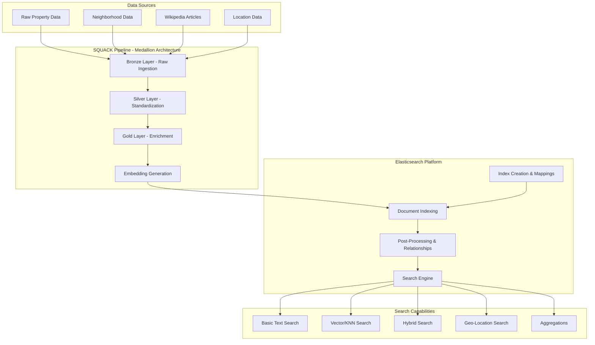

# Elasticsearch Generative AI RAG Pipeline Overview

This document provides a comprehensive overview of building a complete Elasticsearch platform for Generative AI RAG (Retrieval-Augmented Generation) pipelines, using the real estate search system as a practical implementation.

## Elasticsearch Highlights

### Real Estate RAG System Demonstration
**Purpose**: Elasticsearch-based RAG real estate and Wikipedia search demonstrating Vector Search, Full Text Search, and Hybrid Search capabilities

**Key Features**:
- **Vector Search**: 1024-dimensional embeddings with k-NN search for semantic similarity
- **Full Text Search**: BM25-based text search with multi-field queries and relevance scoring  
- **Hybrid Search**: Combines vector similarity with text relevance using Reciprocal Rank Fusion (RRF) for optimal results
- **Data Ingestion & Processing**: Scalable medallion architecture pipeline for indexing properties, neighborhoods, and Wikipedia content
- **Geographic Search**: Intelligent radius search with coordinate-based ranking and polygon boundaries
- **Faceted Search**: AI-driven faceted search with dynamic filtering and aggregations

## High-Level Architecture

## Elasticsearch Rebuild Flow

The `es-manager.sh rebuild` command orchestrates a complete reconstruction of the Elasticsearch environment through these steps:

### 1. Environment Preparation
Activates the Python virtual environment and loads API keys from the .env file to ensure all dependencies and credentials are available.

### 2. Index Cleanup
Removes all existing Elasticsearch indices to ensure a clean slate. This prevents data conflicts and ensures consistency in the new build.

### 3. Index Creation with Mappings
Creates fresh indices with properly configured field mappings. Defines data types, analyzers, and special fields like dense vectors for embeddings and geo-points for location searches.

### 4. Data Pipeline Execution (SQUACK)
Runs the medallion architecture pipeline that processes raw data through Bronze (ingestion), Silver (standardization), and Gold (enrichment) layers. Each layer progressively refines and enhances the data quality.

### 5. Embedding Generation
Creates vector embeddings for semantic search capabilities. Processes text through embedding models (Voyage, OpenAI, or Gemini) to generate high-dimensional vectors that capture semantic meaning.

### 6. Document Indexing
Bulk loads processed documents with their embeddings into Elasticsearch. Utilizes efficient batch processing to optimize indexing performance.

### 7. Wikipedia Enrichment
Enhances Wikipedia articles with additional metadata and cross-references. Links articles to relevant properties and neighborhoods for contextual search.

### 8. Relationship Building
Constructs denormalized indices that pre-compute relationships between entities. Creates property-to-property and property-to-neighborhood connections for faster query-time joins.

### 9. Statistics Verification
Validates the rebuild by checking document counts, index health, and mapping integrity. Ensures all data has been properly indexed and is searchable.

## SQUACK Pipeline - Data Processing

The SQUACK pipeline implements a medallion architecture pattern for reliable data processing:

### Bronze Layer - Raw Data Ingestion
Loads raw JSON data from source files without transformation. Preserves original data structure for traceability and debugging. Handles multiple entity types including properties, neighborhoods, and Wikipedia articles.

### Silver Layer - Data Standardization
Applies consistent formatting and data type conversions. Cleans and validates data according to business rules. Standardizes field names and removes duplicates. Ensures data quality through validation checks.

### Gold Layer - Business Logic & Enrichment
Calculates derived metrics like price per square foot. Adds geospatial computations for distance-based features. Enriches properties with neighborhood statistics. Creates aggregated views for analytical queries.

### Embedding Pipeline
Batches text data for efficient API calls. Generates dense vector representations using configured embedding models. Handles rate limiting and retries for external API calls. Stores embeddings alongside original documents for hybrid search.

## Elasticsearch Write Operations

### Document Structure
Each document contains original fields, computed metrics, embeddings, and metadata. Properties include structured data (price, bedrooms) and unstructured text (descriptions). Neighborhoods contain demographic statistics and boundary polygons. Wikipedia articles are chunked with overlap for context preservation.

### Bulk Indexing Strategy
Documents are batched in configurable sizes for optimal throughput. Failed documents are tracked and retried with exponential backoff. Progress monitoring ensures visibility into long-running operations. Memory-efficient streaming prevents out-of-memory errors on large datasets.

### Index Settings Optimization
Refresh intervals are temporarily disabled during bulk loads for speed. Replica counts are set to zero during indexing and restored afterward. Segment merging is optimized for write-heavy operations. Field data circuit breakers prevent memory exhaustion.

## Post-Processing Operations

### Relationship Denormalization
Pre-computes expensive joins to improve query performance. Creates dedicated indices for property relationships and neighborhood associations. Maintains bidirectional references for graph-like traversals. Updates relationships incrementally as new data arrives.

### Wikipedia Article Enhancement
Splits long articles into searchable chunks with configurable overlap. Maintains parent-child relationships between chunks and full articles. Adds location extraction for geo-aware Wikipedia searches. Creates summary indices for high-level content browsing.

### Aggregation Pre-computation
Calculates neighborhood statistics like average prices and property counts. Builds faceted search metadata for filtering options. Creates time-series indices for historical analysis. Generates heat map data for geographic visualizations.

## Query Capabilities Overview

Based on the demo queries in `real_estate_search/demo_queries/`, the system supports diverse search patterns:

### Basic Text Search (BM25)
Traditional keyword matching using Elasticsearch's BM25 algorithm. Searches across multiple text fields with field boosting. Supports phrase matching, wildcards, and fuzzy search. Analyzes text with language-specific tokenizers and stemmers.

### Vector/KNN Search (Semantic)
Pure semantic search using dense vector similarities. Converts natural language queries to embeddings on-the-fly. Finds semantically similar properties regardless of exact keyword matches. Understands context like "cozy family home" or "modern urban living".

### Hybrid Search (RRF)
Combines BM25 text relevance with vector semantic understanding. Uses Reciprocal Rank Fusion to merge result sets optimally. Balances keyword precision with semantic recall. Configurable weights for text vs vector contributions.

### Geo-Location Search
Distance-based queries from specific points or addresses. Bounding box searches for properties within geographic regions. Polygon searches for complex geographic boundaries. Combines location filters with text and vector searches.

### Multi-Index Federation
Searches across properties, neighborhoods, and Wikipedia simultaneously. Joins data from multiple indices at query time. Maintains consistent scoring across heterogeneous data types. Supports cross-index aggregations and faceting.

### Natural Language Understanding
Interprets queries like "homes near good schools under 500k". Extracts intent, filters, and preferences from unstructured text. Maps natural language to structured Elasticsearch queries. Handles complex multi-constraint searches elegantly.

### Aggregation Analytics
Price distribution histograms and statistics by neighborhood. Property type breakdowns with average metrics. Time-based trending for market analysis. Geographic clustering for hot spot identification.

### Relationship Traversal
Finds similar properties based on pre-computed relationships. Discovers properties in the same neighborhood cluster. Navigates property networks for recommendation systems. Supports multi-hop traversals for complex queries.

## Performance Optimizations

### Query-Time Optimizations
Query result caching for frequently accessed searches. Field filtering to reduce network payload. Source filtering to return only required fields. Scroll API for large result set pagination.

### Index-Time Optimizations
Custom analyzers for domain-specific text processing. Denormalized data structures to avoid join operations. Strategic field indexing based on query patterns. Compressed embeddings to reduce storage requirements.

### Infrastructure Considerations
Appropriate shard sizing for cluster balance. Read replicas for search throughput scaling. Dedicated master nodes for cluster stability. SSD storage for optimal I/O performance.

### Core Elasticsearch Capabilities Demonstrated

**Search Technologies**:
- **Dense Vector Similarity**: Leverages Elasticsearch's native k-NN search for semantic understanding
- **BM25 Relevance Scoring**: Traditional text search with field boosting and custom analyzers
- **Reciprocal Rank Fusion**: Native RRF support for combining multiple search strategies
- **Multi-Index Search**: Federated search across heterogeneous data sources
- **Geo-spatial Queries**: Distance calculations, bounding boxes, and polygon searches

**Data Management**:
- **Bulk Indexing**: Efficient batch processing with retry logic and error handling
- **Index Templates**: Reusable mappings for consistent data structures
- **Dynamic Mappings**: Automatic field detection with type inference
- **Nested Objects**: Complex data structures for hierarchical relationships
- **Denormalization**: Pre-computed joins for performance optimization

**Performance Features**:
- **Query Caching**: Result caching for frequently accessed searches
- **Field Data Optimization**: Memory-efficient loading of aggregation data
- **Segment Management**: Optimized merge policies for write-heavy workloads
- **Shard Distribution**: Balanced data distribution across cluster nodes
- **Source Filtering**: Network bandwidth optimization through selective field retrieval

**Advanced Analytics**:
- **Aggregation Framework**: Multi-level aggregations for statistical analysis
- **Histogram Facets**: Price distribution and temporal analysis
- **Terms Aggregations**: Category breakdowns and top-N queries
- **Geographic Aggregations**: Heat maps and cluster analysis
- **Pipeline Aggregations**: Derived metrics and moving averages

## Summary

This Elasticsearch RAG pipeline demonstrates a production-ready approach to building semantic search systems. The medallion architecture ensures data quality through progressive refinement. The hybrid search capabilities combine the best of keyword and semantic search. The comprehensive post-processing creates a rich, interconnected knowledge graph. The result is a powerful platform for AI-augmented information retrieval that can understand natural language, respect geographic constraints, and provide relevant results across multiple data sources.

The system showcases how modern Elasticsearch can serve as the foundation for sophisticated RAG applications, providing the retrieval layer that feeds context to large language models for accurate, grounded responses.