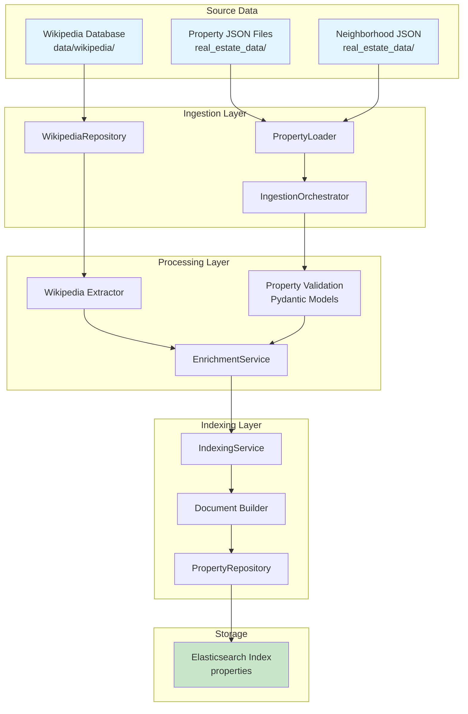
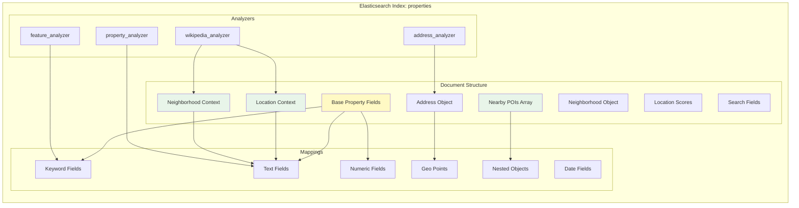
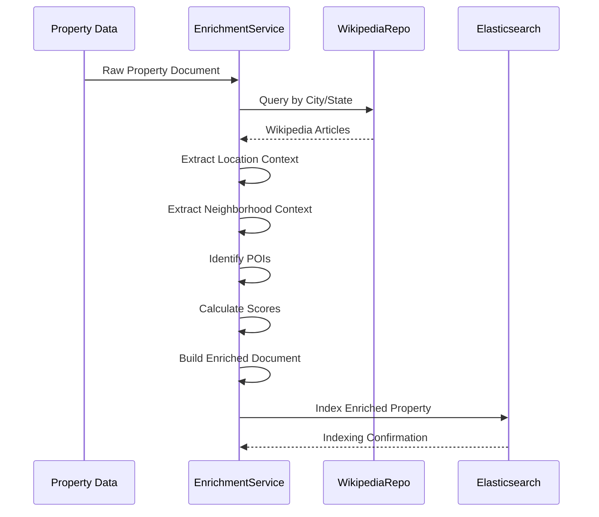
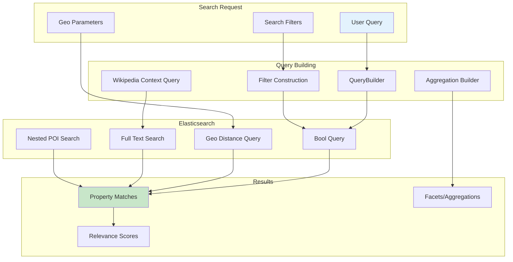

# Elasticsearch Data Model Documentation

## Overview

The Real Estate Search system implements a sophisticated Elasticsearch-based search infrastructure that combines property listings with enriched Wikipedia contextual data. The system ingests raw property data from JSON files and Wikipedia articles from a SQLite database, enriches them through a multi-stage pipeline, and indexes them into Elasticsearch for advanced search capabilities.

### Key Components

1. **Data Sources**: 
   - Property data (JSON files in `real_estate_data/`)
   - Wikipedia articles (SQLite database in `data/wikipedia/wikipedia.db`)
   
2. **Data Processing Pipeline**:
   - Property ingestion and validation
   - Wikipedia enrichment service
   - Elasticsearch indexing with custom analyzers
   
3. **Search Capabilities**:
   - Full-text search with custom analyzers
   - Geographic search with geo-points
   - Faceted search with aggregations
   - Wikipedia-enriched contextual search

## Schema Overview

The Elasticsearch index schema consists of three main sections:

1. **Base Property Fields**: Core real estate listing data
2. **Wikipedia Enhancement Fields**: Contextual data from Wikipedia
3. **Search Optimization Fields**: Computed fields for improved search

### Index Settings

```json
{
  "number_of_shards": 1,
  "number_of_replicas": 0,
  "refresh_interval": "1s",
  "analysis": {
    "analyzer": {
      "property_analyzer": "custom analyzer for descriptions",
      "address_analyzer": "custom analyzer for addresses", 
      "feature_analyzer": "keyword analyzer for features",
      "wikipedia_analyzer": "custom analyzer for Wikipedia content"
    }
  }
}
```

## Complete Schema Elements

### Base Property Fields

| Field Name | Type | Description | Source Field |
|------------|------|-------------|--------------|
| **listing_id** | keyword | Unique property identifier | `properties_*.json: listing_id` |
| **property_type** | keyword | Type of property (house, condo, etc.) | `property_details.property_type` |
| **price** | float | Listing price | `listing_price` |
| **bedrooms** | short | Number of bedrooms | `property_details.bedrooms` |
| **bathrooms** | half_float | Number of bathrooms | `property_details.bathrooms` |
| **square_feet** | integer | Property size in sq ft | `property_details.square_feet` |
| **year_built** | short | Year property was built | `property_details.year_built` |
| **lot_size** | integer | Lot size | `property_details.lot_size` |
| **description** | text | Property description | `description` |
| **features** | keyword[] | Property features list | `features[]` |
| **amenities** | keyword[] | Property amenities | Generated from features |
| **status** | keyword | Listing status (active, pending, sold) | Computed (default: active) |
| **listing_date** | date | Date property was listed | `listing_date` |
| **last_updated** | date | Last update timestamp | Generated |
| **days_on_market** | integer | Days since listing | Computed from listing_date |
| **price_per_sqft** | float | Price per square foot | `price_per_sqft` or computed |
| **hoa_fee** | float | HOA fees | Extracted from description |
| **virtual_tour_url** | keyword | Virtual tour link | `virtual_tour_url` |
| **images** | keyword[] | Image URLs | `images[]` |
| **mls_number** | keyword | MLS listing number | Generated |
| **tax_assessed_value** | long | Tax assessment value | Computed estimate |
| **annual_tax** | float | Annual property tax | Computed estimate |
| **search_tags** | text | Combined searchable text | Generated from all text fields |

### Address Object

| Field Name | Type | Description | Source Field |
|------------|------|-------------|--------------|
| **address.street** | text/keyword | Street address | `address.street` |
| **address.city** | keyword | City name | `address.city` |
| **address.state** | keyword | State code | `address.state` |
| **address.zip_code** | keyword | ZIP code | `address.zip` |
| **address.location** | geo_point | Lat/lon coordinates | `coordinates.latitude/longitude` |

### Neighborhood Object

| Field Name | Type | Description | Source Field |
|------------|------|-------------|--------------|
| **neighborhood.id** | keyword | Neighborhood identifier | `neighborhood_id` |
| **neighborhood.name** | text/keyword | Neighborhood name | From neighborhoods_*.json |
| **neighborhood.walkability_score** | byte | Walk score (0-100) | Generated/enriched |
| **neighborhood.school_rating** | half_float | School rating (0-10) | Generated/enriched |

### Parking Object

| Field Name | Type | Description | Source Field |
|------------|------|-------------|--------------|
| **parking.spaces** | byte | Number of parking spaces | `property_details.garage_spaces` |
| **parking.type** | keyword | Parking type (garage, street, etc.) | Extracted from features |

### Wikipedia Enhancement Fields

#### Location Context Object

| Field Name | Type | Description | Source |
|------------|------|-------------|---------|
| **location_context.wikipedia_page_id** | keyword | Wikipedia page ID | `page_summaries.page_id` |
| **location_context.wikipedia_title** | text/keyword | Article title | `page_summaries.title` |
| **location_context.location_summary** | text | Location description | `page_summaries.short_summary` |
| **location_context.historical_significance** | text | Historical info | Extracted from summary |
| **location_context.key_topics** | keyword[] | Key topics/tags | `page_summaries.key_topics` |
| **location_context.landmarks** | nested | Nearby landmarks | Extracted from articles |
| **location_context.cultural_features** | keyword[] | Cultural features | Extracted from content |
| **location_context.recreational_features** | keyword[] | Recreation options | Extracted from content |
| **location_context.transportation** | keyword[] | Transit options | Extracted from content |
| **location_context.location_type** | keyword | Type of location | `locations.location_type` |
| **location_context.confidence_score** | float | Data confidence | `page_summaries.overall_confidence` |

#### Neighborhood Context Object

| Field Name | Type | Description | Source |
|------------|------|-------------|---------|
| **neighborhood_context.wikipedia_page_id** | keyword | Wikipedia page ID | `page_summaries.page_id` |
| **neighborhood_context.wikipedia_title** | text/keyword | Article title | `page_summaries.title` |
| **neighborhood_context.description** | text | Neighborhood description | `page_summaries.long_summary` |
| **neighborhood_context.history** | text | Historical background | Extracted from content |
| **neighborhood_context.character** | text | Neighborhood character | Extracted from content |
| **neighborhood_context.notable_residents** | keyword[] | Famous residents | Extracted from content |
| **neighborhood_context.architectural_style** | keyword[] | Architecture styles | Extracted from content |
| **neighborhood_context.establishment_year** | integer | Year established | Extracted from content |
| **neighborhood_context.gentrification_index** | float | Gentrification score | Computed |
| **neighborhood_context.diversity_score** | float | Diversity metric | Computed |
| **neighborhood_context.key_topics** | keyword[] | Key topics | `page_summaries.key_topics` |

#### Nearby Points of Interest (Nested)

| Field Name | Type | Description | Source |
|------------|------|-------------|---------|
| **nearby_poi.name** | text/keyword | POI name | Extracted from Wikipedia |
| **nearby_poi.wikipedia_page_id** | keyword | Wikipedia page ID | `articles.pageid` |
| **nearby_poi.category** | keyword | POI category | Classified from content |
| **nearby_poi.distance_miles** | float | Distance from property | Computed |
| **nearby_poi.walking_time_minutes** | integer | Walking time | Computed |
| **nearby_poi.significance_score** | float | Importance score | Computed |
| **nearby_poi.description** | text | POI description | From Wikipedia summary |
| **nearby_poi.key_topics** | keyword[] | Related topics | `page_summaries.key_topics` |

#### Location Scores Object

| Field Name | Type | Description | Computation |
|------------|------|-------------|-------------|
| **location_scores.cultural_richness** | float | Cultural score (0-1) | Based on cultural POIs |
| **location_scores.historical_importance** | float | Historical score (0-1) | Based on historical content |
| **location_scores.tourist_appeal** | float | Tourism score (0-1) | Based on tourist attractions |
| **location_scores.local_amenities** | float | Amenities score (0-1) | Based on nearby services |
| **location_scores.overall_desirability** | float | Overall score (0-1) | Weighted average |

### Search Optimization Fields

| Field Name | Type | Description | Purpose |
|------------|------|-------------|----------|
| **enriched_search_text** | text | Combined Wikipedia content | Enhanced full-text search |

## Source Data Mapping

### Property Data Source (`real_estate_data/properties_*.json`)

The system ingests property data from JSON files with the following structure:

```json
{
  "listing_id": "prop-oak-125",
  "neighborhood_id": "oak-temescal-006",
  "address": {
    "street": "2986 Telegraph Court",
    "city": "Oakland",
    "county": "Alameda",
    "state": "CA",
    "zip": "94115"
  },
  "coordinates": {
    "latitude": 37.834,
    "longitude": -122.264
  },
  "property_details": {
    "square_feet": 1685,
    "bedrooms": 4,
    "bathrooms": 3.5,
    "property_type": "townhome",
    "year_built": 1978,
    "lot_size": 0.03,
    "stories": 2,
    "garage_spaces": 2
  },
  "listing_price": 492540,
  "price_per_sqft": 292,
  "description": "Property description...",
  "features": ["Community pool", "City views"],
  "listing_date": "2025-05-31",
  "days_on_market": 15,
  "virtual_tour_url": "https://...",
  "images": ["https://..."],
  "price_history": [...]
}
```

### Wikipedia Data Source (`data/wikipedia/wikipedia.db`)

The Wikipedia SQLite database contains:

#### Table: `page_summaries`
- **page_id**: Wikipedia page identifier
- **article_id**: Internal article ID
- **title**: Article title
- **short_summary**: Brief description
- **long_summary**: Extended description
- **key_topics**: Comma-separated topics
- **best_city**: Identified city
- **best_county**: Identified county
- **best_state**: Identified state
- **overall_confidence**: Confidence score

#### Table: `locations`
- **location_id**: Location identifier
- **country**: Country (default: United States)
- **state**: State name
- **county**: County name
- **location**: Specific location
- **location_type**: Type classification
- **confidence**: Confidence score

#### Table: `articles`
- **pageid**: Wikipedia page ID
- **title**: Article title
- **content**: Full article content

### Neighborhood Data Source (`real_estate_data/neighborhoods_*.json`)

Contains neighborhood metadata:

```json
{
  "id": "oak-temescal-006",
  "name": "Temescal",
  "city": "Oakland",
  "state": "CA",
  "demographics": {...},
  "statistics": {...}
}
```

## Data Pipeline Flow



## Elasticsearch Index Structure



## Data Enrichment Process



## Search Query Flow



## Key Features

### 1. Multi-Analyzer Strategy
- **property_analyzer**: Stemming and stop words for descriptions
- **address_analyzer**: ASCII folding for address matching
- **feature_analyzer**: Exact keyword matching for features
- **wikipedia_analyzer**: Shingle filter for phrase matching

### 2. Nested Document Support
- POIs stored as nested documents for independent querying
- Landmarks with distance calculations
- Maintains relationship integrity

### 3. Geo-Spatial Capabilities
- Geo-point mapping for coordinates
- Distance-based searches
- Proximity scoring for POIs

### 4. Rich Text Search
- Combined enriched search text field
- Wikipedia content integration
- Multi-field search with boosting

### 5. Computed Fields
- Days on market calculation
- Price per square foot
- Walking time estimates
- Desirability scores

## Index Management

### Creation
```python
# Mappings defined in indexer/mappings.py
mappings = get_property_mappings()
property_repository.create_index(mappings)
```

### Bulk Indexing
```python
# Handled by IndexingService
indexing_service.index_properties(properties)
```

### Enrichment Pipeline
```python
# EnrichmentService adds Wikipedia data
enriched = enrichment_service.enrich_property(property_dict)
```

## Performance Considerations

1. **Sharding**: Single shard for demo, increase for production
2. **Replicas**: Zero replicas for demo, add for redundancy
3. **Refresh Interval**: 1 second for near real-time search
4. **Nested Documents**: Limited to 10 POIs per property
5. **Text Fields**: Limited to 5000 characters for descriptions

## Query Examples

### Full-Text Search with Wikipedia Context
```json
{
  "query": {
    "multi_match": {
      "query": "historic victorian near golden gate",
      "fields": [
        "description^2",
        "enriched_search_text",
        "location_context.location_summary",
        "neighborhood_context.character"
      ]
    }
  }
}
```

### Geo-Distance with POI Filter
```json
{
  "query": {
    "bool": {
      "must": [
        {
          "geo_distance": {
            "distance": "2km",
            "address.location": {
              "lat": 37.7749,
              "lon": -122.4194
            }
          }
        }
      ],
      "filter": [
        {
          "nested": {
            "path": "nearby_poi",
            "query": {
              "term": {
                "nearby_poi.category": "park"
              }
            }
          }
        }
      ]
    }
  }
}
```

### Aggregated Location Scores
```json
{
  "aggs": {
    "high_cultural_areas": {
      "range": {
        "field": "location_scores.cultural_richness",
        "ranges": [
          { "from": 0.7, "to": 1.0 }
        ]
      }
    }
  }
}
```

## Data Quality & Validation

### Property Data Validation
- Pydantic models enforce type safety
- Required fields validation
- Coordinate bounds checking
- Price and size constraints

### Wikipedia Data Quality
- Confidence scores from NLP processing
- Location matching validation
- Topic relevance scoring
- Duplicate detection

### Enrichment Fallbacks
- Graceful handling of missing Wikipedia data
- Default values for scores
- Partial enrichment support
- Error logging and monitoring

## Future Enhancements

1. **Additional Data Sources**
   - School district integration
   - Crime statistics
   - Transit schedules
   - Local business data

2. **Advanced Analytics**
   - Price prediction models
   - Market trend analysis
   - Neighborhood trajectory scoring
   - Investment potential metrics

3. **Search Improvements**
   - Personalized ranking
   - Query suggestion
   - Semantic search with embeddings
   - Natural language processing

4. **Performance Optimization**
   - Result caching
   - Query optimization
   - Shard optimization
   - Index lifecycle management