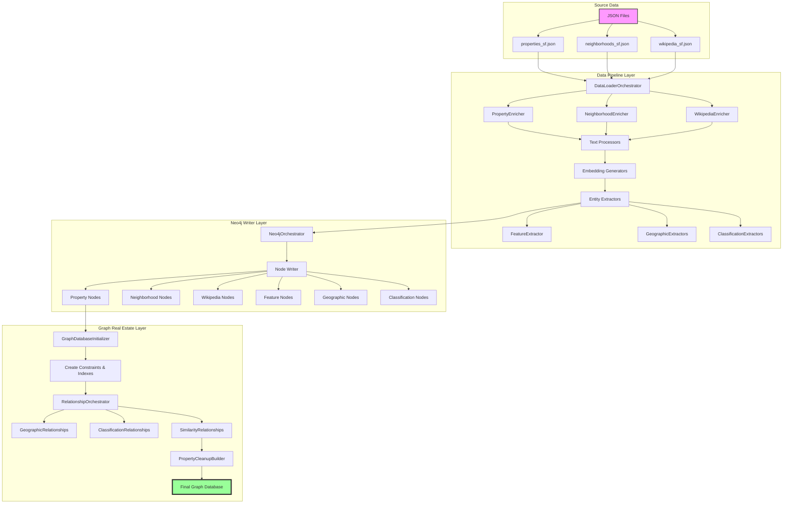
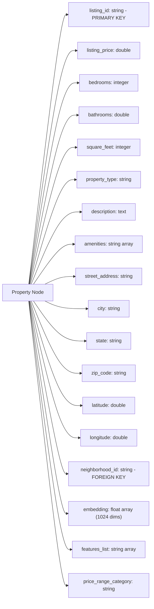
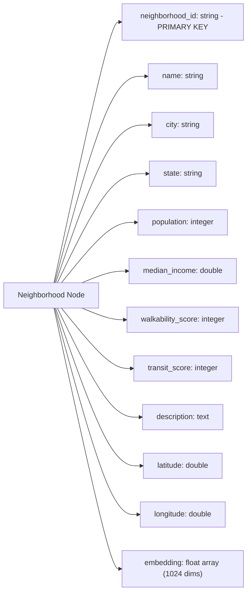
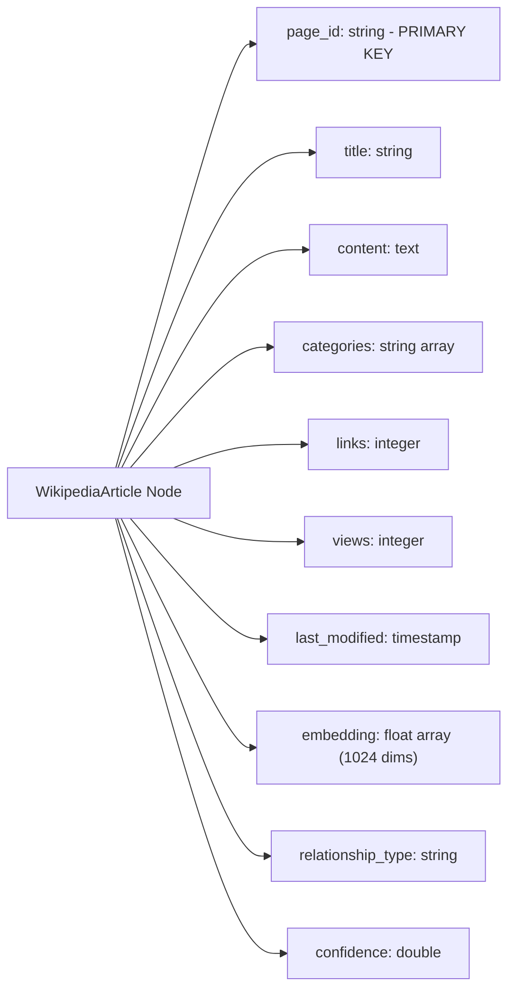
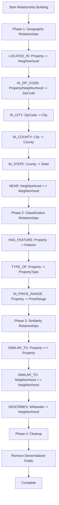

# Neo4j Graph Pipeline: In-Depth Documentation

## Table of Contents
1. [Overview and Architecture](#overview-and-architecture)
2. [Data Flow Diagram](#data-flow-diagram)
3. [Graph Model Setup and Constraints](#graph-model-setup-and-constraints)
4. [Entity Data Models](#entity-data-models)
5. [Data Transformation Pipeline](#data-transformation-pipeline)
6. [Neo4j Write Process](#neo4j-write-process)
7. [Relationship Building](#relationship-building)
8. [Post-Processing and Cleanup](#post-processing-and-cleanup)

## Overview and Architecture

The Neo4j graph pipeline is a sophisticated data processing system that transforms real estate data from JSON sources into a rich, interconnected graph database. The pipeline follows a three-phase normalization strategy:

1. **Phase 1 (Data Pipeline)**: Load complete denormalized data into Neo4j nodes
2. **Phase 2 (Relationship Building)**: Create relationships using the denormalized data
3. **Phase 3 (Cleanup)**: Remove denormalized fields after relationships are established

This approach ensures data integrity while optimizing for relationship creation performance.

## Data Flow Diagram



## Graph Model Setup and Constraints

### GraphDatabaseInitializer (graph_real_estate/utils/graph_builder.py:8-231)

The `GraphDatabaseInitializer` class sets up the Neo4j database with proper schema, constraints, and indexes.

#### Constraints Created
```cypher
-- Unique constraints ensure data integrity
CREATE CONSTRAINT IF NOT EXISTS FOR (p:Property) REQUIRE p.listing_id IS UNIQUE
CREATE CONSTRAINT IF NOT EXISTS FOR (n:Neighborhood) REQUIRE n.neighborhood_id IS UNIQUE
CREATE CONSTRAINT IF NOT EXISTS FOR (c:City) REQUIRE c.city_id IS UNIQUE
CREATE CONSTRAINT IF NOT EXISTS FOR (co:County) REQUIRE co.county_id IS UNIQUE
CREATE CONSTRAINT IF NOT EXISTS FOR (s:State) REQUIRE s.state_id IS UNIQUE
CREATE CONSTRAINT IF NOT EXISTS FOR (w:Wikipedia) REQUIRE w.page_id IS UNIQUE
CREATE CONSTRAINT IF NOT EXISTS FOR (f:Feature) REQUIRE f.name IS UNIQUE
CREATE CONSTRAINT IF NOT EXISTS FOR (pr:PriceRange) REQUIRE pr.range IS UNIQUE
CREATE CONSTRAINT IF NOT EXISTS FOR (pt:PropertyType) REQUIRE pt.name IS UNIQUE
```

#### Performance Indexes
```cypher
-- Indexes for query performance
CREATE INDEX IF NOT EXISTS FOR (p:Property) ON (p.listing_price)
CREATE INDEX IF NOT EXISTS FOR (p:Property) ON (p.property_type)
CREATE INDEX IF NOT EXISTS FOR (p:Property) ON (p.bedrooms)
CREATE INDEX IF NOT EXISTS FOR (p:Property) ON (p.city)
CREATE INDEX IF NOT EXISTS FOR (p:Property) ON (p.state)
CREATE INDEX IF NOT EXISTS FOR (n:Neighborhood) ON (n.city)
CREATE INDEX IF NOT EXISTS FOR (n:Neighborhood) ON (n.state)
CREATE INDEX IF NOT EXISTS FOR (n:Neighborhood) ON (n.walkability_score)
CREATE INDEX IF NOT EXISTS FOR (w:Wikipedia) ON (w.relationship_type)
CREATE INDEX IF NOT EXISTS FOR (w:Wikipedia) ON (w.confidence)
```

#### Vector Indexes for Embeddings
```cypher
-- Vector indexes for similarity search (1024 dimensions for nomic-embed-text)
CREATE VECTOR INDEX property_embedding IF NOT EXISTS
FOR (n:Property) ON n.embedding
OPTIONS { indexConfig: {
    `vector.dimensions`: 1024,
    `vector.similarity_function`: 'cosine'
}}

CREATE VECTOR INDEX neighborhood_embedding IF NOT EXISTS
FOR (n:Neighborhood) ON n.embedding
OPTIONS { indexConfig: {
    `vector.dimensions`: 1024,
    `vector.similarity_function`: 'cosine'
}}

CREATE VECTOR INDEX wikipedia_embedding IF NOT EXISTS
FOR (n:Wikipedia) ON n.embedding
OPTIONS { indexConfig: {
    `vector.dimensions`: 1024,
    `vector.similarity_function`: 'cosine'
}}
```

## Entity Data Models

### Core Entities

#### 1. Property Node


#### 2. Neighborhood Node


#### 3. WikipediaArticle Node


#### 4. Classification Nodes
```yaml
Feature:
  id: string (PRIMARY KEY - feature name lowercased)
  name: string (display name)
  category: string (feature category)
  count: integer (number of properties with this feature)

PropertyType:
  id: string (PRIMARY KEY - type name lowercased)
  name: string (display name)
  count: integer (number of properties of this type)

PriceRange:
  id: string (PRIMARY KEY - range identifier)
  range: string (e.g., "$500k-$750k")
  min_price: double
  max_price: double
  count: integer (number of properties in range)
```

#### 5. Geographic Hierarchy Nodes
```yaml
ZipCode:
  id: string (PRIMARY KEY - zip code)
  city_id: string (FOREIGN KEY)
  county_id: string (FOREIGN KEY)
  state_id: string (FOREIGN KEY)

City:
  id: string (PRIMARY KEY - "city_state")
  name: string
  state: string
  county_id: string (FOREIGN KEY)
  population: integer

County:
  id: string (PRIMARY KEY - "county_state")
  name: string
  state: string
  state_id: string (FOREIGN KEY)

State:
  id: string (PRIMARY KEY - state abbreviation)
  name: string
  abbreviation: string
```

## Data Transformation Pipeline

### PropertyEnricher (data_pipeline/enrichment/property_enricher.py:31-290)

The PropertyEnricher performs critical transformations on property data:

```python
# Step 1: Add correlation IDs for tracking
enriched_df = self.add_correlation_ids(df, "property_correlation_id")

# Step 2: Normalize addresses
# - Standardizes city names (SF -> San Francisco)
# - Normalizes state abbreviations (Ca -> CA)
# - Cleans zip codes (94107-1234 -> 94107)
enriched_df = self._normalize_addresses(enriched_df)

# Step 3: Join with neighborhoods
# - Adds neighborhood names based on neighborhood_id
# - Preserves neighborhood_id for relationship creation
enriched_df = self._add_neighborhood_names(enriched_df)

# Step 4: Enhance with location hierarchy
# - Adds city_id, county_id, state_id
# - Creates geographic hierarchy linkage
enriched_df = self._enhance_with_location_data(enriched_df)

# Step 5: Calculate price fields
# - price_per_sqft = listing_price / square_feet
# - price_category (luxury, high-end, mid-range, affordable)
enriched_df = self._calculate_price_fields(enriched_df)

# Step 6: Calculate quality scores
# - Composite score based on amenities, features, size
# - Normalized 0-100 scale
enriched_df = self._calculate_quality_scores(enriched_df)

# Step 7: Categorize features
# - Extracts individual features from amenities text
# - Creates features_list array for HAS_FEATURE relationships
enriched_df = self.categorize_features(enriched_df)

# Step 8: Add embeddings
# - Generates 1024-dimensional vectors from description + amenities
# - Uses configured embedding model (Voyage, OpenAI, etc.)
enriched_df = embedding_generator.generate_embeddings(enriched_df)
```

### NeighborhoodEnricher (data_pipeline/enrichment/neighborhood_enricher.py)

```python
# Neighborhood enrichment pipeline
# Step 1: Normalize location data
enriched_df = self._normalize_locations(df)

# Step 2: Calculate demographic metrics
# - population_density = population / area
# - income_bracket (high, medium, low)
enriched_df = self._calculate_demographics(enriched_df)

# Step 3: Calculate livability scores
# - Combined score from walkability, transit, safety
# - Weighted average with configurable weights
enriched_df = self._calculate_livability_scores(enriched_df)

# Step 4: Generate embeddings
# - From description + demographic data
enriched_df = embedding_generator.generate_embeddings(enriched_df)
```

### WikipediaEnricher (data_pipeline/enrichment/wikipedia_enricher.py)

```python
# Wikipedia article enrichment
# Step 1: Extract metadata
# - categories array from article structure
# - link count, view count statistics
enriched_df = self._extract_metadata(df)

# Step 2: Content processing
# - Clean HTML/wiki markup
# - Extract first paragraph as summary
enriched_df = self._process_content(enriched_df)

# Step 3: Determine relationships
# - Analyzes content for neighborhood mentions
# - Calculates confidence scores
enriched_df = self._determine_relationships(enriched_df)

# Step 4: Generate embeddings
# - From full content or summary
enriched_df = embedding_generator.generate_embeddings(enriched_df)
```

## Neo4j Write Process

### Neo4jOrchestrator (data_pipeline/writers/neo4j/neo4j_orchestrator.py:26-549)

The Neo4j writer handles the critical task of writing nodes with complete denormalized data:

```python
class Neo4jOrchestrator(EntityWriter):
    """
    Phase 1 of the three-phase normalization strategy.
    Writes complete denormalized nodes for relationship creation.
    """
    
    def write(self, df: DataFrame, metadata: WriteMetadata) -> bool:
        # Step 1: Convert Decimal types to Double for Neo4j compatibility
        df = self._convert_decimal_columns(df)
        
        # Step 2: Handle array types appropriately
        # - Embeddings: Keep as float arrays
        # - Features/amenities: Keep as string arrays
        # - Other arrays: Convert to strings
        
        # Step 3: Write nodes with MERGE semantics
        writer = df.write.format("org.neo4j.spark.DataSource")
        writer.option("labels", f":{label}")
        writer.option("node.keys", key_field)  # Primary key for MERGE
        writer.mode("overwrite")  # Handles duplicates
        
        # Step 4: Optimize for large datasets
        if record_count > 10000:
            df = df.coalesce(10)  # Reduce partitions for batching
        
        writer.save()
```

### Entity Configuration Mapping

```python
def _get_entity_configs(self) -> Dict[EntityType, Neo4jEntityConfig]:
    return {
        EntityType.PROPERTY: Neo4jEntityConfig(
            label="Property", 
            key_field="listing_id"
        ),
        EntityType.NEIGHBORHOOD: Neo4jEntityConfig(
            label="Neighborhood", 
            key_field="neighborhood_id"
        ),
        EntityType.WIKIPEDIA: Neo4jEntityConfig(
            label="WikipediaArticle", 
            key_field="page_id"
        ),
        EntityType.FEATURE: Neo4jEntityConfig(
            label="Feature", 
            key_field="id"
        ),
        # ... additional entity configurations
    }
```

## Relationship Building

### RelationshipOrchestrator (graph_real_estate/relationships/builder.py:59-309)

The relationship building process occurs in four carefully orchestrated phases:



### Geographic Relationships (graph_real_estate/relationships/geographic.py:16-260)

#### LOCATED_IN Relationship
```cypher
-- Creates property to neighborhood relationships
-- Uses neighborhood_id field from denormalized property data
MATCH (p:Property)
WHERE p.neighborhood_id IS NOT NULL
MATCH (n:Neighborhood {neighborhood_id: p.neighborhood_id})
MERGE (p)-[:LOCATED_IN]->(n)
```

#### Geographic Hierarchy
```cypher
-- IN_ZIP_CODE: Properties to ZipCodes
MATCH (p:Property)
WHERE p.zip_code IS NOT NULL
MATCH (z:ZipCode {id: p.zip_code})
MERGE (p)-[:IN_ZIP_CODE]->(z)

-- IN_CITY: ZipCodes to Cities (inferred from properties)
MATCH (z:ZipCode)
MATCH (p:Property {zip_code: z.id})
WHERE p.city_normalized IS NOT NULL AND p.state_standardized IS NOT NULL
MATCH (c:City {name: p.city_normalized, state: p.state_standardized})
WITH z, c
MERGE (z)-[:IN_CITY]->(c)

-- IN_COUNTY: Cities to Counties (inferred from properties)
MATCH (c:City)
MATCH (p:Property)
WHERE p.city_normalized = c.name AND p.county IS NOT NULL
MATCH (co:County {name: p.county, state: c.state})
WITH c, co
MERGE (c)-[:IN_COUNTY]->(co)

-- IN_STATE: Counties to States
MATCH (co:County)
WHERE co.state IS NOT NULL
MATCH (s:State {abbreviation: co.state})
MERGE (co)-[:IN_STATE]->(s)
```

#### NEAR Relationship (Distance-based)
```cypher
-- Creates NEAR relationships between geographically close neighborhoods
MATCH (n1:Neighborhood)
WHERE n1.latitude IS NOT NULL AND n1.longitude IS NOT NULL
MATCH (n2:Neighborhood)
WHERE n2.latitude IS NOT NULL AND n2.longitude IS NOT NULL
  AND n1.neighborhood_id < n2.neighborhood_id  -- Avoid duplicates
WITH n1, n2, 
  point.distance(
    point({latitude: n1.latitude, longitude: n1.longitude}),
    point({latitude: n2.latitude, longitude: n2.longitude})
  ) as distance
WHERE distance <= 5000  -- Within 5km
MERGE (n1)-[:NEAR {distance: distance}]->(n2)
```

### Classification Relationships (graph_real_estate/relationships/classification.py)

#### HAS_FEATURE Relationship
```cypher
-- Creates relationships from properties to feature nodes
-- Uses features_list array from enriched property data
MATCH (p:Property)
WHERE p.features_list IS NOT NULL
UNWIND p.features_list as feature_name
MERGE (f:Feature {id: toLower(feature_name), name: feature_name})
MERGE (p)-[:HAS_FEATURE]->(f)
```

#### TYPE_OF Relationship
```cypher
-- Links properties to their property type
MATCH (p:Property)
WHERE p.property_type IS NOT NULL
MERGE (pt:PropertyType {
  id: toLower(p.property_type), 
  name: p.property_type
})
MERGE (p)-[:TYPE_OF]->(pt)
```

#### IN_PRICE_RANGE Relationship
```cypher
-- Categorizes properties into price ranges
MATCH (p:Property)
WHERE p.price_range_category IS NOT NULL
MERGE (pr:PriceRange {
  id: p.price_range_category,
  range: p.price_range_category
})
MERGE (p)-[:IN_PRICE_RANGE]->(pr)
```

### Similarity Relationships (graph_real_estate/relationships/similarity.py)

#### Property Similarity (Vector-based)
```cypher
-- Creates SIMILAR_TO relationships based on embedding similarity
MATCH (p1:Property)
WHERE p1.embedding IS NOT NULL
CALL db.index.vector.queryNodes('property_embedding', 10, p1.embedding)
YIELD node as p2, score
WHERE p1.listing_id <> p2.listing_id AND score > 0.85
MERGE (p1)-[:SIMILAR_TO {similarity: score}]->(p2)
```

#### Neighborhood Similarity
```cypher
-- Similar process for neighborhoods using embedding vectors
MATCH (n1:Neighborhood)
WHERE n1.embedding IS NOT NULL
CALL db.index.vector.queryNodes('neighborhood_embedding', 5, n1.embedding)
YIELD node as n2, score
WHERE n1.neighborhood_id <> n2.neighborhood_id AND score > 0.8
MERGE (n1)-[:SIMILAR_TO {similarity: score}]->(n2)
```

#### DESCRIBES Relationship
```cypher
-- Links Wikipedia articles to neighborhoods they describe
-- Uses relationship_type and confidence from enrichment
MATCH (w:WikipediaArticle)
WHERE w.relationship_type = 'describes_neighborhood' 
  AND w.confidence > 0.7
MATCH (n:Neighborhood)
WHERE w.content CONTAINS n.name
  OR w.title CONTAINS n.name
MERGE (w)-[:DESCRIBES {confidence: w.confidence}]->(n)
```

## Post-Processing and Cleanup

### PropertyCleanupBuilder (graph_real_estate/relationships/cleanup.py)

The final phase removes denormalized data after relationships are established:

```python
class PropertyCleanupBuilder:
    """
    Phase 3 of the three-phase normalization strategy.
    Removes denormalized fields after relationships are created.
    """
    
    def cleanup_all_denormalization(self) -> CleanupStats:
        # Remove geographic denormalization from Properties
        self._cleanup_property_geographic_fields()
        # Fields removed: city, state, county, zip_code (kept in relationships)
        
        # Remove classification denormalization from Properties  
        self._cleanup_property_classification_fields()
        # Fields removed: property_type, features_list, price_range_category
        
        # Remove linkage fields
        self._cleanup_linkage_fields()
        # Fields removed: neighborhood_id (relationship exists)
        
        # Clean up intermediate processing fields
        self._cleanup_processing_fields()
        # Fields removed: *_normalized, *_standardized, correlation_ids
```

### Final Cleanup Queries

```cypher
-- Remove denormalized geographic fields from Properties
MATCH (p:Property)
WHERE p.city IS NOT NULL OR p.state IS NOT NULL 
   OR p.county IS NOT NULL OR p.zip_code IS NOT NULL
REMOVE p.city, p.state, p.county, p.zip_code
RETURN count(p) as properties_cleaned

-- Remove classification fields (now in relationships)
MATCH (p:Property)
WHERE p.property_type IS NOT NULL 
   OR p.features_list IS NOT NULL 
   OR p.price_range_category IS NOT NULL
REMOVE p.property_type, p.features_list, p.price_range_category
RETURN count(p) as properties_cleaned

-- Remove foreign keys (relationships established)
MATCH (p:Property)
WHERE p.neighborhood_id IS NOT NULL
REMOVE p.neighborhood_id
RETURN count(p) as properties_cleaned

-- Clean processing artifacts
MATCH (n)
WHERE n.city_normalized IS NOT NULL 
   OR n.state_standardized IS NOT NULL
   OR n.property_correlation_id IS NOT NULL
REMOVE n.city_normalized, n.state_standardized, 
       n.property_correlation_id, n.neighborhood_correlation_id
RETURN count(n) as nodes_cleaned
```

## Summary

The Neo4j graph pipeline implements a sophisticated three-phase normalization strategy that:

1. **Preserves Data Integrity**: Denormalized data ensures relationships can be created accurately
2. **Optimizes Performance**: Bulk node creation followed by relationship creation is more efficient
3. **Maintains Clean Schema**: Final cleanup removes redundancy while preserving graph structure
4. **Enables Rich Queries**: The resulting graph supports complex traversals, similarity searches, and geographic queries

The pipeline transforms flat JSON data into a rich, interconnected knowledge graph with:
- **10+ entity types** (Properties, Neighborhoods, Cities, Features, etc.)
- **11+ relationship types** (LOCATED_IN, SIMILAR_TO, DESCRIBES, etc.)
- **Vector embeddings** for semantic similarity search
- **Geographic hierarchy** for location-based queries
- **Classification taxonomy** for faceted search

This architecture enables powerful graph queries combining semantic search, geographic proximity, and entity relationships for comprehensive real estate intelligence.