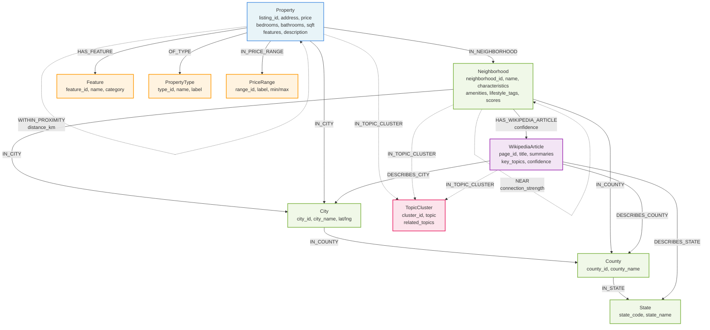

# Real Estate Knowledge Graph Data Model

## Overview

The Real Estate Knowledge Graph is a comprehensive Neo4j-based graph database that integrates property listings, geographic hierarchies, neighborhood characteristics, and Wikipedia knowledge to create a rich, interconnected data model for real estate analysis and search. The model leverages graph relationships to enable complex queries, similarity matching, and knowledge-enhanced property discovery.

### Key Design Principles

1. **Hierarchical Geographic Organization**: Properties are connected through a multi-level geographic hierarchy (State → County → City → Neighborhood)
2. **Feature-Based Classification**: Properties are categorized by type, price range, and features to enable faceted search
3. **Knowledge Enhancement**: Wikipedia articles provide contextual information about locations and neighborhoods
4. **Similarity Networks**: Properties and neighborhoods are connected through calculated similarity relationships
5. **Topic Clustering**: Wikipedia-derived topics create semantic connections between entities

## Node Types

### 1. Property Node
**Label**: `Property`

Core node representing individual real estate listings.

**Properties**:
- `listing_id` (String, Primary Key): Unique identifier for the property listing
- `neighborhood_id` (String): Reference to the neighborhood
- `street` (String): Street address
- `city` (String): City name
- `county` (String): County name
- `state` (String): State abbreviation
- `zip` (String): ZIP code
- `latitude` (Float): Geographic latitude coordinate
- `longitude` (Float): Geographic longitude coordinate
- `listing_price` (Float): Listed sale price
- `price_per_sqft` (Float): Calculated price per square foot
- `description` (String): Property description text
- `features` (String[]): Array of property features
- `bedrooms` (Integer): Number of bedrooms
- `bathrooms` (Float): Number of bathrooms
- `square_feet` (Integer): Total square footage
- `year_built` (Integer): Year of construction
- `property_type` (String): Type of property (single-family, condo, etc.)
- `lot_size` (Float): Lot size in acres
- `stories` (Integer): Number of floors
- `garage_spaces` (Integer): Number of garage parking spaces
- `listing_date` (String): Date property was listed
- `created_at` (DateTime): Node creation timestamp

### 2. Neighborhood Node
**Label**: `Neighborhood`

Represents distinct neighborhood areas within cities.

**Properties**:
- `neighborhood_id` (String, Primary Key): Unique neighborhood identifier
- `name` (String): Neighborhood name
- `city` (String): Parent city name
- `county` (String): Parent county name
- `state` (String): State name/abbreviation
- `latitude` (Float): Central latitude coordinate
- `longitude` (Float): Central longitude coordinate
- `description` (String): Detailed neighborhood description
- `median_home_price` (Float): Median property price in neighborhood
- `price_trend` (String): Price trend indicator (rising/stable/declining)
- `walkability_score` (Integer, 0-10): Walkability rating
- `transit_score` (Integer, 0-10): Public transit accessibility
- `school_rating` (Integer, 0-10): School quality rating
- `safety_rating` (Integer, 0-10): Safety/crime rating
- `nightlife_score` (Integer, 0-10): Nightlife and entertainment rating
- `family_friendly_score` (Integer, 0-10): Family suitability rating
- `amenities` (String[]): List of neighborhood amenities
- `lifestyle_tags` (String[]): Lifestyle descriptors
- `primary_age_group` (String): Dominant demographic age group
- `vibe` (String): Neighborhood atmosphere descriptor
- `population` (Integer): Estimated population
- `median_household_income` (Float): Median household income
- `knowledge_score` (Float, 0-1): Wikipedia knowledge coverage score
- `aggregated_topics` (String[]): Wikipedia-derived topic tags
- `wikipedia_count` (Integer): Number of related Wikipedia articles
- `created_at` (DateTime): Node creation timestamp

### 3. City Node
**Label**: `City`

Represents cities containing neighborhoods and properties.

**Properties**:
- `city_id` (String, Primary Key): Unique city identifier (normalized name)
- `city_name` (String): Official city name
- `county_id` (String): Parent county identifier
- `county_name` (String): Parent county name
- `state_code` (String): Two-letter state code
- `state_name` (String): Full state name
- `latitude` (Float): City center latitude
- `longitude` (Float): City center longitude
- `created_at` (DateTime): Node creation timestamp

### 4. County Node
**Label**: `County`

Represents counties containing cities.

**Properties**:
- `county_id` (String, Primary Key): Unique county identifier
- `county_name` (String): Official county name (e.g., "Summit County")
- `state_code` (String): Two-letter state code
- `state_name` (String): Full state name
- `created_at` (DateTime): Node creation timestamp

### 5. State Node
**Label**: `State`

Represents states at the top of the geographic hierarchy.

**Properties**:
- `state_code` (String, Primary Key): Two-letter state code
- `state_name` (String): Full state name
- `created_at` (DateTime): Node creation timestamp

### 6. Feature Node
**Label**: `Feature`

Represents distinct property features and amenities.

**Properties**:
- `feature_id` (String, Primary Key): Normalized feature identifier
- `name` (String): Feature display name
- `category` (String): Feature category (View, Outdoor, Kitchen, Parking, etc.)
- `created_at` (DateTime): Node creation timestamp

### 7. PropertyType Node
**Label**: `PropertyType`

Represents property type categories.

**Properties**:
- `type_id` (String, Primary Key): Type identifier
- `name` (String): Type name (single-family, condo, townhouse, etc.)
- `label` (String): Display label
- `created_at` (DateTime): Node creation timestamp

### 8. PriceRange Node
**Label**: `PriceRange`

Represents price range categories for grouping properties.

**Properties**:
- `range_id` (String, Primary Key): Range identifier
- `label` (String): Display label (e.g., "$500k-$1M")
- `min_price` (Integer): Minimum price in range
- `max_price` (Integer): Maximum price in range (null for unlimited)
- `created_at` (DateTime): Node creation timestamp

### 9. WikipediaArticle Node
**Label**: `WikipediaArticle`

Represents Wikipedia articles with location-relevant content.

**Properties**:
- `page_id` (Integer, Primary Key): Wikipedia page ID
- `title` (String): Article title
- `short_summary` (String): Concise summary (350-550 chars)
- `long_summary` (String): Detailed summary (1000-1300 chars)
- `key_topics` (String[]): LLM-extracted key topics
- `best_city` (String): Most relevant city
- `best_county` (String): Most relevant county
- `best_state` (String): Most relevant state
- `location_type` (String): Type of location described
- `overall_confidence` (Float, 0-1): Relevance confidence score
- `url` (String): Wikipedia article URL
- `latitude` (Float): Location latitude if applicable
- `longitude` (Float): Location longitude if applicable
- `last_updated` (DateTime): Last update timestamp

### 10. TopicCluster Node
**Label**: `TopicCluster`

Represents topic-based clusters derived from Wikipedia content.

**Properties**:
- `cluster_id` (String, Primary Key): Unique cluster identifier
- `topic` (String): Primary topic/theme
- `related_topics` (String[]): Related topic list
- `cluster_strength` (Float, 0-1): Cluster cohesion strength
- `member_count` (Integer): Number of entities in cluster
- `created_at` (DateTime): Node creation timestamp

## Relationship Types

### Geographic Relationships

#### 1. IN_NEIGHBORHOOD
**Direction**: `(Property)-[:IN_NEIGHBORHOOD]->(Neighborhood)`

Connects properties to their neighborhoods.

**Properties**:
- `created_at` (DateTime): Relationship creation timestamp

#### 2. IN_CITY
**Direction**: `(Property)-[:IN_CITY]->(City)` and `(Neighborhood)-[:IN_CITY]->(City)`

Connects properties and neighborhoods to their cities.

**Properties**:
- `created_at` (DateTime): Relationship creation timestamp

#### 3. IN_COUNTY
**Direction**: `(City)-[:IN_COUNTY]->(County)` and `(Neighborhood)-[:IN_COUNTY]->(County)`

Connects cities and neighborhoods to their counties.

**Properties**:
- `created_at` (DateTime): Relationship creation timestamp

#### 4. IN_STATE
**Direction**: `(County)-[:IN_STATE]->(State)`

Connects counties to their states.

**Properties**:
- `created_at` (DateTime): Relationship creation timestamp

### Property Classification Relationships

#### 5. HAS_FEATURE
**Direction**: `(Property)-[:HAS_FEATURE]->(Feature)`

Connects properties to their features.

**Properties**:
- `created_at` (DateTime): Relationship creation timestamp

#### 6. OF_TYPE
**Direction**: `(Property)-[:OF_TYPE]->(PropertyType)`

Connects properties to their type classification.

**Properties**:
- `created_at` (DateTime): Relationship creation timestamp

#### 7. IN_PRICE_RANGE
**Direction**: `(Property)-[:IN_PRICE_RANGE]->(PriceRange)`

Connects properties to their price range category.

**Properties**:
- `created_at` (DateTime): Relationship creation timestamp

### Similarity Relationships

#### 8. SIMILAR_TO
**Direction**: `(Property)-[:SIMILAR_TO]->(Property)`

Connects similar properties based on composite similarity scores.

**Properties**:
- `similarity_score` (Float, 0-1): Overall similarity score
- `price_similarity` (Float, 0-1): Price-based similarity
- `size_similarity` (Float, 0-1): Size-based similarity
- `feature_similarity` (Float, 0-1): Feature overlap similarity
- `location_similarity` (Float, 0-1): Geographic proximity
- `type_similarity` (Float, 0-1): Property type match
- `shared_features` (String[]): Common features
- `method` (String): Calculation method used
- `created_at` (DateTime): Relationship creation timestamp

#### 9. NEAR
**Direction**: `(Neighborhood)-[:NEAR]->(Neighborhood)`

Connects geographically or thematically related neighborhoods.

**Properties**:
- `connection_strength` (Float, 0-1): Connection strength
- `geographic_proximity` (Float, 0-1): Physical distance factor
- `lifestyle_similarity` (Float, 0-1): Lifestyle overlap
- `price_range_similarity` (Float, 0-1): Price range overlap
- `wikipedia_topic_overlap` (Float, 0-1): Shared Wikipedia topics
- `distance_km` (Float): Physical distance in kilometers
- `shared_lifestyle_tags` (String[]): Common lifestyle tags
- `shared_wikipedia_topics` (String[]): Common Wikipedia topics
- `created_at` (DateTime): Relationship creation timestamp

#### 10. WITHIN_PROXIMITY
**Direction**: `(Property)-[:WITHIN_PROXIMITY]->(Property)`

Connects properties within geographic proximity.

**Properties**:
- `distance_km` (Float): Distance in kilometers
- `distance_miles` (Float): Distance in miles
- `within_walking_distance` (Boolean): Within 1.5km
- `within_driving_distance` (Boolean): Within 50km
- `created_at` (DateTime): Relationship creation timestamp

### Knowledge Relationships

#### 11. HAS_WIKIPEDIA_ARTICLE
**Direction**: `(Neighborhood)-[:HAS_WIKIPEDIA_ARTICLE]->(WikipediaArticle)`

Connects neighborhoods to relevant Wikipedia articles.

**Properties**:
- `correlation_method` (String): Method used (direct, geographic, name_match, proximity)
- `confidence` (Float, 0-1): Correlation confidence
- `relationship_type` (String): Type of relationship (primary, neighborhood, landmark, etc.)
- `created_at` (DateTime): Relationship creation timestamp

#### 12. DESCRIBES_STATE
**Direction**: `(WikipediaArticle)-[:DESCRIBES_STATE]->(State)`

Connects Wikipedia articles to states they describe.

**Properties**:
- `confidence` (Float, 0-1): Relevance confidence
- `created_at` (DateTime): Relationship creation timestamp

#### 13. DESCRIBES_COUNTY
**Direction**: `(WikipediaArticle)-[:DESCRIBES_COUNTY]->(County)`

Connects Wikipedia articles to counties they describe.

**Properties**:
- `confidence` (Float, 0-1): Relevance confidence
- `created_at` (DateTime): Relationship creation timestamp

#### 14. DESCRIBES_CITY
**Direction**: `(WikipediaArticle)-[:DESCRIBES_CITY]->(City)`

Connects Wikipedia articles to cities they describe.

**Properties**:
- `confidence` (Float, 0-1): Relevance confidence
- `created_at` (DateTime): Relationship creation timestamp

#### 15. IN_TOPIC_CLUSTER
**Direction**: `(Property|Neighborhood|WikipediaArticle)-[:IN_TOPIC_CLUSTER]->(TopicCluster)`

Connects entities to topic clusters.

**Properties**:
- `relevance_score` (Float, 0-1): Topic relevance
- `created_at` (DateTime): Relationship creation timestamp

## Graph Visualization



## Data Loading and Transformation Process

### Source Data Overview

The graph is populated from three primary data sources:

#### 1. Property Data (`real_estate_data/properties_*.json`)
JSON files containing property listings with:
- Listing identification and neighborhood references
- Full address with geographic coordinates
- Property details (bedrooms, bathrooms, square footage, type)
- Pricing information
- Features and amenities lists
- Listing metadata

#### 2. Neighborhood Data (`real_estate_data/neighborhoods_*.json`)
JSON files containing neighborhood profiles with:
- Neighborhood identification and geographic hierarchy
- Descriptive text and characteristics scores
- Amenities and lifestyle tags
- Market statistics (median prices, trends)
- Demographic information

#### 3. Wikipedia Data (`data/wikipedia/wikipedia.db`)
SQLite database with three main tables:
- **articles**: Wikipedia page data with geographic relevance
- **page_summaries**: LLM-processed summaries and topic extractions
- **locations**: Geographic location mappings and confidence scores

### Data Loading Pipeline

The data loading process follows a carefully orchestrated sequence to ensure referential integrity and optimal graph construction:

#### Phase 1: Geographic Hierarchy Construction
1. **Location Processing** (`locations.json`)
   - Parse location entries to identify states, counties, and cities
   - Generate normalized IDs (lowercase, underscore-separated)
   - Create State nodes with unique state codes
   - Create County nodes linked to states via IN_STATE relationships
   - Create City nodes linked to counties via IN_COUNTY relationships

2. **Hierarchy Validation**
   - Ensure all geographic paths are complete
   - Validate state/county/city relationships
   - Flag and handle missing geographic data

#### Phase 2: Neighborhood Loading
1. **Neighborhood Node Creation**
   - Parse neighborhood JSON files
   - Create Neighborhood nodes with all characteristic scores
   - Extract and store lifestyle tags and amenities
   - Calculate initial knowledge scores (to be updated with Wikipedia data)

2. **Geographic Linking**
   - Connect neighborhoods to cities via IN_CITY relationships
   - Connect neighborhoods to counties via IN_COUNTY relationships
   - Store geographic coordinates for spatial queries

#### Phase 3: Property Loading
1. **Property Node Creation**
   - Parse property JSON files
   - Validate property data (required fields, data types)
   - Transform nested objects (address, coordinates, details) into flat properties
   - Create Property nodes with all attributes

2. **Feature Extraction and Classification**
   - Extract unique features from all properties
   - Categorize features (View, Outdoor, Kitchen, Parking, etc.)
   - Create Feature nodes for each unique feature
   - Extract unique property types
   - Create PropertyType nodes
   - Create standard PriceRange nodes

3. **Property Relationship Creation**
   - Connect properties to neighborhoods (IN_NEIGHBORHOOD)
   - Connect properties to cities (IN_CITY)
   - Connect properties to features (HAS_FEATURE)
   - Connect properties to types (OF_TYPE)
   - Calculate price ranges and create IN_PRICE_RANGE relationships

#### Phase 4: Wikipedia Knowledge Integration
1. **Wikipedia Article Loading**
   - Query `page_summaries` table for processed articles
   - Create WikipediaArticle nodes with summaries and topics
   - Extract key topics for clustering

2. **Geographic Correlation**
   - Match Wikipedia articles to states/counties/cities based on `best_*` fields
   - Create DESCRIBES_* relationships with confidence scores
   - Correlate articles with neighborhoods using multiple methods:
     - **Direct matching**: Exact name matches
     - **Geographic proximity**: Coordinate-based matching
     - **Name similarity**: Fuzzy string matching
     - **Topic overlap**: Shared topic analysis

3. **Neighborhood Enrichment**
   - Update neighborhood nodes with Wikipedia-derived data
   - Aggregate topics from related articles
   - Calculate and update knowledge scores
   - Store Wikipedia article counts

#### Phase 5: Similarity and Clustering
1. **Property Similarity Calculation**
   - Compare properties pairwise within configurable limits
   - Calculate component similarities:
     - Price similarity (normalized price difference)
     - Size similarity (square footage comparison)
     - Feature similarity (Jaccard coefficient of features)
     - Location similarity (geographic distance)
     - Type similarity (exact match bonus)
   - Compute weighted composite score
   - Create SIMILAR_TO relationships for scores above threshold

2. **Neighborhood Connections**
   - Calculate neighborhood-to-neighborhood connections
   - Consider factors:
     - Geographic proximity (distance-based)
     - Lifestyle tag overlap
     - Price range similarity
     - Wikipedia topic overlap
   - Create NEAR relationships with connection strength

3. **Topic Clustering**
   - Extract topics from all Wikipedia articles
   - Create TopicCluster nodes for major themes
   - Connect properties, neighborhoods, and articles to clusters
   - Calculate relevance scores for cluster membership

#### Phase 6: Verification and Indexing
1. **Data Verification**
   - Count nodes by type
   - Verify relationship counts
   - Check for orphaned nodes
   - Validate geographic hierarchy completeness

2. **Index Creation**
   - Create indexes on primary keys (listing_id, neighborhood_id, etc.)
   - Create composite indexes for common query patterns
   - Create full-text indexes on description fields

### Data Transformation Details

#### Property Data Transformation
```python
# Input JSON structure
{
    "listing_id": "prop-001",
    "neighborhood_id": "sf-mission-001",
    "address": {
        "street": "123 Main St",
        "city": "San Francisco",
        "county": "San Francisco",
        "state": "CA",
        "zip": "94102"
    },
    "coordinates": {"latitude": 37.7, "longitude": -122.4},
    "property_details": {
        "bedrooms": 3,
        "bathrooms": 2.5,
        "square_feet": 1800,
        "property_type": "condo"
    },
    "listing_price": 1200000,
    "features": ["City View", "In-Unit Laundry", "Parking"]
}

# Transformed to Property node with flat structure
# Address and coordinates are flattened
# Features trigger creation of Feature nodes and HAS_FEATURE relationships
# Property type triggers OF_TYPE relationship
# Price triggers IN_PRICE_RANGE relationship calculation
```

#### Wikipedia Integration Transform
```python
# Wikipedia article from database
{
    "page_id": 12345,
    "title": "Mission District",
    "short_summary": "Historic neighborhood in San Francisco...",
    "key_topics": "hispanic culture, murals, gentrification, restaurants",
    "best_city": "San Francisco",
    "best_county": "San Francisco",
    "overall_confidence": 0.95
}

# Creates WikipediaArticle node
# Creates DESCRIBES_CITY relationship to San Francisco
# Creates HAS_WIKIPEDIA_ARTICLE relationship to Mission District neighborhood
# Topics are parsed and used for TopicCluster creation
# Confidence scores weight the relationships
```

#### Similarity Calculation Transform
```python
# For each property pair within same city or nearby neighborhoods:
similarity_score = (
    price_weight * price_similarity +
    size_weight * size_similarity +
    feature_weight * feature_similarity +
    location_weight * location_similarity +
    type_weight * type_similarity
)

# Default weights:
# price_weight: 0.25
# size_weight: 0.20
# feature_weight: 0.30
# location_weight: 0.15
# type_weight: 0.10

# Creates SIMILAR_TO relationship if score > 0.3
```

### Batch Processing Strategy

The loaders implement efficient batch processing:

1. **Batch Sizes**
   - Properties: 100 nodes per batch
   - Features: 500 nodes per batch
   - Relationships: 500 per batch
   - Wikipedia articles: 50 per batch

2. **Transaction Management**
   - Each batch runs in a separate transaction
   - Failed batches are retried with exponential backoff
   - Partial failures are logged and skipped

3. **Memory Optimization**
   - Streaming processing for large files
   - Incremental relationship creation
   - Periodic cache clearing

### Data Quality and Validation

Throughout the loading process, multiple validation steps ensure data quality:

1. **Input Validation**
   - Required fields presence check
   - Data type validation
   - Range validation (prices, coordinates, scores)
   - Referential integrity (neighborhood_id exists)

2. **Transformation Validation**
   - Address parsing verification
   - Feature categorization review
   - Topic extraction quality check
   - Similarity score sanity checks

3. **Output Validation**
   - Node count verification
   - Relationship count verification
   - Orphaned node detection
   - Circular relationship detection

### Performance Considerations

The loading process is optimized for performance:

1. **Parallel Processing**
   - Independent node types loaded concurrently
   - Relationship creation parallelized where possible
   - Wikipedia correlation runs in parallel threads

2. **Caching Strategy**
   - Feature and type lookups cached in memory
   - Geographic hierarchy cached for relationship creation
   - Wikipedia topic cache for clustering

3. **Index Strategy**
   - Indexes created before bulk loading
   - Unique constraints ensure data integrity
   - Composite indexes optimize relationship creation

This comprehensive data model and loading pipeline creates a rich, interconnected graph that enables sophisticated real estate search, analysis, and recommendation capabilities.