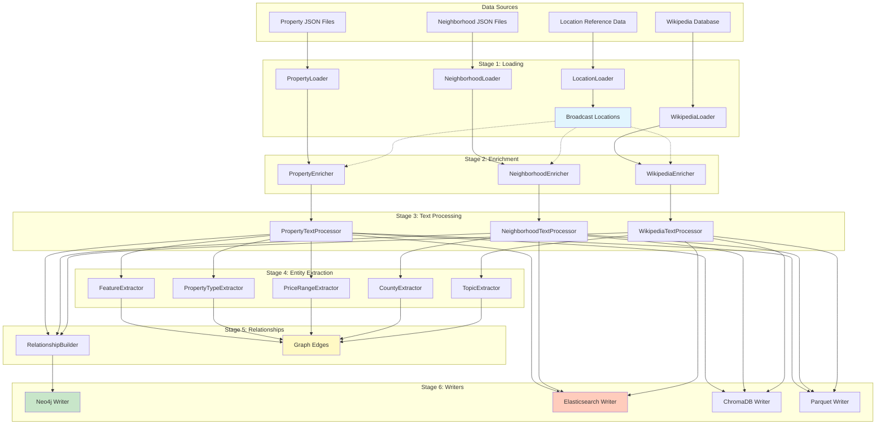
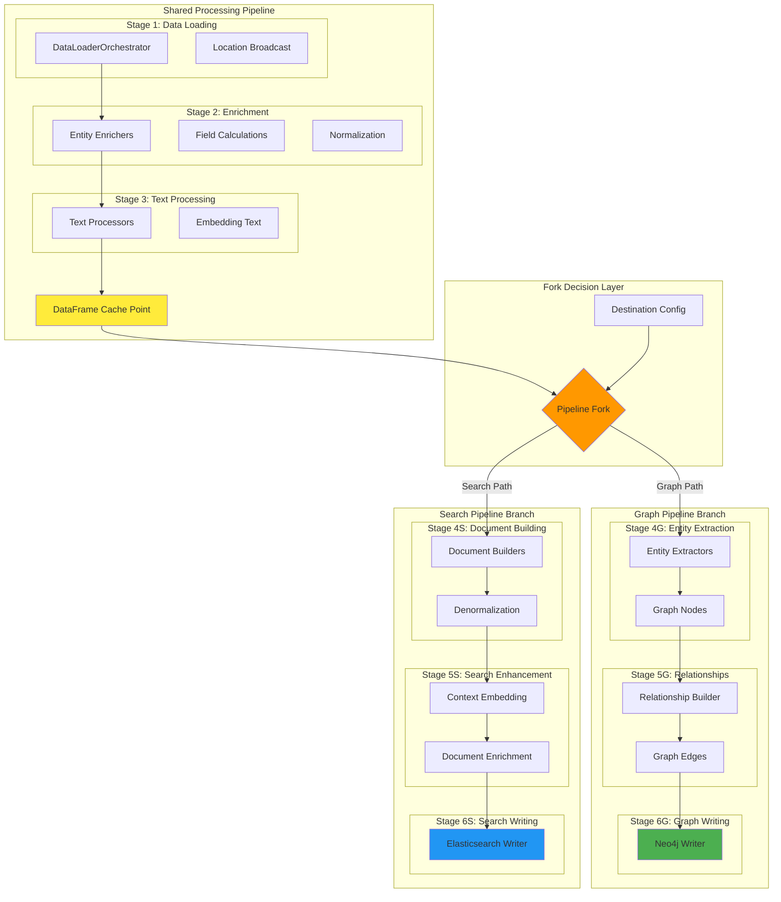
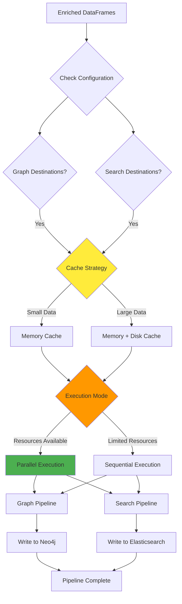

# Data Pipeline Architecture Design

## Current Pipeline Design

### Overview

The data pipeline is a sophisticated Apache Spark-based system designed primarily for graph database ingestion. It processes real estate data through multiple stages, transforming raw JSON and database sources into enriched entities suitable for Neo4j graph storage. The pipeline employs a linear processing model where data flows through sequential transformation stages before being written to multiple destinations.

### Core Architecture Principles

The current design follows these architectural principles:

1. **Entity-Centric Processing**: Each data type (properties, neighborhoods, Wikipedia articles) is treated as a distinct entity with specialized processing logic
2. **Sequential Transformation**: Data flows through ordered stages with each stage building upon the previous
3. **Broadcast Optimization**: Reference data is broadcast for efficient distributed lookups
4. **Lazy Evaluation**: Spark's lazy evaluation model delays computation until actions are triggered
5. **Multi-Destination Writing**: A pluggable writer architecture supports multiple output formats

### Pipeline Stages

#### Stage 1: Data Loading
The pipeline begins by loading data from configured sources into separate DataFrames. The DataLoaderOrchestrator coordinates entity-specific loaders, each responsible for reading and parsing its data format. Location reference data is loaded first and broadcast across the cluster for efficient enrichment lookups.

#### Stage 2: Enrichment
Entity-specific enrichers add calculated fields, normalize data, and enhance records with derived information. Each enricher extends BaseEnricher, providing common functionality while implementing entity-specific logic. Location hierarchies are resolved, addresses are normalized, and quality scores are calculated.

#### Stage 3: Text Processing
Text processors prepare content for downstream consumption, particularly for embedding generation. They extract and combine relevant text fields, clean content, and create searchable text representations. This stage produces embedding-ready text for vector databases.

#### Stage 4: Entity Extraction
The pipeline extracts additional graph nodes from the enriched data. Feature extractors identify property amenities, property type extractors categorize listings, price range extractors create market segments, and topic extractors identify thematic clusters from Wikipedia content.

#### Stage 5: Relationship Building
The RelationshipBuilder constructs edges between entities, creating the graph structure. It identifies spatial relationships (properties in neighborhoods), hierarchical relationships (neighborhoods in cities), and semantic relationships (properties with features).

#### Stage 6: Multi-Destination Writing
The WriterOrchestrator manages parallel writes to configured destinations. Each writer implements the EntityWriter interface, handling destination-specific transformations and optimizations. Writers operate independently, allowing failures in one destination to not affect others.

### Current Data Flow

### Processing Characteristics

#### Data Volume and Performance
The pipeline processes datasets ranging from thousands to millions of records. Spark's distributed processing enables horizontal scaling, with performance linearly improving with additional compute resources. The broadcast join pattern optimizes enrichment operations, reducing shuffle operations.

#### Memory Management
DataFrames are lazily evaluated, building execution plans without immediate computation. Critical DataFrames are cached at strategic points to avoid recomputation. Broadcast variables distribute reference data efficiently across executors.

#### Fault Tolerance
Each stage validates its output before proceeding. Failed writes to one destination don't affect others. The pipeline can resume from intermediate cached states.

### Current Limitations for Search

The current architecture treats Elasticsearch as just another write destination, receiving the same graph-oriented data structure as Neo4j. This creates several inefficiencies:

1. **Structural Mismatch**: Graph nodes are normalized while search requires denormalized documents
2. **Missing Transformations**: No document building or relationship embedding occurs
3. **Separate Indices**: Related data is split across indices, requiring expensive joins
4. **Limited Enrichment**: Wikipedia context isn't integrated into property documents
5. **No Search Optimization**: Lacks custom analyzers, nested structures, and search fields

## Pipeline Enhancement Design

### Strategic Approach

The enhancement introduces a fork in the pipeline after the enrichment and text processing stages, creating two parallel processing paths optimized for their respective storage systems. This fork-and-specialize pattern leverages shared computation while allowing destination-specific optimizations.

### Architectural Principles for Enhancement

1. **Shared Computation Maximization**: Reuse all possible processing before forking
2. **Lazy Fork Optimization**: Delay the fork point to maximize shared transformations
3. **Cache at Fork Point**: Persist DataFrames where paths diverge to prevent recomputation
4. **Parallel Path Processing**: Execute graph and search transformations concurrently
5. **Independent Optimization**: Each path can be optimized without affecting the other

### Fork Point Analysis

The optimal fork point occurs after Stage 3 (Text Processing) for several reasons:

**Shared Requirements**:
- Both paths need clean, enriched data with normalized fields
- Both benefit from calculated fields and quality scores
- Both use text processing for different purposes (embeddings vs search)
- Both require location hierarchy resolution

**Divergent Requirements**:
- Graph needs entity extraction and relationship building
- Search needs document denormalization and context embedding
- Graph maintains normalized structure
- Search requires flattened, enriched documents

### Enhanced Pipeline Architecture

### Search Pipeline Branch Design

#### Stage 4S: Document Building

The Document Building stage transforms normalized entities into search-optimized documents through several sophisticated operations:

**Property Document Builder**:
Constructs comprehensive property documents by assembling data from multiple sources. It starts with the enriched property DataFrame and systematically adds layers of information. Neighborhood data is embedded directly into each property document, eliminating the need for runtime joins. Location hierarchy information becomes part of the document structure, enabling efficient geographic filtering. All calculated fields from enrichment are preserved and additional search-specific fields are computed.

**Neighborhood Document Builder**:
Creates rich neighborhood documents that serve as both standalone search targets and reference data for property searches. It aggregates statistical information from associated properties, calculates market trends and demographic summaries, and embeds relevant Wikipedia article summaries. The builder also computes lifestyle indicators and amenity scores based on extracted entities.

**Wikipedia Document Builder**:
Transforms Wikipedia articles into searchable documents with location context. It structures content for optimal text search, preserves topic hierarchies and relationships, and adds geographic relevance scoring. The builder maintains links to related properties and neighborhoods while optimizing content length for search performance.

#### Stage 5S: Search Enhancement

The Search Enhancement stage adds sophisticated search-specific features to documents:

**Context Embedding Process**:
This process enriches documents with contextual information from related entities. For properties, it embeds Wikipedia-derived location context, including historical significance, cultural features, and notable landmarks. Neighborhood character descriptions are integrated from Wikipedia articles. Points of interest are added as nested documents with distance calculations. The process maintains confidence scores for relevance weighting.

**Document Enrichment Operations**:
Multiple enrichment operations enhance search capabilities. Search text aggregation combines multiple text fields into a unified searchable field with appropriate weighting. Tag generation extracts searchable tags from descriptions and features. Location scoring calculates cultural richness, historical importance, and tourist appeal metrics. Temporal enrichment adds time-based relevance factors. The system also performs relationship flattening to embed related entity data.

**Nested Structure Creation**:
Complex nested structures are created for sophisticated search capabilities. POI arrays are structured as nested documents for independent filtering. Price history is formatted for temporal queries. Feature objects include categories and metadata. Image galleries are organized with captions and metadata. Related content links are maintained with relevance scores.

#### Stage 6S: Search Writing

The Elasticsearch Writer is specifically enhanced for search document indexing:

**Mapping Application**:
Custom mappings are applied before document indexing, including field-specific analyzers for different text types, geo-point and geo-shape configurations, nested document type definitions, and dynamic template matching rules. The writer ensures all documents conform to the expected schema.

**Bulk Optimization**:
The writer optimizes bulk indexing operations through intelligent batching based on document size, parallel indexing across multiple indices, refresh control for performance, and automatic retry with exponential backoff. It monitors indexing throughput and adjusts parameters dynamically.

**Index Management**:
Sophisticated index management ensures optimal search performance through index template versioning, alias management for zero-downtime updates, index lifecycle policies, and segment optimization scheduling. The writer coordinates index warming for new deployments.

### Graph Pipeline Branch Design

#### Stage 4G: Entity Extraction

The Entity Extraction stage continues the existing graph-focused processing:

**Node Generation**:
Specialized extractors generate various node types from the enriched data. Feature nodes are created from property amenities and characteristics. Property type nodes categorize listings into market segments. Price range nodes define market tiers. County nodes establish geographic hierarchy. Topic cluster nodes group thematic Wikipedia content.

**Node Enrichment**:
Each extracted node is enriched with metadata for graph analytics. Usage counts track how many entities reference each node. Temporal data indicates when nodes were created or modified. Quality scores assess data completeness and reliability. Relationship hints suggest potential connections.

#### Stage 5G: Relationship Building

The Relationship Builder constructs the graph structure:

**Relationship Types**:
Multiple relationship types connect entities in meaningful ways. Spatial relationships link properties to neighborhoods and neighborhoods to cities. Feature relationships connect properties to their amenities. Market relationships group properties by type and price range. Semantic relationships link entities through shared topics.

**Relationship Properties**:
Each relationship carries properties that enhance graph traversal. Distance metrics quantify spatial relationships. Confidence scores indicate relationship reliability. Temporal properties track relationship evolution. Strength indicators measure relationship importance.

#### Stage 6G: Graph Writing

The Neo4j Writer optimizes for graph database storage:

**Batch Transaction Management**:
Sophisticated transaction management ensures data consistency while maintaining performance. Nodes are written in optimized batches. Relationships are created after all nodes exist. Constraint validation occurs before commit. Transaction size is dynamically adjusted based on performance metrics.

**Cypher Query Generation**:
The writer generates optimized Cypher queries for data insertion. MERGE operations prevent duplicate nodes. Batch parameter binding improves performance. Index hints optimize query execution. Relationship creation is parallelized where possible.

### Implementation Strategy

#### Phase 1: Pipeline Fork Infrastructure

The first phase establishes the foundation for dual-path processing:

**Fork Point Manager**:
A new component that manages the pipeline split. It receives enriched DataFrames from text processors and caches them at the fork point for reuse. Based on destination configuration, it routes DataFrames to appropriate processing paths. The manager monitors cache utilization and eviction. It provides metrics on fork efficiency and resource usage.

**Configuration Enhancement**:
The pipeline configuration is extended to support path-specific settings. Destination routing rules determine which paths are active. Processing flags enable or disable specific transformations. Resource allocation can be configured per path. Cache strategies are configurable based on data volume.

**Cache Strategy Implementation**:
Intelligent caching at the fork point prevents recomputation. DataFrames are persisted to memory and disk based on access patterns. Cache levels are determined by data size and reuse frequency. Automatic unpersisting occurs after path completion. Cache statistics are tracked for optimization.

#### Phase 2: Search Document Builders

The second phase implements document building components:

**Builder Framework**:
An extensible framework for document builders is created. The abstract DocumentBuilder base class defines the interface. Entity-specific builders implement transformation logic. Builders are composable for complex transformations. The framework provides common utilities for document manipulation.

**Property Document Builder Implementation**:
The property builder performs sophisticated document assembly. It joins neighborhood data into property documents. Wikipedia context is embedded based on location matching. POIs are calculated and nested within documents. All enrichment fields are preserved and indexed.

**Neighborhood Document Builder Implementation**:
The neighborhood builder creates comprehensive area documents. Property statistics are aggregated by neighborhood. Wikipedia articles are matched and embedded. Lifestyle scores are calculated from various signals. Market trends are computed from historical data.

**Wikipedia Document Builder Implementation**:
The Wikipedia builder optimizes articles for search. Content is structured for text search. Geographic relevance is calculated and stored. Links to properties and neighborhoods are maintained. Topics are extracted and made searchable.

#### Phase 3: Search Enhancement Pipeline

The third phase adds search-specific enhancements:

**Context Embedding Service**:
A service that enriches documents with contextual data. It matches Wikipedia articles to locations. Extracts and embeds relevant content sections. Calculates confidence scores for matches. Handles missing data gracefully.

**Enrichment Orchestrator**:
Coordinates multiple enrichment operations. Manages enrichment operation ordering. Handles dependencies between enrichments. Provides fallback strategies for failures. Tracks enrichment coverage metrics.

**Nested Structure Generator**:
Creates complex nested documents for Elasticsearch. Formats POIs as nested documents. Structures price history for temporal queries. Organizes features with categories. Maintains referential integrity.

#### Phase 4: Enhanced Elasticsearch Writer

The fourth phase upgrades the Elasticsearch writer:

**Mapping Manager**:
Manages Elasticsearch index mappings. Defines custom analyzers for different field types. Configures nested document mappings. Sets up geo-spatial field types. Handles mapping versioning and updates.

**Document Validator**:
Validates documents before indexing. Checks required fields are present. Validates nested structure integrity. Ensures geo-points are properly formatted. Reports validation failures with context.

**Bulk Indexer Optimization**:
Optimizes bulk indexing operations. Implements intelligent batching strategies. Handles document size variations. Manages indexing back-pressure. Provides detailed indexing metrics.

#### Phase 5: Parallel Execution Optimization

The fifth phase optimizes parallel execution:

**Spark DAG Optimization**:
Optimizes the execution plan for dual paths. Identifies common subexpressions. Minimizes shuffle operations. Optimizes broadcast join strategies. Balances partition sizes.

**Resource Allocation Strategy**:
Intelligently allocates resources between paths. Dynamic executor allocation based on load. Memory configuration per path requirements. CPU allocation for compute-intensive operations. Network bandwidth management.

**Monitoring and Metrics**:
Comprehensive monitoring of dual-path execution. Path-specific performance metrics. Resource utilization tracking. Bottleneck identification. Performance regression detection.

### Fork Decision Logic

The pipeline uses sophisticated logic to determine processing paths:

### Performance Optimization Strategies

#### Caching Strategy

The caching strategy is crucial for efficient dual-path processing:

**Adaptive Caching**:
The system determines cache levels based on data characteristics. Small datasets use memory-only caching for speed. Large datasets use memory and disk caching for reliability. Frequently accessed data is prioritized in memory. Cache eviction follows LRU policies with custom priorities.

**Cache Point Selection**:
Strategic cache points minimize recomputation. After enrichment, data is cached if multiple paths need it. After text processing, prepared text is cached for embeddings. Before expensive operations, inputs are cached. After path divergence, branch-specific data is cached.

**Cache Lifecycle Management**:
Proper lifecycle management prevents resource exhaustion. Caches are created before fork points. Reference counting tracks cache usage. Automatic unpersisting occurs after consumption. Memory monitoring triggers early eviction if needed.

#### Parallel Processing Optimization

Parallel execution maximizes resource utilization:

**Task Scheduling**:
Intelligent scheduling balances workload. Independent paths execute concurrently. Resource-intensive operations are staggered. I/O operations overlap with computation. Task dependencies are minimized.

**Resource Balancing**:
Dynamic resource allocation improves efficiency. Executors are allocated based on path requirements. Memory is distributed according to data volume. Network bandwidth is managed for write operations. CPU cores are assigned based on computation needs.

**Bottleneck Mitigation**:
Common bottlenecks are actively addressed. Data skew is detected and corrected. Shuffle operations are minimized. Broadcast joins replace shuffle joins where possible. Partition sizes are balanced dynamically.

#### Memory Management

Sophisticated memory management prevents out-of-memory errors:

**Memory Budget Allocation**:
Memory is carefully budgeted across operations. Cache memory is reserved upfront. Working memory is allocated per operation. Buffer pools are sized appropriately. Safety margins prevent OOM errors.

**Spill Management**:
Graceful degradation handles memory pressure. Spill-to-disk thresholds are configured. Compression reduces memory footprint. Partial results are persisted incrementally. Recovery from spills is automatic.

**Garbage Collection Optimization**:
GC is tuned for large-scale processing. G1GC is configured for predictable pauses. Eden space is sized for object allocation rate. Old generation is tuned for long-lived caches. GC logs are monitored for optimization.

### Monitoring and Observability

Comprehensive monitoring ensures pipeline health:

#### Performance Metrics

**Path-Specific Metrics**:
Each processing path tracks detailed metrics. Record counts at each stage. Processing time per transformation. Memory usage per operation. I/O throughput rates.

**Comparative Analysis**:
Metrics enable path comparison. Relative processing times identify slow paths. Resource consumption highlights inefficiencies. Success rates indicate reliability differences. Throughput metrics show scaling characteristics.

**Trend Analysis**:
Historical metrics reveal patterns. Performance degradation is detected early. Capacity planning uses growth trends. Optimization opportunities are identified. Regression detection prevents performance loss.

#### Data Quality Metrics

**Enrichment Coverage**:
Enrichment success is continuously monitored. Field population rates are tracked. Enrichment source availability is monitored. Fallback usage indicates data gaps. Quality scores assess enrichment value.

**Document Completeness**:
Search documents are validated for completeness. Required fields are verified present. Nested structures are checked for integrity. Reference integrity is validated. Schema compliance is enforced.

**Relationship Integrity**:
Graph relationships are validated. Orphaned nodes are detected. Relationship consistency is verified. Bidirectional relationships are balanced. Constraint violations are reported.

### Failure Handling and Recovery

Robust failure handling ensures pipeline reliability:

#### Failure Isolation

**Path Independence**:
Failures in one path don't affect the other. Exception handling is path-specific. Failed paths can retry independently. Successful paths complete normally. Partial results are preserved.

**Stage Recovery**:
Individual stages can recover from failures. Checkpointing enables stage restart. Cached data survives stage failures. Retry logic is stage-specific. Circuit breakers prevent cascade failures.

#### Recovery Strategies

**Automatic Retry**:
Transient failures are automatically retried. Exponential backoff prevents overwhelming systems. Retry budgets limit retry attempts. Different failure types have specific strategies. Success metrics track retry effectiveness.

**Manual Intervention**:
Some failures require manual resolution. Clear error messages aid debugging. Recovery procedures are documented. Partial results can be manually completed. Monitoring alerts notify operators.

**Graceful Degradation**:
The pipeline continues with reduced functionality when possible. Optional enrichments can be skipped. Fallback data sources are used. Quality is reduced rather than failing completely. Users are notified of degraded operation.

### Configuration Management

Flexible configuration supports diverse requirements:

#### Path-Specific Configuration

**Processing Flags**:
Fine-grained control over processing steps. Entity extraction can be enabled/disabled. Document building steps are configurable. Enrichment operations are optional. Cache strategies are selectable.

**Resource Allocation**:
Resources are configured per path. Executor counts are path-specific. Memory allocation is configurable. Parallelism levels are adjustable. Timeout values are customizable.

**Output Configuration**:
Each destination has specific configuration. Index naming strategies for Elasticsearch. Graph constraints for Neo4j. Compression settings for Parquet. Retention policies per destination.

#### Dynamic Configuration

**Runtime Adjustment**:
Some configuration can be adjusted during execution. Cache sizes adapt to memory pressure. Parallelism adjusts to cluster load. Batch sizes respond to throughput. Timeout values extend for slow operations.

**Feature Flags**:
Features can be toggled without code changes. New transformations can be tested safely. Gradual rollout of enhancements is supported. A/B testing of processing strategies. Quick rollback of problematic features.

### Testing Strategy

Comprehensive testing ensures reliability:

#### Unit Testing

**Component Testing**:
Each component is thoroughly tested. Document builders have extensive test suites. Enrichment operations are individually tested. Cache strategies are validated. Fork logic is comprehensively tested.

**Mock Data Testing**:
Realistic test data validates functionality. Various data volumes are tested. Edge cases are explicitly handled. Missing data scenarios are covered. Malformed data is properly rejected.

#### Integration Testing

**Path Testing**:
Each processing path is tested end-to-end. Graph path produces valid Neo4j data. Search path creates proper documents. Fork point correctly splits data. Parallel execution is verified correct.

**Cross-Path Testing**:
Interactions between paths are tested. Shared cache access is thread-safe. Resource contention is handled properly. Configuration changes affect correct path. Monitoring aggregates correctly across paths.

#### Performance Testing

**Load Testing**:
The pipeline is tested under various loads. Small datasets verify correctness. Large datasets test scalability. Sustained load tests stability. Burst load tests elasticity.

**Benchmark Testing**:
Performance baselines are established. Processing time per record is measured. Memory usage per operation is tracked. I/O throughput is benchmarked. Cache hit rates are monitored.

### Migration Strategy

A phased migration ensures smooth transition:

#### Phase 1: Parallel Running

Initially, both old and new pipelines run in parallel. Output is compared for correctness. Performance metrics are collected. Issues are identified and fixed. Confidence is built in new system.

#### Phase 2: Gradual Cutover

Traffic is gradually shifted to new pipeline. Percentage-based routing is implemented. Rollback is immediately available. Metrics are closely monitored. Issues trigger automatic rollback.

#### Phase 3: Full Migration

The new pipeline becomes primary. Old pipeline remains as backup. Final validation is performed. Documentation is updated. Team training is completed.

#### Phase 4: Cleanup

The old pipeline is decommissioned. Unused code is removed. Configuration is simplified. Documentation is finalized. Lessons learned are documented.

### Benefits of the Enhanced Architecture

#### Performance Benefits

**Optimized Processing**:
Each path is optimized for its destination. Unnecessary operations are eliminated. Parallel execution reduces total time. Caching eliminates redundant computation. Resource utilization is maximized.

**Scalability Improvements**:
The architecture scales better with data volume. Independent paths scale separately. Cache strategies adapt to data size. Resource allocation is dynamic. Bottlenecks are isolated per path.

#### Maintainability Benefits

**Separation of Concerns**:
Graph and search logic are clearly separated. Changes to one path don't affect the other. Testing is more focused. Debugging is simplified. Team ownership is clearer.

**Extensibility**:
New destinations are easily added. New transformations plug in cleanly. Existing paths are unaffected by additions. Configuration drives behavior. Features can be toggled independently.

#### Operational Benefits

**Reliability**:
Failure isolation improves overall reliability. Recovery is faster and simpler. Monitoring is more granular. Issues are detected earlier. Resolution is more targeted.

**Flexibility**:
Different requirements are easily accommodated. Processing can be customized per destination. Resources can be allocated optimally. Configuration provides fine control. Evolution is incremental.

### Future Enhancements

The architecture enables future improvements:

#### Additional Processing Paths

**Stream Processing Branch**:
A real-time processing path for immediate updates. Change data capture from sources. Micro-batch processing for low latency. Event-driven transformations. Near real-time indexing.

**Machine Learning Branch**:
A path optimized for ML feature engineering. Feature extraction and encoding. Training data preparation. Model scoring integration. Feature store population.

#### Advanced Optimizations

**Adaptive Processing**:
The pipeline learns from execution history. Optimal cache points are discovered. Resource allocation is learned. Batch sizes are automatically tuned. Parallelism is dynamically optimized.

**Predictive Scaling**:
Resource needs are predicted in advance. Cluster scaling is proactive. Cache preloading is intelligent. Memory allocation is predictive. Performance is consistently optimal.

#### Enhanced Monitoring

**ML-Powered Anomaly Detection**:
Machine learning identifies unusual patterns. Performance anomalies are detected. Data quality issues are identified. Resource usage anomalies trigger alerts. Root cause analysis is automated.

**Automated Optimization**:
The pipeline self-optimizes based on metrics. Configuration is automatically tuned. Resource allocation is continuously optimized. Cache strategies evolve with usage. Performance continuously improves.

## Conclusion

The enhanced pipeline architecture elegantly solves the challenge of supporting both graph and search databases by introducing a strategic fork after shared processing stages. This design maximizes code reuse while allowing destination-specific optimizations. The search pipeline branch adds sophisticated document building and enrichment capabilities that transform normalized graph data into rich, searchable documents optimized for Elasticsearch.

The implementation strategy provides a clear path forward with minimal disruption to existing functionality. By caching at the fork point and processing paths in parallel, the enhanced architecture maintains performance while adding significant new capabilities. The comprehensive monitoring and testing strategies ensure reliability and provide visibility into the dual-path processing.

This architecture positions the data pipeline for future growth, enabling new processing paths and optimizations while maintaining the flexibility to evolve with changing requirements. The clear separation of concerns and pluggable design patterns make the system maintainable and extensible for years to come.