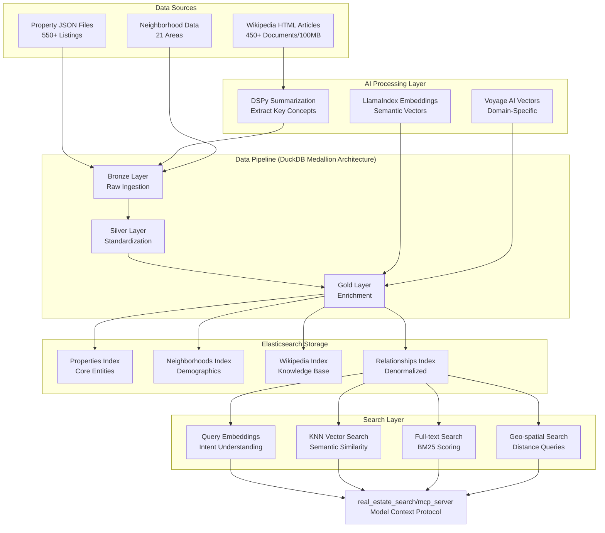
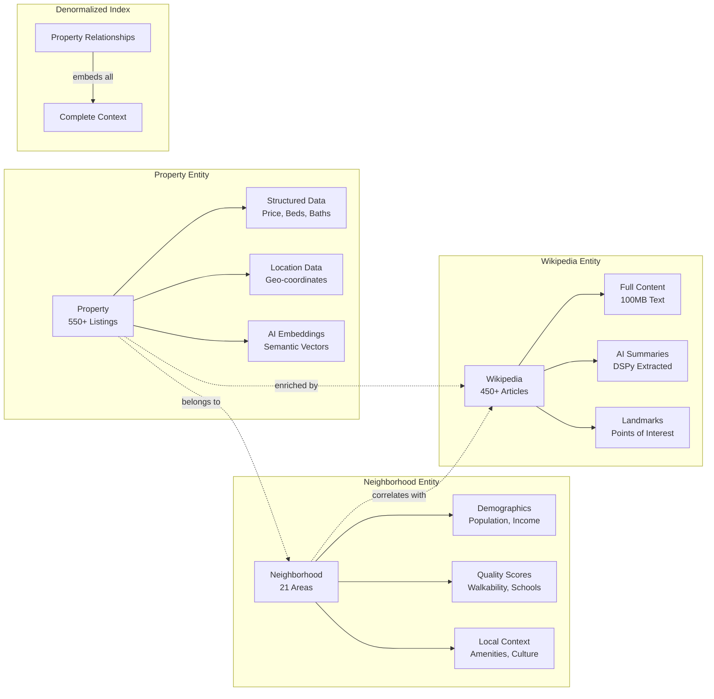

# Real Estate AI Search

This repository demonstrates both **GraphRAG** and **RAG** architectures through two production-ready real estate search implementations, alongside comprehensive tools for Wikipedia content processing and semantic search using generative AI and embeddings. The data is ingested via a DuckDB-based medallion architecture pipeline, providing efficient local data processing with SQL-first transformations. The core modules showcase how to build AI-driven data pipelines for both approaches. GraphRAG uses Neo4j where embeddings are stored as node properties within the graph database for unified hybrid search. RAG leverages Elasticsearch with vector search capabilities. Both implementations demonstrate how to prepare, process, and serve data for generative AI applications.

### Core AI Capabilities
- **Neo4j GraphRAG Implementation**: Graph-based retrieval system with native vector search, combining knowledge graph relationships with semantic embeddings for enhanced accuracy
- **Elasticsearch RAG Implementation**: RAG pipeline with hybrid text and vector search, faceted filtering, and relevance scoring for scalable retrieval
- **ChromaDB Embedding Prototyping**: Rapid prototyping environment for comparing embedding models directly with built-in benchmarking and evaluation metrics
- **DSPy Content Classification**: Advanced generative AI framework for intelligent content extraction with Chain-of-Thought reasoning
- **Multi-Model Embeddings**: Support for Ollama, OpenAI, Gemini, and Voyage AI models with automated benchmarking
- **LLM Summarization Pipeline**: Structured information extraction from Wikipedia with confidence scoring
- **Hybrid Scoring Algorithm**: Combines vector similarity, graph centrality, and feature richness for optimal search relevance
- **Semantic Chunking**: AI-powered text segmentation using embedding similarity boundaries
- **Real Estate Property Analysis**: Embedding generation and comparison for synthetic property and neighborhood data

## Project Overview

### Data Overview

The project utilizes three primary datasets to demonstrate comprehensive AI search capabilities:

- **Real Estate Property Listings (Synthetic - AI Generated)**: ~2,000 property listings across San Francisco Bay Area and Park City, Utah. Each property includes detailed specifications (bedrooms, bathrooms, square footage), precise geographic coordinates, pricing information, amenities, and rich text descriptions suitable for semantic search.

- **Neighborhood Information (Synthetic - AI Generated)**: Comprehensive neighborhood profiles for ~100 neighborhoods featuring walkability scores, transit accessibility, school ratings, safety metrics, lifestyle characteristics, local amenities, and detailed narrative descriptions capturing the unique character of each area.

- **Wikipedia Articles (Real Data)**: 500+ curated Wikipedia articles covering cities, landmarks, historical events, and cultural topics relevant to the property locations. Articles include full text content, metadata, and have been processed for optimal retrieval and semantic understanding.

### Core Architectural Patterns

The Real Estate AI Search System employs a sophisticated pipeline architecture where data flows through distinct transformation stages, each adding semantic richness and searchability through AI-powered enrichment. This design elevates the system beyond traditional search applications by creating a knowledge graph that connects properties, neighborhoods, and encyclopedic content in meaningful ways.

#### System Architecture Overview



#### Key Architectural Components

**1. Multi-Stage Data Pipeline (DuckDB Medallion Architecture)**
The system processes raw data through a medallion architecture using DuckDB's columnar OLAP engine:

- **Bronze Layer - Raw Ingestion**: Direct file operations using DuckDB's native readers (read_json_auto, read_parquet) for property JSON, Wikipedia HTML, and neighborhood CSVs
- **Silver Layer - Standardization**: SQL-first transformations to clean, validate, and standardize data types with consistent schemas across all entities
- **Gold Layer - Enrichment**: Business logic and data enrichment including relationship building, feature engineering, and preparation for embedding generation
- **Embedding Generation**: LlamaIndex and Voyage AI create 1024-dimensional vectors from Gold layer data, capturing semantic meaning of all text content
- **Output Writers**: Parallel export to Parquet files for archival and Elasticsearch bulk indexing for search applications
- **Post-Processing**: Final transformations including metadata enrichment and index optimization for different query patterns

**2. AI-Powered Search Capabilities**
The search layer combines multiple retrieval methods enhanced by generative AI:

- **Semantic Search**: Query embeddings generated through LlamaIndex/Voyage AI enable natural language understanding ("cozy family home near parks")
- **Hybrid Scoring**: Combines vector similarity, BM25 text relevance, geographic proximity, and feature matching for optimal results
- **Query Understanding**: DSPy models parse intent, extracting entities, attributes, and constraints from natural language
- **KNN Vector Search**: HNSW algorithm searches 1024-dimensional space in milliseconds, finding conceptually similar properties

For a comprehensive deep-dive into the system architecture, implementation patterns, and design decisions, see [ARCHITECTURE_IN_DEPTH.md](./ARCHITECTURE_IN_DEPTH.md).

### [1. Wikipedia Summarization](./wiki_summary/README.md)
**Purpose**: Use generative AI with DSPy for Context Engineering and LLM Calling  
**Key Features**:
- **AI Content Classification**: Employs generative AI models to classify and extract relevant content
- **DSPy Pipeline**: Uses DSPy framework for structured Chain-of-Thought reasoning and prompt optimization
- **Dual Processing**: Combines HTML parsing with LLM understanding for accurate extraction
- **Confidence Scoring**: AI-generated confidence scores for location data and topic relevance
- **Key Topic Extraction**: Generative AI identifies and categorizes main topics from articles

---

### [2. DuckDB Data Pipeline](./squack_pipeline_v2/)
**Purpose**: DuckDB-based medallion architecture pipeline for efficient local data processing with Vector Embeddings using LlamaIndex  
**Key Features**:
- **Medallion Architecture**: Bronze → Silver → Gold data quality tiers with clear separation of concerns
- **SQL-First Design**: All transformations in SQL leveraging DuckDB's columnar OLAP engine
- **Direct File Operations**: Native readers for JSON, Parquet, and CSV without Python intermediaries
- **Vector Embedding Integration**: Coordinates embedding generation across multiple providers like Voyage, Ollama, OpenAI, and Gemini
- **Output to Multiple Stores**: Writes to Parquet files and Elasticsearch indices with bulk operations

---

### [3. Elasticsearch Real Estate RAG](./real_estate_search/)
**Purpose**: Elasticsearch-based RAG real estate and Wikipedia search demonstrating Vector Search, Full Text Search, and Hybrid Search capabilities  
**Key Features**:
- **Vector Search**: 1024-dimensional embeddings with k-NN search for semantic similarity
- **Full Text Search**: BM25-based text search with multi-field queries and relevance scoring
- **Hybrid Search**: Combines vector similarity with text relevance for optimal results
- **Data Ingestion & Processing**: Scalable pipeline for indexing properties, neighborhoods, and Wikipedia content
- **Geographic Search**: Intelligent radius search with coordinate-based ranking
- **Faceted Search**: AI-driven faceted search and dynamic filtering
- **Type Safety**: Pydantic models with AI validation and comprehensive error handling

---

### [4. Neo4j GraphRAG Real Estate Search](./graph_real_estate/)
**Purpose**: Neo4j-based GraphRAG system for intelligent property and Wikipedia search with knowledge graph relationships  
**Key Features**:
- **Neo4j Native Vector Search**: 1024-dimensional embeddings with ANN (Approximate Nearest Neighbor) indexing
- **Hybrid Scoring Algorithm**: Combines vector similarity, graph centrality, and feature richness
- **Knowledge Graph Structure**: Properties, neighborhoods, features, and Wikipedia articles connected through semantic relationships
- **Multi-Provider Embeddings**: Support for Ollama, OpenAI, and Gemini models
- **Advanced Graph Queries**: Relationship-aware retrieval using Cypher queries
- **Natural Language Search**: "modern condo with city views", "family home near schools"

---

### [5. Common Embeddings](./common_embeddings/)
**Purpose**: Testing LlamaIndex Semantic Chunking and embedding evaluations using Voyage, Ollama and OpenAI with ChromaDB  
**Key Features**:
- **Semantic Chunking**: LlamaIndex-powered intelligent text segmentation
- **Multi-Provider Comparison**: Benchmarks Voyage, Ollama, and OpenAI embeddings
- **ChromaDB Integration**: Vector storage and retrieval testing
- **Evaluation Metrics**: Comprehensive accuracy and performance analysis
- **Chunking Strategies**: Compare semantic vs fixed-size chunking approaches
- **Retrieval Testing**: End-to-end RAG pipeline evaluation

---

## Generative AI Technologies

This project leverages an extensive suite of cutting-edge generative AI frameworks, models, and techniques:

### Core AI Frameworks

| Framework | Purpose | Modules Using It |
|-----------|---------|-----------------|
| **LlamaIndex** | Document processing, embedding generation, semantic chunking | `real_estate_embed`, `wiki_embed` |
| **DSPy (Stanford)** | LLM programming, Chain-of-Thought reasoning, prompt optimization | `wiki_summary` |

### Infrastructure & Storage

| System | Purpose | Modules Using It |
|--------|---------|-----------------|
| **Neo4j** | Graph database with native vector indexing for GraphRAG, hybrid search, and relationship-aware retrieval | `graph_real_estate` |
| **Elasticsearch** | Hybrid text/vector search, RAG retrieval layer | `real_estate_search`, `wiki_embed` |
| **ChromaDB** | Vector database for embedding storage and similarity search | `real_estate_embed`, `wiki_embed` |
| **SQLite** | Lightweight relational database for article metadata | `wiki_crawl`, `wiki_summary` |

### Embedding Models & Providers

| Provider | Models | Capabilities | Use Cases |
|----------|--------|--------------|-----------|
| **Ollama (Local)** | `nomic-embed-text` (768d), `mxbai-embed-large` (1024d) | Privacy-preserving, no API costs | Development, sensitive data |
| **Claude (Anthropic)** | Claude 4 Opus, Sonnet | Advanced reasoning, long context, tool calling | Complex analysis, summarization |
| **Google Gemini** | `models/embedding-001` | Cloud-scale, multilingual | Production deployments |
| **VoyageAI** | `voyage-3`, `voyage-finance-2` | Domain-optimized embeddings | Specialized search |
| **OpenAI** | `text-embedding-3-*` | Industry standard | Baseline comparisons |

### Language Models (LLMs)

| Provider | Access Method | Models | Primary Use |
|----------|--------------|--------|-------------|
| **OpenRouter** | API Gateway | GPT-4, Claude, Llama, 100+ models | Content summarization |
| **OpenAI** | Direct API | GPT-4o, GPT-4o-mini | High-quality generation |
| **Google Gemini** | Direct API | Gemini Pro, Gemini Ultra | Multimodal understanding |
| **Ollama** | Local deployment | Llama 3, Mistral, Phi | Privacy-sensitive tasks |

### Advanced AI Techniques Implemented

#### Embedding & Vector Search
- **Semantic Chunking**: AI-powered text segmentation using embedding similarity boundaries
- **Augmented Embeddings**: Enhanced chunks with contextual summaries for better retrieval
- **Hybrid Search**: Combining BM25 text scoring with vector similarity
- **Multi-Model Benchmarking**: Automated comparison across embedding providers

#### AI Content Intelligence
- **Chain-of-Thought (CoT) Reasoning**: Multi-step AI logical analysis for classification
- **AI Structured Data Extraction**: Converting unstructured text to typed schemas using LLMs
- **AI Summarization**: Intelligent content summarization with key information extraction
- **AI Confidence Scoring**: Probabilistic quality assessment of extractions
- **AI Content Classification Pipeline**: Multi-stage AI filtering and categorization

#### RAG & GraphRAG Preparation
- **Document Preprocessing**: Optimized chunking for LLM context windows
- **Metadata Enrichment**: Adding semantic tags for improved retrieval
- **Knowledge Graph Structuring**: Preparing data for Neo4j relationships
- **Relevance Filtering**: Domain-specific content evaluation

## Getting Started

### Installation

#### 1. Set Up Python Environment
```bash
# Create virtual environment
python -m venv venv

# Activate virtual environment
# On macOS/Linux:
source venv/bin/activate
# On Windows:
venv\Scripts\activate

# Upgrade pip
pip install --upgrade pip
```

#### 2. Install Dependencies
```bash
# Install all dependencies using pyproject.toml
pip install -e .
```

#### 3. Install and Configure Ollama (for local embeddings)
```bash
# macOS
brew install ollama

# Linux
curl -fsSL https://ollama.ai/install.sh | sh

# Start Ollama server
ollama serve

# Pull embedding models
ollama pull nomic-embed-text
ollama pull mxbai-embed-large
```

#### 4. Configure API Keys (optional)
For enhanced functionality with external APIs:

```bash
# Create .env file in project root
cp .env.example .env

# Edit .env and add your API keys:
# OPENAI_API_KEY=your-key-here
# OPENROUTER_API_KEY=your-key-here
# GEMINI_API_KEY=your-key-here
# VOYAGE_API_KEY=your-key-here
# NEO4J_URI=bolt://localhost:7687
# NEO4J_USER=neo4j
# NEO4J_PASSWORD=password
```

## Common Workflows

### Complete Wikipedia Pipeline

If you want to run this demo from scratch let me know and I would be happy to help you get set up and download the wikipedia data.

The wiki_crawl module is a WIP. However it works pretty well if you just ask your friendly local LLM like Claude Code to download wikipedia articles using the wiki_crawl module.

After you have that everything else is automated.

```bash
Process Wikipedia data from crawling to searchable embeddings:

```bash
# 1. Generate summaries with DSPy
python wiki_summary/summarize_main.py --limit 50

# 2. Run DuckDB pipeline for Wikipedia data
python -m squack_pipeline_v2 --entities wikipedia

# 3. Test embeddings with LlamaIndex
python -m common_embeddings.main evaluate
```

### Elasticsearch Real Estate Search

Run Elasticsearch locally using the [Elastic Quick Start Guide](https://www.elastic.co/docs/deploy-manage/deploy/self-managed/local-development-installation-quickstart#local-dev-quick-start).

Complete pipeline flow for Elasticsearch-based real estate search:

```bash
# 1. Create indexes with proper mappings
python -m real_estate_search.management setup-indices --clear

# 2. Run data pipeline to process and index data
python -m squack_pipeline_v2

# 3. Enrich Wikipedia articles for full-text search
python -m real_estate_search.management enrich-wikipedia

# 4. Build Property Relationships Index
# After all data is loaded, build the denormalized property_relationships index
python -m real_estate_search.management setup-indices --build-relationships

# 5. Run search demos using the demo runner script
./elastic_demos.sh --list  # Show all available demos
./elastic_demos.sh         # Run default demo (Rich Property Listing)
./elastic_demos.sh 10      # Run specific demo (Wikipedia full-text search)
./elastic_demos.sh 15 -v   # Run with verbose output to see query DSL
```

See [real_estate_search/README.md](./real_estate_search/README.md) for more details on the complete pipeline flow and available demos.

### Neo4j GraphRAG Pipeline
Build a complete GraphRAG system with Neo4j:

```bash
# 1. Setup Neo4j with Docker
docker-compose up -d

# 2. Run DuckDB pipeline to populate Neo4j
python -m squack_pipeline_v2 --output neo4j

# 3. Test hybrid search
python graph_real_estate/search_properties.py "modern condo with city views" --demo
```


### Neighborhood Research
Find Wikipedia pages for specific neighborhoods:

```bash
# Search for neighborhood pages
python wiki_crawl/wikipedia_location_crawler.py search real_estate_data/neighborhoods_sf.json

# Quick preview
python wiki_crawl/wikipedia_location_crawler.py quick real_estate_data/neighborhoods_pc.json
```

## Data Organization

### Knowledge Graph Architecture
The system creates a rich knowledge graph connecting three primary entity types:



### Directory Structure
```
real_estate_ai_search/
├── data/                      # Shared data directory
│   ├── parquet/              # Parquet files for Spark processing
│   ├── chroma_db/            # ChromaDB vector storage
│   ├── wikipedia/            # Wikipedia articles and pages
│   │   ├── pages/           # HTML files
│   │   └── wikipedia.db     # SQLite database
│   └── embeddings/          # Generated embeddings
│
├── squack_pipeline_v2/       # DuckDB Data Pipeline (Current)
│   ├── bronze/             # Raw data ingestion layer
│   ├── silver/             # Data standardization layer
│   ├── gold/               # Business logic & enrichment
│   ├── embeddings/         # Vector generation
│   └── writers/            # Output to Parquet/Elasticsearch
│
├── squack_pipeline/          # Legacy Spark Pipeline
│   ├── core/               # Core pipeline components
│   └── outputs/            # Output writers
│
├── graph_real_estate/        # Neo4j GraphRAG module
│   ├── src/                # Source code
│   │   ├── models/        # Pydantic models
│   │   ├── vectors/       # Embedding pipeline
│   │   └── database/      # Neo4j client
│   └── search_properties.py # Hybrid search
│
├── real_estate_search/       # Elasticsearch RAG module
│   ├── api/                # FastAPI endpoints
│   ├── models/             # Data models
│   └── search/             # Search logic
│
├── common_embeddings/        # Embedding evaluation
│   ├── chunkers/           # Semantic chunking
│   ├── embedders/          # Multi-provider embeddings
│   └── evaluators/         # Performance metrics
│
└── real_estate_data/         # Source data
    ├── properties_*.json    # Property datasets
    └── neighborhoods_*.json # Neighborhood datasets
```

## Testing

Each module includes its own test suite:

```bash
# Test real estate embeddings
python -m real_estate_embed.main test --model nomic-embed-text

# Test Wikipedia summarization
python wiki_summary/validation.py quick

# Test Wikipedia embeddings
python -m wiki_embed.test_eval

# Run all unit tests
python -m pytest tests/
```

## Contributing

Contributions are welcome! Please:
1. Fork the repository
2. Create a feature branch
3. Make your changes
4. Add tests if applicable
5. Submit a pull request

## License

MIT License for code. Wikipedia content is under CC BY-SA 3.0.

### Wikipedia Content Attribution

This project retrieves and processes content from Wikipedia. Please review the [Wikipedia Attribution Guidelines](WIKIPEDIA_ATTRIBUTION.md) for important information about:
- Proper attribution requirements
- CC BY-SA 3.0 license compliance  
- How to display Wikipedia content in your application
- API usage with Wikipedia-enriched data

All Wikipedia content used by this system remains under its original [CC BY-SA 3.0](https://creativecommons.org/licenses/by-sa/3.0/) license.

## Acknowledgments

- **LlamaIndex**: For the embedding framework
- **Ollama**: For local LLM support
- **ChromaDB**: For vector storage
- **Wikipedia**: For content (CC BY-SA 3.0)
- **DSPy**: For structured LLM interactions