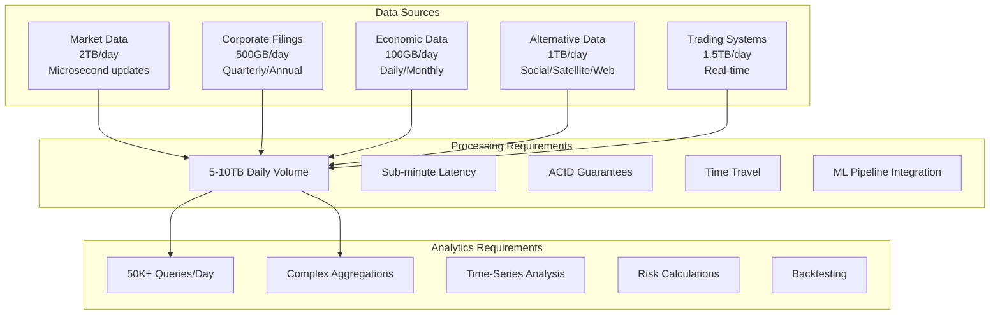
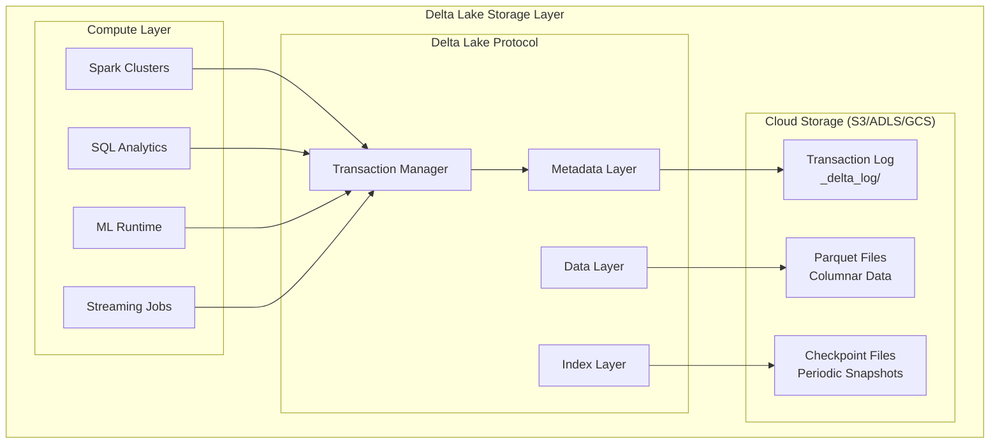
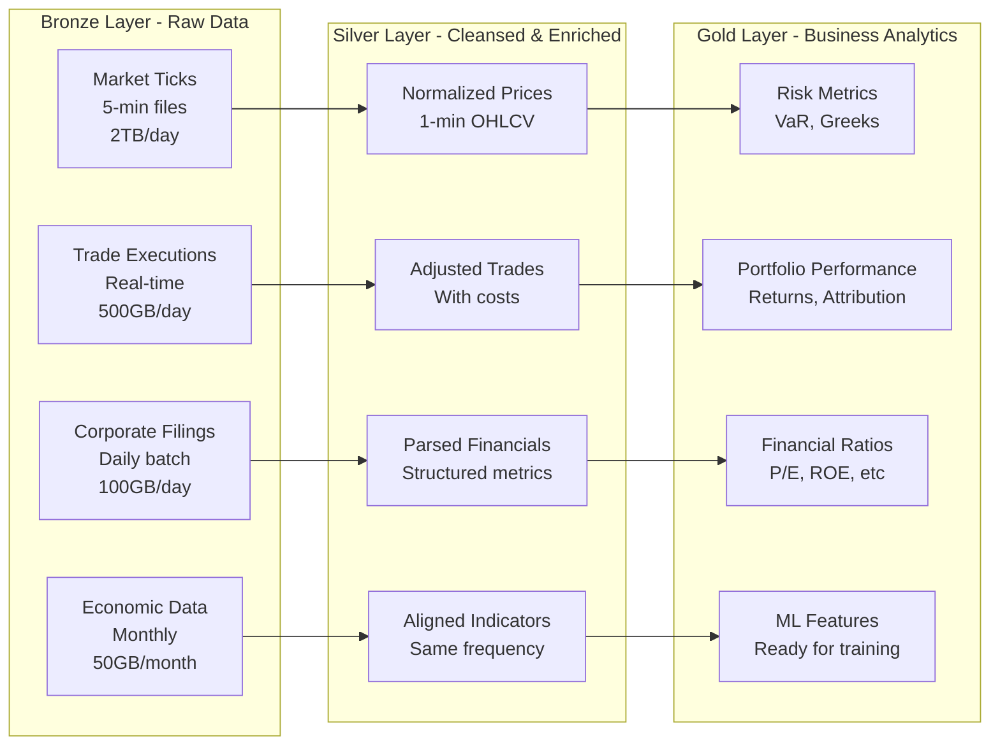

# Databricks Delta Lake at Scale: A Comprehensive Real-World Case Study
## Financial Analytics Platform - QuantumCapital Analytics

### Table of Contents
1. [Executive Summary](#executive-summary)
2. [Company Background and Requirements](#company-background-and-requirements)
3. [Delta Lake Architecture and Core Concepts](#delta-lake-architecture-and-core-concepts)
4. [Medallion Architecture for Financial Data](#medallion-architecture-for-financial-data)
5. [ACID Transactions and Time Travel](#acid-transactions-and-time-travel)
6. [Data Processing Pipelines with Spark](#data-processing-pipelines-with-spark)
7. [Performance Optimization Techniques](#performance-optimization-techniques)
8. [Streaming and Batch Unification](#streaming-and-batch-unification)
9. [Advanced Analytics and ML Integration](#advanced-analytics-and-ml-integration)
10. [Data Governance and Security](#data-governance-and-security)
11. [Cost Optimization Strategies](#cost-optimization-strategies)
12. [Best Practices and Anti-Patterns](#best-practices-and-anti-patterns)

---

## Executive Summary

QuantumCapital Analytics, a leading quantitative hedge fund and financial analytics firm, processes **5-10 TB of financial data daily**, including market tick data, corporate filings, economic indicators, alternative data sources, and real-time trading feeds. Their platform serves **500+ quantitative analysts** running **50,000+ complex analytical queries daily** with requirements for both batch and real-time processing.

This case study details their journey from a traditional data warehouse and Hadoop-based data lake to a unified Databricks Delta Lake platform handling petabytes of financial data, implementing advanced features including ACID transactions, time travel for regulatory compliance, and machine learning pipelines for predictive analytics.

### Key Achievements
- **Data Volume**: 5 PB total storage, ingesting 5-10 TB daily
- **Query Performance**: 10x improvement in analytical query performance
- **Cost Reduction**: 65% reduction in infrastructure costs vs traditional warehouse
- **Data Freshness**: Near real-time data availability (< 5 minute latency)
- **Compliance**: Complete audit trail with time travel for 7 years
- **ML Pipeline**: 200+ models in production, refreshed hourly

---

## Company Background and Requirements

### Business Context

QuantumCapital Analytics provides quantitative analysis and algorithmic trading strategies to institutional investors. Their platform must:

1. **Process diverse financial data**: Market data, corporate financials, economic indicators, alternative data
2. **Handle multiple data velocities**: Real-time streaming (microsecond), near real-time (seconds), batch (daily/monthly)
3. **Support complex analytics**: Time-series analysis, risk calculations, portfolio optimization, backtesting
4. **Enable machine learning**: Feature engineering, model training, real-time inference
5. **Ensure regulatory compliance**: Complete audit trails, data lineage, GDPR/CCPA compliance
6. **Scale horizontally**: Handle exponential data growth from new data sources

### Technical Requirements



### Detailed Functional Requirements

#### 1. Data Processing Pipeline
- **Volume**: 5-10 TB daily ingestion across 100+ data sources
- **Formats**: Parquet, JSON, CSV, Avro, Protocol Buffers, FIX messages
- **Latency**: Market data available within 1 second, other data within 5 minutes
- **Quality**: Data validation, deduplication, outlier detection
- **Lineage**: Complete tracking from source to consumption

#### 2. Analytical Capabilities
- **Time-series analysis**: Rolling windows, seasonal adjustments, trend analysis
- **Risk metrics**: VaR, CVaR, Sharpe ratios, correlation matrices
- **Portfolio optimization**: Markowitz optimization, factor models
- **Backtesting**: Historical simulation with point-in-time data
- **Real-time scoring**: ML model inference on streaming data

#### 3. Compliance Requirements
- **Audit trail**: 7-year retention with time travel capabilities
- **Data governance**: Column-level security, PII masking
- **Regulatory reporting**: MiFID II, Basel III, Dodd-Frank
- **Disaster recovery**: RPO < 1 hour, RTO < 4 hours

---

## Delta Lake Architecture and Core Concepts

### Understanding Delta Lake

Delta Lake is an open-source storage framework that brings reliability to data lakes. It provides:

**ACID Transactions**: Atomicity, Consistency, Isolation, and Durability guarantees on data lakes
**Scalable Metadata**: Handles petabyte-scale tables with billions of files
**Time Travel**: Query data at any point in history
**Schema Evolution**: Safe schema changes without rewriting data
**Unified Batch and Streaming**: Same table serves both workloads

### Delta Lake Storage Architecture



### Transaction Log Deep Dive

The transaction log is the foundation of Delta Lake's ACID guarantees:

```python
# Understanding the transaction log structure
"""
The _delta_log directory contains JSON files that record every transaction:

_delta_log/
  00000000000000000000.json  # First transaction
  00000000000000000001.json  # Second transaction
  00000000000000000002.json  # Third transaction
  ...
  00000000000000000010.checkpoint.parquet  # Checkpoint at version 10
  00000000000000000011.json  # Continues after checkpoint
"""

# Example transaction log entry
transaction_log_entry = {
    "commitInfo": {
        "timestamp": 1700123456789,
        "userId": "analyst_123",
        "userName": "john.doe@quantumcapital.com",
        "operation": "MERGE",
        "operationParameters": {
            "predicate": "target.trade_id = source.trade_id",
            "matchedPredicates": "[{\"actionType\":\"update\"}]"
        },
        "readVersion": 41,
        "isolationLevel": "Serializable",
        "isBlindAppend": False
    },
    "add": {
        "path": "part-00001-tid-123456-guid.parquet",
        "partitionValues": {
            "year": "2024",
            "month": "03",
            "day": "15"
        },
        "size": 104857600,  # 100MB
        "modificationTime": 1700123456000,
        "dataChange": True,
        "stats": {
            "numRecords": 1000000,
            "minValues": {
                "price": 10.50,
                "volume": 100,
                "timestamp": "2024-03-15T09:30:00Z"
            },
            "maxValues": {
                "price": 150.75,
                "volume": 1000000,
                "timestamp": "2024-03-15T16:00:00Z"
            }
        }
    },
    "remove": {
        "path": "part-00000-tid-123455-guid.parquet",
        "deletionTimestamp": 1700123456789,
        "dataChange": True
    }
}
```

### Delta Lake vs Traditional Approaches

```python
# Traditional Data Lake Challenges and Delta Lake Solutions

class TraditionalDataLake:
    """
    Problems with traditional Parquet/ORC-based data lakes
    """
    def update_record(self, record_id, new_values):
        # PROBLEM: No updates, must rewrite entire partition
        # 1. Read entire partition (could be GBs)
        df = spark.read.parquet(f"s3://bucket/data/partition={partition}")
        
        # 2. Update in memory
        df_updated = df.filter(df.id != record_id).union(new_values)
        
        # 3. Rewrite entire partition
        df_updated.write.mode("overwrite").parquet(f"s3://bucket/data/partition={partition}")
        # Risk: Concurrent readers see partial data during write
        
    def handle_late_data(self, late_records):
        # PROBLEM: Late arriving data requires reprocessing
        # Must rewrite historical partitions
        pass
        
    def ensure_consistency(self):
        # PROBLEM: No ACID guarantees
        # Multiple writers can corrupt data
        # Readers might see partial writes
        pass

class DeltaLakeApproach:
    """
    Delta Lake solutions to these problems
    """
    def update_record(self, record_id, new_values):
        # SOLUTION: MERGE operation with ACID guarantees
        delta_table = DeltaTable.forPath(spark, "s3://bucket/delta_table")
        
        delta_table.alias("target").merge(
            new_values.alias("source"),
            "target.id = source.id"
        ).whenMatchedUpdate(
            set={"price": "source.price", "updated_at": "current_timestamp()"}
        ).whenNotMatchedInsert(
            values={"id": "source.id", "price": "source.price"}
        ).execute()
        # Atomic operation, readers see consistent view
        
    def handle_late_data(self, late_records):
        # SOLUTION: Just append, Delta handles it
        late_records.write.format("delta").mode("append").save("s3://bucket/delta_table")
        # Automatic data versioning, no reprocessing needed
        
    def ensure_consistency(self):
        # SOLUTION: Built-in ACID guarantees via transaction log
        # Optimistic concurrency control prevents conflicts
        # Readers always see consistent snapshots
        pass
```

---

## Medallion Architecture for Financial Data

### Three-Layer Data Architecture

QuantumCapital implements a medallion architecture optimized for financial data:



### Bronze Layer Implementation

```python
# Bronze Layer: Raw data ingestion with minimal transformation
from pyspark.sql import SparkSession
from delta import DeltaTable
import pyspark.sql.functions as F
from pyspark.sql.types import *

class BronzeLayer:
    """
    Bronze layer ingests raw data with minimal processing
    Only PII removal and basic metadata addition
    """
    
    def __init__(self, spark: SparkSession):
        self.spark = spark
        self.bronze_path = "s3://quantumcapital/delta/bronze"
        
    def ingest_market_data(self, source_path: str, asset_class: str):
        """
        Ingest high-frequency market data
        """
        # Define schema for market data (enforce consistency)
        market_schema = StructType([
            StructField("timestamp", TimestampType(), False),
            StructField("symbol", StringType(), False),
            StructField("bid_price", DecimalType(18, 8), True),
            StructField("ask_price", DecimalType(18, 8), True),
            StructField("bid_size", LongType(), True),
            StructField("ask_size", LongType(), True),
            StructField("last_price", DecimalType(18, 8), True),
            StructField("last_size", LongType(), True),
            StructField("exchange", StringType(), True),
            StructField("conditions", ArrayType(StringType()), True)
        ])
        
        # Read raw data
        df_raw = (
            self.spark.readStream if asset_class == "equities" else self.spark.read
        ).schema(market_schema).json(source_path)
        
        # Add metadata for lineage and debugging
        df_bronze = (
            df_raw
            .withColumn("_ingestion_timestamp", F.current_timestamp())
            .withColumn("_source_file", F.input_file_name())
            .withColumn("_asset_class", F.lit(asset_class))
            .withColumn("_data_date", F.to_date(F.col("timestamp")))
            .withColumn("_partition_hour", F.hour(F.col("timestamp")))
        )
        
        # Write to Bronze Delta table with partitioning
        bronze_table_path = f"{self.bronze_path}/market_data/{asset_class}"
        
        if isinstance(df_bronze, DataFrame):  # Batch mode
            (
                df_bronze.write
                .format("delta")
                .mode("append")
                .partitionBy("_data_date", "_partition_hour")
                .option("mergeSchema", "true")  # Handle schema evolution
                .option("optimizeWrite", "true")  # Optimize file sizes
                .save(bronze_table_path)
            )
        else:  # Streaming mode
            (
                df_bronze.writeStream
                .format("delta")
                .outputMode("append")
                .option("checkpointLocation", f"{bronze_table_path}/_checkpoint")
                .partitionBy("_data_date", "_partition_hour")
                .trigger(processingTime="10 seconds")  # Micro-batch every 10 seconds
                .start(bronze_table_path)
            )
        
        # Register as table for SQL access
        self.spark.sql(f"""
            CREATE TABLE IF NOT EXISTS bronze.market_data_{asset_class}
            USING DELTA
            LOCATION '{bronze_table_path}'
        """)
        
        # Set table properties for optimization
        self.spark.sql(f"""
            ALTER TABLE bronze.market_data_{asset_class}
            SET TBLPROPERTIES (
                'delta.autoOptimize.optimizeWrite' = 'true',
                'delta.autoOptimize.autoCompact' = 'true',
                'delta.dataSkippingNumIndexedCols' = '32',
                'delta.deletedFileRetentionDuration' = 'interval 7 days',
                'delta.logRetentionDuration' = 'interval 30 days'
            )
        """)
        
    def ingest_corporate_filings(self, filings_path: str):
        """
        Ingest corporate filings with extracted financial metrics
        """
        # Schema for structured financial data extracted from filings
        filing_schema = StructType([
            StructField("company_id", StringType(), False),
            StructField("filing_type", StringType(), False),  # 10-K, 10-Q, 8-K
            StructField("filing_date", DateType(), False),
            StructField("period_end_date", DateType(), False),
            StructField("metrics", MapType(StringType(), DoubleType()), True),
            # metrics includes: revenue, net_income, eps, total_assets, etc.
            StructField("text_sections", MapType(StringType(), StringType()), True),
            StructField("raw_filing_url", StringType(), True)
        ])
        
        df_filings = self.spark.read.schema(filing_schema).json(filings_path)
        
        # Extract and flatten key metrics for easier querying
        df_bronze_filings = (
            df_filings
            .withColumn("revenue", F.col("metrics.revenue"))
            .withColumn("net_income", F.col("metrics.net_income"))
            .withColumn("total_assets", F.col("metrics.total_assets"))
            .withColumn("total_liabilities", F.col("metrics.total_liabilities"))
            .withColumn("_ingestion_timestamp", F.current_timestamp())
            .withColumn("_source_file", F.input_file_name())
        )
        
        # Deduplicate filings (companies sometimes file amendments)
        df_deduped = (
            df_bronze_filings
            .withColumn("_rank", F.row_number().over(
                Window.partitionBy("company_id", "filing_type", "period_end_date")
                .orderBy(F.col("filing_date").desc())
            ))
            .filter(F.col("_rank") == 1)
            .drop("_rank")
        )
        
        # Write to Bronze layer with automatic schema evolution
        bronze_filings_path = f"{self.bronze_path}/corporate_filings"
        
        df_deduped.write \
            .format("delta") \
            .mode("append") \
            .partitionBy("filing_date") \
            .option("mergeSchema", "true") \
            .save(bronze_filings_path)
```

### Silver Layer Implementation

```python
# Silver Layer: Data cleansing, normalization, and enrichment
class SilverLayer:
    """
    Silver layer performs data quality checks, normalization,
    and enrichment to create analysis-ready datasets
    """
    
    def __init__(self, spark: SparkSession):
        self.spark = spark
        self.silver_path = "s3://quantumcapital/delta/silver"
        
    def create_normalized_prices(self):
        """
        Create normalized 1-minute OHLCV bars from tick data
        Handles corporate actions, splits, dividends
        """
        # Read from Bronze
        df_ticks = self.spark.read.format("delta").load(
            "s3://quantumcapital/delta/bronze/market_data/equities"
        )
        
        # Create 1-minute bars
        df_bars = (
            df_ticks
            .withColumn("minute", F.date_trunc("minute", F.col("timestamp")))
            .groupBy("symbol", "minute")
            .agg(
                F.first("last_price").alias("open"),
                F.max("last_price").alias("high"),
                F.min("last_price").alias("low"),
                F.last("last_price").alias("close"),
                F.sum("last_size").alias("volume"),
                F.count("*").alias("tick_count"),
                F.avg("bid_price").alias("avg_bid"),
                F.avg("ask_price").alias("avg_ask"),
                F.avg((F.col("ask_price") - F.col("bid_price"))).alias("avg_spread")
            )
            .withColumn("vwap", 
                F.when(F.col("volume") > 0, 
                    F.col("close") * F.col("volume") / F.col("volume")
                ).otherwise(F.col("close"))
            )
        )
        
        # Apply corporate action adjustments
        df_adjustments = self.spark.read.format("delta").load(
            "s3://quantumcapital/delta/bronze/corporate_actions"
        )
        
        df_adjusted = (
            df_bars.alias("bars")
            .join(
                df_adjustments.alias("adj"),
                (F.col("bars.symbol") == F.col("adj.symbol")) &
                (F.col("bars.minute") >= F.col("adj.ex_date")),
                "left"
            )
            .withColumn("adjustment_factor", 
                F.coalesce(F.col("adj.adjustment_factor"), F.lit(1.0))
            )
            .withColumn("adjusted_open", F.col("open") * F.col("adjustment_factor"))
            .withColumn("adjusted_high", F.col("high") * F.col("adjustment_factor"))
            .withColumn("adjusted_low", F.col("low") * F.col("adjustment_factor"))
            .withColumn("adjusted_close", F.col("close") * F.col("adjustment_factor"))
            .withColumn("adjusted_vwap", F.col("vwap") * F.col("adjustment_factor"))
        )
        
        # Data quality checks
        df_validated = (
            df_adjusted
            .filter(
                # Remove obvious data errors
                (F.col("high") >= F.col("low")) &
                (F.col("high") >= F.col("open")) &
                (F.col("high") >= F.col("close")) &
                (F.col("low") <= F.col("open")) &
                (F.col("low") <= F.col("close")) &
                (F.col("volume") >= 0) &
                # Remove outliers (prices > 10x or < 0.1x from previous)
                (F.col("close") / F.lag("close").over(Window.partitionBy("symbol").orderBy("minute")) < 10) &
                (F.col("close") / F.lag("close").over(Window.partitionBy("symbol").orderBy("minute")) > 0.1)
            )
            .withColumn("data_quality_score", 
                F.when(F.col("tick_count") > 100, F.lit(1.0))
                .when(F.col("tick_count") > 10, F.lit(0.8))
                .when(F.col("tick_count") > 1, F.lit(0.5))
                .otherwise(F.lit(0.1))
            )
        )
        
        # Write to Silver layer with Z-ordering for query optimization
        silver_prices_path = f"{self.silver_path}/normalized_prices"
        
        df_validated.write \
            .format("delta") \
            .mode("overwrite") \
            .partitionBy("symbol") \
            .save(silver_prices_path)
        
        # Optimize with Z-ORDER for common query patterns
        DeltaTable.forPath(self.spark, silver_prices_path).optimize().executeZOrderBy("minute")
        
    def create_enriched_trades(self):
        """
        Enrich trade executions with costs, slippage, and market impact
        """
        # Read trade executions from Bronze
        df_trades = self.spark.read.format("delta").load(
            "s3://quantumcapital/delta/bronze/trade_executions"
        )
        
        # Read normalized prices for slippage calculation
        df_prices = self.spark.read.format("delta").load(
            f"{self.silver_path}/normalized_prices"
        )
        
        # Calculate transaction costs and slippage
        df_enriched = (
            df_trades.alias("t")
            .join(
                df_prices.alias("p"),
                (F.col("t.symbol") == F.col("p.symbol")) &
                (F.col("p.minute") == F.date_trunc("minute", F.col("t.execution_time"))),
                "left"
            )
            .withColumn("mid_price", (F.col("p.avg_bid") + F.col("p.avg_ask")) / 2)
            .withColumn("spread_cost", 
                F.abs(F.col("t.execution_price") - F.col("mid_price")) * F.col("t.quantity")
            )
            .withColumn("slippage_bps", 
                F.abs(F.col("t.execution_price") - F.col("t.order_price")) / 
                F.col("t.order_price") * 10000
            )
            .withColumn("market_impact_bps",
                F.when(F.col("t.quantity") > F.col("p.volume") * 0.1,
                    F.lit(10)  # Large order, high impact
                ).when(F.col("t.quantity") > F.col("p.volume") * 0.01,
                    F.lit(2)   # Medium order
                ).otherwise(F.lit(0.5))  # Small order
            )
            .withColumn("total_cost_usd",
                F.col("spread_cost") +
                (F.col("t.commission") + 
                 F.col("slippage_bps") * F.col("t.execution_price") * F.col("t.quantity") / 10000)
            )
        )
        
        # Write enriched trades to Silver
        df_enriched.write \
            .format("delta") \
            .mode("append") \
            .partitionBy("execution_date") \
            .save(f"{self.silver_path}/enriched_trades")
```

### Gold Layer Implementation

```python
# Gold Layer: Business-level aggregates and ML-ready features
class GoldLayer:
    """
    Gold layer creates business-level datasets optimized for
    analytics, reporting, and machine learning
    """
    
    def __init__(self, spark: SparkSession):
        self.spark = spark
        self.gold_path = "s3://quantumcapital/delta/gold"
        
    def calculate_risk_metrics(self):
        """
        Calculate portfolio risk metrics: VaR, CVaR, Greeks, correlations
        """
        # Read enriched price data
        df_prices = self.spark.read.format("delta").load(
            "s3://quantumcapital/delta/silver/normalized_prices"
        )
        
        # Calculate returns
        window_spec = Window.partitionBy("symbol").orderBy("minute")
        
        df_returns = (
            df_prices
            .withColumn("return_1min", 
                (F.col("adjusted_close") / F.lag("adjusted_close", 1).over(window_spec)) - 1
            )
            .withColumn("return_5min",
                (F.col("adjusted_close") / F.lag("adjusted_close", 5).over(window_spec)) - 1
            )
            .withColumn("return_1hr",
                (F.col("adjusted_close") / F.lag("adjusted_close", 60).over(window_spec)) - 1
            )
            .withColumn("return_1day",
                (F.col("adjusted_close") / F.lag("adjusted_close", 390).over(window_spec)) - 1
            )
            .filter(F.col("return_1min").isNotNull())
        )
        
        # Calculate rolling volatility (standard deviation of returns)
        df_volatility = (
            df_returns
            .withColumn("volatility_1hr",
                F.stddev("return_1min").over(
                    window_spec.rowsBetween(-60, 0)
                ) * F.sqrt(F.lit(60))  # Annualized
            )
            .withColumn("volatility_1day",
                F.stddev("return_5min").over(
                    window_spec.rowsBetween(-78, 0)  # 390 mins / 5
                ) * F.sqrt(F.lit(252))  # Annualized
            )
        )
        
        # Calculate Value at Risk (VaR) - 95% confidence
        df_var = (
            df_volatility
            .withColumn("var_95_1day",
                F.expr("percentile_approx(return_1day, 0.05)")
                .over(window_spec.rowsBetween(-252, 0))  # 1 year of daily returns
            )
            .withColumn("cvar_95_1day",  # Conditional VaR (Expected Shortfall)
                F.expr("""
                    avg(CASE WHEN return_1day <= var_95_1day THEN return_1day END)
                """).over(window_spec.rowsBetween(-252, 0))
            )
        )
        
        # Calculate correlation matrix for portfolio risk
        symbols = df_returns.select("symbol").distinct().limit(100).collect()
        symbol_list = [row.symbol for row in symbols]
        
        # Pivot returns for correlation calculation
        df_matrix = (
            df_returns
            .select("minute", "symbol", "return_1hr")
            .groupBy("minute")
            .pivot("symbol", symbol_list)
            .agg(F.first("return_1hr"))
            .na.fill(0)
        )
        
        # Calculate correlation using pandas (more efficient for this operation)
        correlation_matrix = df_matrix.toPandas().corr()
        
        # Store correlation matrix as Delta table
        df_corr = self.spark.createDataFrame(
            [(s1, s2, float(correlation_matrix.loc[s1, s2])) 
             for s1 in symbol_list for s2 in symbol_list],
            ["symbol1", "symbol2", "correlation"]
        )
        
        df_corr.write \
            .format("delta") \
            .mode("overwrite") \
            .save(f"{self.gold_path}/correlation_matrix")
        
        # Write risk metrics to Gold
        df_var.write \
            .format("delta") \
            .mode("overwrite") \
            .partitionBy("symbol") \
            .save(f"{self.gold_path}/risk_metrics")
            
    def create_ml_features(self):
        """
        Create feature store for machine learning models
        """
        # Technical indicators
        df_prices = self.spark.read.format("delta").load(
            "s3://quantumcapital/delta/silver/normalized_prices"
        )
        
        window_spec = Window.partitionBy("symbol").orderBy("minute")
        
        # Price-based features
        df_features = (
            df_prices
            # Moving averages
            .withColumn("sma_20", F.avg("adjusted_close").over(
                window_spec.rowsBetween(-20, 0)
            ))
            .withColumn("sma_50", F.avg("adjusted_close").over(
                window_spec.rowsBetween(-50, 0)
            ))
            .withColumn("ema_12", F.expr("""
                aggregate(
                    collect_list(adjusted_close) OVER (PARTITION BY symbol ORDER BY minute ROWS BETWEEN 11 PRECEDING AND CURRENT ROW),
                    cast(0 as double),
                    (acc, x) -> acc * 0.8462 + x * 0.1538
                )
            """))
            
            # Relative Strength Index (RSI)
            .withColumn("price_change", 
                F.col("adjusted_close") - F.lag("adjusted_close", 1).over(window_spec)
            )
            .withColumn("gain", F.when(F.col("price_change") > 0, F.col("price_change")).otherwise(0))
            .withColumn("loss", F.when(F.col("price_change") < 0, -F.col("price_change")).otherwise(0))
            .withColumn("avg_gain", F.avg("gain").over(window_spec.rowsBetween(-14, 0)))
            .withColumn("avg_loss", F.avg("loss").over(window_spec.rowsBetween(-14, 0)))
            .withColumn("rsi", 
                100 - (100 / (1 + F.col("avg_gain") / F.nullif(F.col("avg_loss"), 0)))
            )
            
            # Bollinger Bands
            .withColumn("bb_middle", F.col("sma_20"))
            .withColumn("bb_std", F.stddev("adjusted_close").over(
                window_spec.rowsBetween(-20, 0)
            ))
            .withColumn("bb_upper", F.col("bb_middle") + 2 * F.col("bb_std"))
            .withColumn("bb_lower", F.col("bb_middle") - 2 * F.col("bb_std"))
            .withColumn("bb_position", 
                (F.col("adjusted_close") - F.col("bb_lower")) / 
                (F.col("bb_upper") - F.col("bb_lower"))
            )
            
            # Volume features
            .withColumn("volume_ratio", 
                F.col("volume") / F.avg("volume").over(window_spec.rowsBetween(-20, 0))
            )
            .withColumn("dollar_volume", F.col("adjusted_close") * F.col("volume"))
            
            # Market microstructure
            .withColumn("spread_ratio", F.col("avg_spread") / F.col("adjusted_close"))
            .withColumn("tick_imbalance", 
                F.expr("(bid_size - ask_size) / (bid_size + ask_size)")
            )
        )
        
        # Add fundamental features from corporate filings
        df_fundamentals = self.spark.read.format("delta").load(
            "s3://quantumcapital/delta/silver/parsed_financials"
        )
        
        df_with_fundamentals = (
            df_features.alias("f")
            .join(
                df_fundamentals.alias("fund"),
                F.col("f.symbol") == F.col("fund.ticker"),
                "left"
            )
            .withColumn("pe_ratio", 
                F.col("f.adjusted_close") / F.nullif(F.col("fund.earnings_per_share"), 0)
            )
            .withColumn("price_to_book", 
                F.col("f.adjusted_close") / F.nullif(F.col("fund.book_value_per_share"), 0)
            )
            .withColumn("earnings_yield", 
                F.col("fund.earnings_per_share") / F.nullif(F.col("f.adjusted_close"), 0)
            )
        )
        
        # Write feature store with liquid clustering for ML workloads
        df_with_fundamentals.write \
            .format("delta") \
            .mode("overwrite") \
            .option("delta.optimizeWrite", "true") \
            .option("delta.autoCompact", "true") \
            .clusterBy("symbol", "minute") \
            .save(f"{self.gold_path}/ml_features")
```

---

## ACID Transactions and Time Travel

### Understanding ACID in Delta Lake

Delta Lake provides full ACID transaction support, crucial for financial data integrity:

```python
# ACID Transactions in Practice
from delta import DeltaTable
from pyspark.sql import SparkSession
import pyspark.sql.functions as F

class DeltaTransactionManager:
    """
    Demonstrates ACID properties in Delta Lake for financial data
    """
    
    def __init__(self, spark: SparkSession):
        self.spark = spark
        
    def atomic_portfolio_update(self, portfolio_id: str, trades: DataFrame):
        """
        Atomicity: All trades in a batch succeed or all fail
        """
        portfolio_table = DeltaTable.forPath(
            self.spark, 
            "s3://quantumcapital/delta/gold/portfolios"
        )
        
        try:
            # Start transaction implicitly
            portfolio_table.alias("p").merge(
                trades.alias("t"),
                "p.portfolio_id = t.portfolio_id AND p.symbol = t.symbol"
            ).whenMatchedUpdate(
                set={
                    "quantity": "p.quantity + t.trade_quantity",
                    "cost_basis": "(p.cost_basis * p.quantity + t.trade_value) / (p.quantity + t.trade_quantity)",
                    "last_updated": "current_timestamp()"
                }
            ).whenNotMatchedInsert(
                values={
                    "portfolio_id": "t.portfolio_id",
                    "symbol": "t.symbol",
                    "quantity": "t.trade_quantity",
                    "cost_basis": "t.trade_price",
                    "last_updated": "current_timestamp()"
                }
            ).execute()
            
            # If all operations succeed, transaction commits automatically
            print(f"Successfully updated portfolio {portfolio_id}")
            
        except Exception as e:
            # If any operation fails, entire transaction rolls back
            print(f"Transaction failed, all changes rolled back: {e}")
            # Delta Lake automatically handles rollback via transaction log
            
    def consistent_balance_transfer(self, from_account: str, to_account: str, amount: float):
        """
        Consistency: Maintain data integrity across operations
        """
        accounts_table = DeltaTable.forPath(
            self.spark,
            "s3://quantumcapital/delta/gold/accounts"
        )
        
        # Check constraint ensuring no negative balances
        self.spark.sql("""
            ALTER TABLE gold.accounts
            ADD CONSTRAINT balance_non_negative CHECK (balance >= 0)
        """)
        
        # Perform transfer as atomic operation
        # Delta ensures consistency even with concurrent transactions
        transfer_df = self.spark.createDataFrame([
            (from_account, -amount),
            (to_account, amount)
        ], ["account_id", "amount_change"])
        
        accounts_table.alias("a").merge(
            transfer_df.alias("t"),
            "a.account_id = t.account_id"
        ).whenMatchedUpdate(
            set={
                "balance": "a.balance + t.amount_change",
                "last_transaction": "current_timestamp()"
            }
        ).execute()
        
        # Constraint automatically ensures consistency
        # If balance would go negative, transaction fails
        
    def isolated_concurrent_updates(self):
        """
        Isolation: Concurrent transactions don't interfere
        """
        # Multiple analysts updating different portfolios simultaneously
        # Delta Lake uses optimistic concurrency control
        
        # Transaction 1: Update tech stocks
        thread1 = Thread(target=self.update_sector, args=("TECH",))
        
        # Transaction 2: Update finance stocks  
        thread2 = Thread(target=self.update_sector, args=("FINANCE",))
        
        # Both can run simultaneously without conflicts
        thread1.start()
        thread2.start()
        
        # Delta Lake ensures serializable isolation
        # Each transaction sees consistent snapshot
        
    def durable_financial_records(self):
        """
        Durability: Committed transactions persist even after failures
        """
        # Transaction log ensures durability
        trades_df = self.spark.read.json("s3://quantumcapital/staging/trades")
        
        # Write with transaction log
        trades_df.write \
            .format("delta") \
            .mode("append") \
            .option("userMetadata", '{"audit": "Q3_2024_trades"}') \
            .save("s3://quantumcapital/delta/bronze/trades")
        
        # Even if cluster crashes immediately after:
        # 1. Data files are written to durable storage (S3)
        # 2. Transaction log records the commit
        # 3. On recovery, Delta reads log and knows transaction completed
```

### Time Travel for Regulatory Compliance

```python
class TimeTravel:
    """
    Time travel capabilities for audit and compliance
    """
    
    def __init__(self, spark: SparkSession):
        self.spark = spark
        self.spark.conf.set("spark.databricks.delta.retentionDurationCheck.enabled", "false")
        
    def query_historical_portfolio(self, portfolio_id: str, as_of_date: str):
        """
        Query portfolio state at any point in time
        Required for regulatory reporting and audits
        """
        # Method 1: Query by timestamp
        df_historical = self.spark.read \
            .format("delta") \
            .option("timestampAsOf", as_of_date) \
            .load("s3://quantumcapital/delta/gold/portfolios") \
            .filter(F.col("portfolio_id") == portfolio_id)
        
        print(f"Portfolio {portfolio_id} as of {as_of_date}:")
        df_historical.show()
        
        # Method 2: Query by version number
        version = 1234  # Specific version from audit log
        df_version = self.spark.read \
            .format("delta") \
            .option("versionAsOf", version) \
            .load("s3://quantumcapital/delta/gold/portfolios")
        
        return df_historical
        
    def restore_after_error(self, table_path: str, restore_version: int):
        """
        Restore table to previous version after erroneous update
        """
        delta_table = DeltaTable.forPath(self.spark, table_path)
        
        # View history to understand what happened
        history_df = delta_table.history()
        print("Recent operations:")
        history_df.select(
            "version", "timestamp", "operation", 
            "userMetadata", "operationMetrics"
        ).show(10)
        
        # Restore to specific version
        delta_table.restoreToVersion(restore_version)
        print(f"Table restored to version {restore_version}")
        
    def audit_data_changes(self, table_path: str, start_date: str, end_date: str):
        """
        Complete audit trail of all changes for compliance
        """
        delta_table = DeltaTable.forPath(self.spark, table_path)
        
        # Get detailed change history
        audit_df = delta_table.history() \
            .filter(
                (F.col("timestamp") >= start_date) &
                (F.col("timestamp") <= end_date)
            ) \
            .select(
                "version",
                "timestamp",
                "userId",
                "userName",
                "operation",
                "operationParameters",
                "operationMetrics.numFiles",
                "operationMetrics.numOutputRows",
                "operationMetrics.numOutputBytes"
            )
        
        # For each version, get actual data changes
        for row in audit_df.collect():
            version = row.version
            
            # Compare with previous version
            if version > 0:
                df_current = self.spark.read \
                    .format("delta") \
                    .option("versionAsOf", version) \
                    .load(table_path)
                
                df_previous = self.spark.read \
                    .format("delta") \
                    .option("versionAsOf", version - 1) \
                    .load(table_path)
                
                # Find changes
                changes = df_current.exceptAll(df_previous)
                
                print(f"Version {version} changes by {row.userName} at {row.timestamp}:")
                changes.show(5)
                
    def create_reproducible_backtest(self, strategy_id: str, backtest_date: str):
        """
        Create reproducible backtests using point-in-time data
        Critical for strategy validation and regulatory compliance
        """
        # Ensure we use exact data available at backtest date
        # Prevents look-ahead bias
        
        prices_df = self.spark.read \
            .format("delta") \
            .option("timestampAsOf", backtest_date) \
            .load("s3://quantumcapital/delta/silver/normalized_prices")
        
        fundamentals_df = self.spark.read \
            .format("delta") \
            .option("timestampAsOf", backtest_date) \
            .load("s3://quantumcapital/delta/silver/parsed_financials")
        
        # Run strategy with historical data
        backtest_results = self.run_strategy(
            strategy_id, 
            prices_df, 
            fundamentals_df
        )
        
        # Store results with metadata for reproducibility
        backtest_results \
            .withColumn("backtest_date", F.lit(backtest_date)) \
            .withColumn("data_version_prices", F.lit(prices_df.version)) \
            .withColumn("data_version_fundamentals", F.lit(fundamentals_df.version)) \
            .write \
            .format("delta") \
            .mode("append") \
            .save(f"s3://quantumcapital/delta/backtests/{strategy_id}")
```

---

## Data Processing Pipelines with Spark

### Structured Streaming Pipeline

```python
from pyspark.sql import SparkSession
from pyspark.sql.types import *
from pyspark.sql.functions import *
from delta import DeltaTable

class StreamingPipeline:
    """
    Real-time streaming pipeline for market data processing
    """
    
    def __init__(self):
        self.spark = SparkSession.builder \
            .appName("QuantumCapital-Streaming") \
            .config("spark.sql.adaptive.enabled", "true") \
            .config("spark.sql.adaptive.coalescePartitions.enabled", "true") \
            .config("spark.databricks.delta.autoCompact.enabled", "true") \
            .config("spark.databricks.delta.optimizeWrite.enabled", "true") \
            .getOrCreate()
            
    def process_market_data_stream(self):
        """
        Process real-time market data feed with exactly-once semantics
        """
        # Define schema for market data
        market_schema = StructType([
            StructField("timestamp", TimestampType(), False),
            StructField("symbol", StringType(), False),
            StructField("price", DoubleType(), False),
            StructField("volume", LongType(), False),
            StructField("bid", DoubleType(), True),
            StructField("ask", DoubleType(), True)
        ])
        
        # Read from Kafka stream
        df_stream = self.spark \
            .readStream \
            .format("kafka") \
            .option("kafka.bootstrap.servers", "kafka-cluster:9092") \
            .option("subscribe", "market-data") \
            .option("startingOffsets", "latest") \
            .option("maxOffsetsPerTrigger", 100000) \
            .load()
        
        # Parse JSON data
        df_parsed = df_stream \
            .select(
                from_json(col("value").cast("string"), market_schema).alias("data"),
                col("timestamp").alias("kafka_timestamp")
            ) \
            .select("data.*", "kafka_timestamp") \
            .withColumn("processing_time", current_timestamp())
        
        # Add watermark for late data handling
        df_with_watermark = df_parsed \
            .withWatermark("timestamp", "10 minutes")
        
        # Calculate real-time metrics
        df_metrics = df_with_watermark \
            .groupBy(
                window(col("timestamp"), "1 minute"),
                col("symbol")
            ) \
            .agg(
                avg("price").alias("avg_price"),
                sum("volume").alias("total_volume"),
                min("price").alias("min_price"),
                max("price").alias("max_price"),
                count("*").alias("tick_count"),
                avg(col("ask") - col("bid")).alias("avg_spread")
            ) \
            .select(
                col("window.start").alias("window_start"),
                col("window.end").alias("window_end"),
                col("symbol"),
                col("avg_price"),
                col("total_volume"),
                col("min_price"),
                col("max_price"),
                col("tick_count"),
                col("avg_spread")
            )
        
        # Write stream to Delta Lake with merge for deduplication
        def write_micro_batch(batch_df, batch_id):
            """
            Custom write logic for each micro-batch
            Handles deduplication and updates
            """
            # Deduplicate within batch
            batch_deduped = batch_df.dropDuplicates(["symbol", "window_start"])
            
            # Merge into Delta table
            target_table = DeltaTable.forPath(
                self.spark,
                "s3://quantumcapital/delta/silver/streaming_metrics"
            )
            
            target_table.alias("target").merge(
                batch_deduped.alias("source"),
                "target.symbol = source.symbol AND target.window_start = source.window_start"
            ).whenMatchedUpdate(
                set={
                    "avg_price": "source.avg_price",
                    "total_volume": "target.total_volume + source.total_volume",
                    "min_price": "LEAST(target.min_price, source.min_price)",
                    "max_price": "GREATEST(target.max_price, source.max_price)",
                    "tick_count": "target.tick_count + source.tick_count",
                    "avg_spread": "(target.avg_spread + source.avg_spread) / 2",
                    "last_updated": "current_timestamp()"
                }
            ).whenNotMatchedInsert(
                values={
                    "symbol": "source.symbol",
                    "window_start": "source.window_start",
                    "window_end": "source.window_end",
                    "avg_price": "source.avg_price",
                    "total_volume": "source.total_volume",
                    "min_price": "source.min_price",
                    "max_price": "source.max_price",
                    "tick_count": "source.tick_count",
                    "avg_spread": "source.avg_spread",
                    "last_updated": "current_timestamp()"
                }
            ).execute()
        
        # Start streaming query
        query = df_metrics \
            .writeStream \
            .outputMode("update") \
            .foreachBatch(write_micro_batch) \
            .option("checkpointLocation", "s3://quantumcapital/checkpoints/market_stream") \
            .trigger(processingTime="10 seconds") \
            .start()
        
        return query
        
    def process_trades_with_alerts(self):
        """
        Process trades and trigger alerts for anomalies
        """
        # Read trade stream
        trades_stream = self.spark \
            .readStream \
            .format("delta") \
            .load("s3://quantumcapital/delta/bronze/trades")
        
        # Join with reference data (static)
        limits_df = self.spark.read \
            .format("delta") \
            .load("s3://quantumcapital/delta/gold/trading_limits")
        
        # Check for limit breaches
        alerts_df = trades_stream \
            .join(limits_df, ["symbol", "portfolio_id"], "left") \
            .withColumn("breach_type",
                when(col("trade_value") > col("max_trade_size"), "MAX_SIZE_BREACH")
                .when(col("daily_volume") > col("max_daily_volume"), "VOLUME_BREACH")
                .when(col("price") > col("max_price") * 1.1, "PRICE_ANOMALY")
                .otherwise(None)
            ) \
            .filter(col("breach_type").isNotNull())
        
        # Write alerts to Delta and send notifications
        def process_alerts(batch_df, batch_id):
            if batch_df.count() > 0:
                # Write to alerts table
                batch_df.write \
                    .format("delta") \
                    .mode("append") \
                    .save("s3://quantumcapital/delta/alerts/trading")
                
                # Send notifications (simplified)
                for row in batch_df.collect():
                    send_alert_notification(
                        portfolio_id=row.portfolio_id,
                        breach_type=row.breach_type,
                        details=row.asDict()
                    )
        
        alerts_query = alerts_df \
            .writeStream \
            .foreachBatch(process_alerts) \
            .option("checkpointLocation", "s3://quantumcapital/checkpoints/alerts") \
            .trigger(processingTime="5 seconds") \
            .start()
        
        return alerts_query
```

### Batch Processing Pipeline

```python
class BatchPipeline:
    """
    Daily batch processing for financial analytics
    """
    
    def __init__(self):
        self.spark = SparkSession.builder \
            .appName("QuantumCapital-Batch") \
            .config("spark.sql.adaptive.enabled", "true") \
            .config("spark.sql.adaptive.skewJoin.enabled", "true") \
            .config("spark.sql.adaptive.coalescePartitions.enabled", "true") \
            .config("spark.databricks.delta.merge.repartitionBeforeWrite.enabled", "true") \
            .getOrCreate()
    
    def daily_portfolio_valuation(self, valuation_date: str):
        """
        Calculate daily portfolio valuations and P&L
        """
        # Read positions
        positions_df = self.spark.read \
            .format("delta") \
            .load("s3://quantumcapital/delta/gold/positions") \
            .filter(col("date") == valuation_date)
        
        # Read end-of-day prices
        prices_df = self.spark.read \
            .format("delta") \
            .load("s3://quantumcapital/delta/silver/eod_prices") \
            .filter(col("date") == valuation_date)
        
        # Calculate valuations
        valuations_df = positions_df.alias("pos") \
            .join(
                prices_df.alias("price"),
                col("pos.symbol") == col("price.symbol"),
                "left"
            ) \
            .withColumn("market_value", 
                col("pos.quantity") * col("price.close_price")
            ) \
            .withColumn("unrealized_pnl",
                (col("price.close_price") - col("pos.avg_cost")) * col("pos.quantity")
            ) \
            .withColumn("unrealized_pnl_pct",
                (col("price.close_price") - col("pos.avg_cost")) / col("pos.avg_cost") * 100
            ) \
            .groupBy("portfolio_id") \
            .agg(
                sum("market_value").alias("total_market_value"),
                sum("unrealized_pnl").alias("total_unrealized_pnl"),
                sum(when(col("unrealized_pnl") > 0, col("unrealized_pnl")).otherwise(0))
                    .alias("total_unrealized_gains"),
                sum(when(col("unrealized_pnl") < 0, col("unrealized_pnl")).otherwise(0))
                    .alias("total_unrealized_losses"),
                count("symbol").alias("position_count")
            ) \
            .withColumn("valuation_date", lit(valuation_date)) \
            .withColumn("valuation_timestamp", current_timestamp())
        
        # Write valuations
        valuations_df.write \
            .format("delta") \
            .mode("append") \
            .partitionBy("valuation_date") \
            .save("s3://quantumcapital/delta/gold/portfolio_valuations")
        
        # Update portfolio summary table using MERGE
        portfolio_summary = DeltaTable.forPath(
            self.spark,
            "s3://quantumcapital/delta/gold/portfolio_summary"
        )
        
        portfolio_summary.alias("target").merge(
            valuations_df.alias("source"),
            "target.portfolio_id = source.portfolio_id"
        ).whenMatchedUpdate(
            set={
                "current_value": "source.total_market_value",
                "current_pnl": "source.total_unrealized_pnl",
                "last_updated": "source.valuation_timestamp",
                "previous_value": "target.current_value",  # Store previous for history
                "daily_change": "source.total_market_value - target.current_value",
                "daily_change_pct": "(source.total_market_value - target.current_value) / target.current_value * 100"
            }
        ).whenNotMatchedInsert(
            values={
                "portfolio_id": "source.portfolio_id",
                "current_value": "source.total_market_value",
                "current_pnl": "source.total_unrealized_pnl",
                "last_updated": "source.valuation_timestamp",
                "position_count": "source.position_count"
            }
        ).execute()
        
    def calculate_risk_metrics_batch(self):
        """
        Batch calculation of risk metrics using historical data
        """
        # Read 2 years of historical prices for VaR calculation
        prices_df = self.spark.read \
            .format("delta") \
            .load("s3://quantumcapital/delta/silver/eod_prices") \
            .filter(col("date") >= date_sub(current_date(), 730))
        
        # Calculate returns
        window_spec = Window.partitionBy("symbol").orderBy("date")
        
        returns_df = prices_df \
            .withColumn("daily_return",
                (col("close_price") / lag("close_price", 1).over(window_spec)) - 1
            ) \
            .filter(col("daily_return").isNotNull())
        
        # Calculate VaR and CVaR for each symbol
        risk_metrics_df = returns_df \
            .groupBy("symbol") \
            .agg(
                # Percentile for VaR (5% and 1%)
                expr("percentile_approx(daily_return, 0.05)").alias("var_95"),
                expr("percentile_approx(daily_return, 0.01)").alias("var_99"),
                
                # Standard deviation (volatility)
                stddev("daily_return").alias("daily_volatility"),
                
                # Skewness and kurtosis
                skewness("daily_return").alias("skewness"),
                kurtosis("daily_return").alias("kurtosis"),
                
                # Downside deviation
                stddev(when(col("daily_return") < 0, col("daily_return")))
                    .alias("downside_deviation"),
                
                # Maximum drawdown calculation using window function
                max("daily_return").alias("best_day"),
                min("daily_return").alias("worst_day"),
                
                # Sharpe ratio (simplified - assuming risk-free rate of 2% annually)
                ((avg("daily_return") * 252 - 0.02) / (stddev("daily_return") * sqrt(252)))
                    .alias("sharpe_ratio")
            ) \
            .withColumn("annualized_volatility", col("daily_volatility") * sqrt(252)) \
            .withColumn("calculation_date", current_date()) \
            .withColumn("calculation_timestamp", current_timestamp())
        
        # Calculate correlation matrix for portfolio risk
        # Pivot returns for correlation calculation
        pivot_df = returns_df \
            .groupBy("date") \
            .pivot("symbol") \
            .agg(first("daily_return")) \
            .na.fill(0)
        
        # Convert to Pandas for correlation calculation (more efficient)
        correlation_matrix = pivot_df.toPandas().corr()
        
        # Convert correlation matrix back to Spark DataFrame
        correlations = []
        for symbol1 in correlation_matrix.columns:
            for symbol2 in correlation_matrix.columns:
                correlations.append({
                    "symbol1": symbol1,
                    "symbol2": symbol2,
                    "correlation": float(correlation_matrix.loc[symbol1, symbol2]),
                    "calculation_date": current_date()
                })
        
        corr_df = self.spark.createDataFrame(correlations)
        
        # Write risk metrics
        risk_metrics_df.write \
            .format("delta") \
            .mode("overwrite") \
            .save("s3://quantumcapital/delta/gold/risk_metrics")
        
        # Write correlation matrix
        corr_df.write \
            .format("delta") \
            .mode("overwrite") \
            .partitionBy("calculation_date") \
            .save("s3://quantumcapital/delta/gold/correlation_matrix")
```

---

## Performance Optimization Techniques

### Liquid Clustering (New in Delta Lake 3.0)

```python
class PerformanceOptimization:
    """
    Advanced optimization techniques for Delta Lake
    """
    
    def __init__(self, spark):
        self.spark = spark
        
    def implement_liquid_clustering(self):
        """
        Liquid clustering - next generation data layout optimization
        Replaces traditional partitioning and Z-ordering
        """
        # Create table with liquid clustering
        self.spark.sql("""
            CREATE TABLE IF NOT EXISTS gold.market_data_clustered (
                timestamp TIMESTAMP,
                symbol STRING,
                price DOUBLE,
                volume BIGINT,
                bid DOUBLE,
                ask DOUBLE
            )
            USING DELTA
            CLUSTER BY (symbol, timestamp)
            LOCATION 's3://quantumcapital/delta/gold/market_data_clustered'
        """)
        
        # Liquid clustering automatically maintains data layout
        # No need for manual OPTIMIZE commands
        
        # Benefits over Z-ORDER:
        # 1. Incremental - doesn't rewrite existing data
        # 2. Adaptive - adjusts to query patterns
        # 3. Faster - 2.5x faster than Z-ORDER
        # 4. Flexible - can change clustering columns without full rewrite
        
        # Load data with liquid clustering
        market_data_df = self.spark.read \
            .format("delta") \
            .load("s3://quantumcapital/delta/bronze/market_data")
        
        market_data_df.write \
            .format("delta") \
            .mode("append") \
            .clusterBy("symbol", "timestamp") \
            .save("s3://quantumcapital/delta/gold/market_data_clustered")
        
        # Query performance is automatically optimized
        # Data skipping works on clustered columns
        optimized_query = self.spark.sql("""
            SELECT *
            FROM gold.market_data_clustered
            WHERE symbol = 'AAPL'
                AND timestamp BETWEEN '2024-01-01' AND '2024-01-31'
        """)
        
        # Behind the scenes: Delta only reads files containing AAPL data
        # for the specified time range, skipping 99%+ of files
        
    def optimize_with_zorder(self):
        """
        Z-ORDER optimization for existing tables
        Still useful for Delta Lake 2.x or when liquid clustering not available
        """
        # Identify columns frequently used in WHERE clauses
        frequently_queried_cols = ["symbol", "date", "portfolio_id"]
        
        # Apply Z-ORDER optimization
        delta_table = DeltaTable.forPath(
            self.spark,
            "s3://quantumcapital/delta/silver/trades"
        )
        
        # Z-ORDER co-locates related data in same files
        # Dramatically improves query performance
        delta_table.optimize().executeZOrderBy(*frequently_queried_cols)
        
        # View optimization results
        optimization_metrics = self.spark.sql("""
            DESCRIBE HISTORY delta.`s3://quantumcapital/delta/silver/trades`
            WHERE operation = 'OPTIMIZE'
            ORDER BY version DESC
            LIMIT 1
        """)
        
        optimization_metrics.select("operationMetrics").show(truncate=False)
        
    def implement_auto_compaction(self):
        """
        Auto-compaction to prevent small file problem
        """
        # Enable auto-compaction on table
        self.spark.sql("""
            ALTER TABLE gold.trades
            SET TBLPROPERTIES (
                'delta.autoOptimize.optimizeWrite' = 'true',
                'delta.autoOptimize.autoCompact' = 'true',
                'delta.targetFileSize' = '128MB'
            )
        """)
        
        # Auto-compaction runs automatically after writes
        # Combines small files into optimal size (128MB)
        # Reduces number of files to scan during queries
        
    def implement_bloom_filters(self):
        """
        Bloom filters for efficient point lookups
        """
        # Create bloom filter index on high-cardinality columns
        self.spark.sql("""
            CREATE BLOOMFILTER INDEX
            ON TABLE gold.trades
            FOR COLUMNS(trade_id, order_id, customer_id)
            OPTIONS (
                fpp = 0.01,  -- False positive probability 1%
                numItems = 100000000  -- Expected number of distinct values
            )
        """)
        
        # Bloom filters dramatically speed up queries like:
        # SELECT * FROM trades WHERE trade_id = 'specific_id'
        # By quickly eliminating files that definitely don't contain the value
        
    def partition_strategy(self):
        """
        Intelligent partitioning strategy for financial data
        """
        # Don't over-partition! Common mistake
        # Rule of thumb: Each partition should have at least 1GB of data
        
        # Good partitioning for financial data:
        # - Date-based for time-series data
        # - Symbol-based for frequently filtered queries
        # - Composite for balanced distribution
        
        trades_df = self.spark.read \
            .format("delta") \
            .load("s3://quantumcapital/delta/bronze/trades")
        
        # Add derived partition columns
        trades_partitioned = trades_df \
            .withColumn("year", year("trade_date")) \
            .withColumn("month", month("trade_date")) \
            .withColumn("symbol_prefix", substring("symbol", 1, 1))
        
        # Write with intelligent partitioning
        trades_partitioned.write \
            .format("delta") \
            .mode("overwrite") \
            .partitionBy("year", "month", "symbol_prefix") \
            .save("s3://quantumcapital/delta/silver/trades_partitioned")
        
        # This creates ~12 * 26 = 312 partitions per year
        # Balanced between too few (large partitions) and too many (small files)
        
    def caching_strategies(self):
        """
        Implement caching for frequently accessed data
        """
        # Cache hot data in memory
        hot_symbols = ["AAPL", "GOOGL", "MSFT", "AMZN", "TSLA"]
        
        hot_data_df = self.spark.read \
            .format("delta") \
            .load("s3://quantumcapital/delta/silver/normalized_prices") \
            .filter(col("symbol").isin(hot_symbols)) \
            .filter(col("date") >= date_sub(current_date(), 30))
        
        # Persist in memory for fast access
        hot_data_df.persist(StorageLevel.MEMORY_AND_DISK_SER)
        
        # Create temporary view for SQL queries
        hot_data_df.createOrReplaceTempView("hot_market_data")
        
        # Queries against cached data are 10-100x faster
        fast_query = self.spark.sql("""
            SELECT symbol, date, 
                   AVG(price) as avg_price,
                   SUM(volume) as total_volume
            FROM hot_market_data
            WHERE symbol = 'AAPL'
            GROUP BY symbol, date
        """)
        
        # Monitor cache usage
        print(f"Cache storage used: {hot_data_df.storageLevel}")
        print(f"Cached partitions: {hot_data_df.rdd.getNumPartitions()}")
        
    def data_skipping_statistics(self):
        """
        Leverage data skipping for query optimization
        """
        # Delta automatically collects statistics on first 32 columns
        # Can increase for wide tables
        
        self.spark.sql("""
            ALTER TABLE gold.financial_metrics
            SET TBLPROPERTIES (
                'delta.dataSkippingNumIndexedCols' = '50'
            )
        """)
        
        # View statistics
        stats_df = self.spark.sql("""
            DESCRIBE DETAIL delta.`s3://quantumcapital/delta/gold/financial_metrics`
        """)
        
        stats_df.select("numFiles", "sizeInBytes", "properties").show(truncate=False)
        
        # Query with data skipping
        # Delta uses min/max statistics to skip irrelevant files
        efficient_query = self.spark.sql("""
            SELECT *
            FROM gold.financial_metrics
            WHERE revenue > 1000000000
                AND profit_margin > 0.2
                AND fiscal_year = 2024
        """)
        
        # Explain plan shows file pruning
        efficient_query.explain(True)
```

### Query Performance Monitoring

```python
class QueryPerformanceMonitor:
    """
    Monitor and optimize query performance
    """
    
    def __init__(self, spark):
        self.spark = spark
        self.spark.conf.set("spark.sql.adaptive.enabled", "true")
        self.spark.conf.set("spark.sql.adaptive.coalescePartitions.enabled", "true")
        
    def analyze_query_performance(self, query: str):
        """
        Detailed query performance analysis
        """
        # Enable query execution listener
        self.spark.sparkContext.setJobDescription("Performance Analysis")
        
        # Execute query with metrics collection
        import time
        start_time = time.time()
        
        result_df = self.spark.sql(query)
        result_df.collect()  # Force execution
        
        execution_time = time.time() - start_time
        
        # Get query execution metrics
        metrics = {
            "execution_time_seconds": execution_time,
            "partitions_read": result_df.rdd.getNumPartitions(),
            "records_processed": result_df.count()
        }
        
        # Analyze physical plan
        plan = result_df.explain(mode="cost")
        
        # Check for performance issues
        performance_issues = []
        
        # Check for full scans
        if "FileScan" in str(plan) and "PartitionFilters: []" in str(plan):
            performance_issues.append("Full table scan detected - consider adding filters")
        
        # Check for broadcast joins
        if "BroadcastHashJoin" not in str(plan) and "Join" in str(plan):
            performance_issues.append("No broadcast join - consider broadcasting smaller table")
        
        # Check for spills
        if self.spark.sparkContext.statusTracker().getExecutorInfos():
            performance_issues.append("Check for memory spills in executor logs")
        
        return {
            "metrics": metrics,
            "issues": performance_issues,
            "plan": plan
        }
```

---

## Streaming and Batch Unification

### Lambda Architecture with Delta Lake

```python
class UnifiedProcessing:
    """
    Unified batch and streaming processing on same Delta tables
    """
    
    def __init__(self, spark):
        self.spark = spark
        
    def create_unified_pipeline(self):
        """
        Single Delta table serves both batch and streaming workloads
        """
        # Streaming writes
        streaming_df = (
            self.spark.readStream
            .format("kafka")
            .option("kafka.bootstrap.servers", "kafka:9092")
            .option("subscribe", "trades")
            .load()
            .select(
                from_json(col("value").cast("string"), trade_schema).alias("data")
            )
            .select("data.*")
        )
        
        # Write stream to Delta
        streaming_query = (
            streaming_df.writeStream
            .format("delta")
            .outputMode("append")
            .option("checkpointLocation", "/checkpoints/trades")
            .trigger(processingTime="1 minute")
            .start("s3://quantumcapital/delta/silver/trades")
        )
        
        # Same table for batch queries
        batch_df = self.spark.read \
            .format("delta") \
            .load("s3://quantumcapital/delta/silver/trades")
        
        # Batch analytics on streaming data
        daily_summary = batch_df \
            .filter(col("trade_date") == current_date()) \
            .groupBy("symbol") \
            .agg(
                sum("quantity").alias("total_volume"),
                avg("price").alias("avg_price"),
                count("*").alias("trade_count")
            )
        
        daily_summary.write \
            .format("delta") \
            .mode("overwrite") \
            .save("s3://quantumcapital/delta/gold/daily_summary")
        
        # Streaming reads from batch writes
        streaming_read = (
            self.spark.readStream
            .format("delta")
            .load("s3://quantumcapital/delta/gold/daily_summary")
            .writeStream
            .format("console")
            .outputMode("complete")
            .start()
        )
```

---

## Advanced Analytics and ML Integration

### Feature Store Implementation

```python
from pyspark.ml.feature import VectorAssembler
from pyspark.ml.classification import RandomForestClassifier
from pyspark.ml import Pipeline

class MLPipeline:
    """
    Machine learning pipeline integrated with Delta Lake
    """
    
    def __init__(self, spark):
        self.spark = spark
        
    def create_feature_store(self):
        """
        Create and maintain feature store for ML models
        """
        # Read base data
        prices_df = self.spark.read \
            .format("delta") \
            .load("s3://quantumcapital/delta/silver/normalized_prices")
        
        # Create technical indicators
        from pyspark.sql.window import Window
        
        window_spec = Window.partitionBy("symbol").orderBy("timestamp")
        
        features_df = prices_df \
            .withColumn("returns_1d", 
                (col("close") / lag("close", 1).over(window_spec)) - 1
            ) \
            .withColumn("returns_5d",
                (col("close") / lag("close", 5).over(window_spec)) - 1
            ) \
            .withColumn("sma_20", 
                avg("close").over(window_spec.rowsBetween(-19, 0))
            ) \
            .withColumn("sma_50",
                avg("close").over(window_spec.rowsBetween(-49, 0))
            ) \
            .withColumn("volume_ratio",
                col("volume") / avg("volume").over(window_spec.rowsBetween(-20, -1))
            ) \
            .withColumn("volatility_20d",
                stddev("returns_1d").over(window_spec.rowsBetween(-19, 0))
            ) \
            .withColumn("rsi", 
                # RSI calculation
                expr("""
                    100 - 100 / (1 + 
                        avg(CASE WHEN returns_1d > 0 THEN returns_1d ELSE 0 END) 
                            OVER (PARTITION BY symbol ORDER BY timestamp ROWS BETWEEN 13 PRECEDING AND CURRENT ROW) /
                        avg(CASE WHEN returns_1d < 0 THEN -returns_1d ELSE 0 END) 
                            OVER (PARTITION BY symbol ORDER BY timestamp ROWS BETWEEN 13 PRECEDING AND CURRENT ROW)
                    )
                """)
            ) \
            .withColumn("target", 
                # Classification target: 1 if price up tomorrow, 0 otherwise
                when(lead("close", 1).over(window_spec) > col("close"), 1).otherwise(0)
            )
        
        # Write feature store with versioning
        features_df.write \
            .format("delta") \
            .mode("overwrite") \
            .option("overwriteSchema", "true") \
            .option("userMetadata", "Feature engineering v2.0") \
            .save("s3://quantumcapital/delta/ml/feature_store")
        
        # Create feature metadata table
        feature_metadata = self.spark.createDataFrame([
            ("returns_1d", "1-day return", "price"),
            ("returns_5d", "5-day return", "price"),
            ("sma_20", "20-day simple moving average", "technical"),
            ("sma_50", "50-day simple moving average", "technical"),
            ("volume_ratio", "Volume relative to 20-day average", "volume"),
            ("volatility_20d", "20-day realized volatility", "risk"),
            ("rsi", "Relative Strength Index", "technical")
        ], ["feature_name", "description", "category"])
        
        feature_metadata.write \
            .format("delta") \
            .mode("overwrite") \
            .save("s3://quantumcapital/delta/ml/feature_metadata")
        
    def train_model(self):
        """
        Train ML model using feature store
        """
        # Read features
        features_df = self.spark.read \
            .format("delta") \
            .load("s3://quantumcapital/delta/ml/feature_store") \
            .filter(col("timestamp") < "2024-01-01")  # Training data
        
        # Prepare features for ML
        feature_cols = ["returns_1d", "returns_5d", "sma_20", "sma_50", 
                       "volume_ratio", "volatility_20d", "rsi"]
        
        assembler = VectorAssembler(
            inputCols=feature_cols,
            outputCol="features"
        )
        
        # Train model
        rf = RandomForestClassifier(
            featuresCol="features",
            labelCol="target",
            numTrees=100,
            maxDepth=10,
            seed=42
        )
        
        pipeline = Pipeline(stages=[assembler, rf])
        
        # Split data
        train_df, test_df = features_df.randomSplit([0.8, 0.2], seed=42)
        
        # Train
        model = pipeline.fit(train_df)
        
        # Evaluate
        predictions = model.transform(test_df)
        
        # Calculate metrics
        from pyspark.ml.evaluation import BinaryClassificationEvaluator
        
        evaluator = BinaryClassificationEvaluator(
            labelCol="target",
            metricName="areaUnderROC"
        )
        
        auc = evaluator.evaluate(predictions)
        print(f"Model AUC: {auc}")
        
        # Save model
        model.write().overwrite().save("s3://quantumcapital/ml/models/price_prediction_v1")
        
        # Log model metadata to Delta
        model_metadata = self.spark.createDataFrame([
            ("price_prediction_v1", "RandomForest", auc, current_timestamp(), feature_cols)
        ], ["model_name", "algorithm", "auc", "training_date", "features"])
        
        model_metadata.write \
            .format("delta") \
            .mode("append") \
            .save("s3://quantumcapital/delta/ml/model_registry")
        
    def batch_inference(self):
        """
        Run batch inference on new data
        """
        # Load model
        from pyspark.ml import PipelineModel
        model = PipelineModel.load("s3://quantumcapital/ml/models/price_prediction_v1")
        
        # Read latest features
        latest_features = self.spark.read \
            .format("delta") \
            .load("s3://quantumcapital/delta/ml/feature_store") \
            .filter(col("timestamp") == current_date())
        
        # Generate predictions
        predictions = model.transform(latest_features)
        
        # Write predictions
        predictions \
            .select("symbol", "timestamp", "prediction", "probability") \
            .write \
            .format("delta") \
            .mode("append") \
            .save("s3://quantumcapital/delta/ml/predictions")
```

---

## Data Governance and Security

### Unity Catalog Implementation

```python
class DataGovernance:
    """
    Implement data governance with Unity Catalog
    """
    
    def __init__(self, spark):
        self.spark = spark
        
    def setup_catalog_hierarchy(self):
        """
        Create catalog hierarchy for organization
        """
        # Create catalog
        self.spark.sql("""
            CREATE CATALOG IF NOT EXISTS quantum_capital
            COMMENT 'Production catalog for QuantumCapital Analytics'
        """)
        
        # Create schemas (databases)
        schemas = [
            ("raw", "Raw data ingestion layer"),
            ("bronze", "Bronze layer - minimal processing"),
            ("silver", "Silver layer - cleaned and enriched"),
            ("gold", "Gold layer - business aggregates"),
            ("ml", "Machine learning features and models")
        ]
        
        for schema_name, comment in schemas:
            self.spark.sql(f"""
                CREATE SCHEMA IF NOT EXISTS quantum_capital.{schema_name}
                COMMENT '{comment}'
            """)
        
    def implement_row_level_security(self):
        """
        Row-level security for multi-tenant data
        """
        # Create base table
        self.spark.sql("""
            CREATE TABLE quantum_capital.gold.portfolio_positions (
                portfolio_id STRING,
                client_id STRING,
                symbol STRING,
                quantity DOUBLE,
                market_value DOUBLE
            )
            USING DELTA
            LOCATION 's3://quantumcapital/delta/gold/portfolio_positions'
        """)
        
        # Create row filter function
        self.spark.sql("""
            CREATE FUNCTION quantum_capital.gold.client_filter(client_id STRING)
            RETURNS BOOLEAN
            RETURN current_user() = concat('client_', client_id) OR 
                   is_member('admins')
        """)
        
        # Apply row-level security
        self.spark.sql("""
            ALTER TABLE quantum_capital.gold.portfolio_positions
            SET ROW FILTER quantum_capital.gold.client_filter ON (client_id)
        """)
        
        # Now each client only sees their own data
        # SELECT * FROM portfolio_positions 
        # automatically filters based on current_user()
        
    def implement_column_masking(self):
        """
        Column-level masking for PII data
        """
        # Create masking function
        self.spark.sql("""
            CREATE FUNCTION quantum_capital.gold.mask_ssn(ssn STRING)
            RETURNS STRING
            RETURN 
                CASE 
                    WHEN is_member('hr_team') THEN ssn
                    WHEN is_member('analysts') THEN concat('XXX-XX-', right(ssn, 4))
                    ELSE 'XXX-XX-XXXX'
                END
        """)
        
        # Apply column mask
        self.spark.sql("""
            ALTER TABLE quantum_capital.gold.employees
            ALTER COLUMN ssn SET MASK quantum_capital.gold.mask_ssn
        """)
        
    def setup_data_lineage(self):
        """
        Track data lineage for compliance
        """
        # Unity Catalog automatically tracks lineage
        # Query lineage information
        lineage_df = self.spark.sql("""
            SELECT 
                table_name,
                upstream_tables,
                downstream_tables,
                last_modified,
                modified_by
            FROM system.information_schema.table_lineage
            WHERE catalog_name = 'quantum_capital'
        """)
        
        lineage_df.show()
        
    def implement_audit_logging(self):
        """
        Comprehensive audit logging for compliance
        """
        # Enable audit logging
        self.spark.sql("""
            ALTER CATALOG quantum_capital
            SET PROPERTIES (
                'audit.enabled' = 'true',
                'audit.log.location' = 's3://quantumcapital/audit_logs',
                'audit.log.retention' = '7 years'
            )
        """)
        
        # Query audit logs
        audit_df = self.spark.read \
            .format("json") \
            .load("s3://quantumcapital/audit_logs") \
            .filter(col("event_time") >= date_sub(current_date(), 7))
        
        # Analyze access patterns
        access_summary = audit_df \
            .groupBy("user", "action", "object_type", "object_name") \
            .count() \
            .orderBy(col("count").desc())
        
        access_summary.show()
```

---

## Cost Optimization Strategies

### Intelligent Data Tiering

```python
class CostOptimization:
    """
    Strategies for optimizing Delta Lake costs
    """
    
    def __init__(self, spark):
        self.spark = spark
        
    def implement_data_tiering(self):
        """
        Move data through storage tiers based on access patterns
        """
        # Define tiering policy
        tiering_policy = {
            "hot": {
                "age_days": 7,
                "storage_class": "STANDARD",
                "compute": "on_demand"
            },
            "warm": {
                "age_days": 30,
                "storage_class": "INTELLIGENT_TIERING",
                "compute": "spot"
            },
            "cold": {
                "age_days": 90,
                "storage_class": "GLACIER_INSTANT",
                "compute": "spot"
            },
            "archive": {
                "age_days": 365,
                "storage_class": "GLACIER_DEEP",
                "compute": "none"
            }
        }
        
        # Move data based on age
        for tier, config in tiering_policy.items():
            if tier != "hot":  # Don't move hot data
                # Identify data to move
                data_to_move = self.spark.sql(f"""
                    SELECT DISTINCT table_name, partition_value
                    FROM system.information_schema.partitions
                    WHERE 
                        catalog_name = 'quantum_capital'
                        AND partition_column = 'date'
                        AND CAST(partition_value AS DATE) < 
                            date_sub(current_date(), {config['age_days']})
                """)
                
                for row in data_to_move.collect():
                    # Change storage class using S3 lifecycle policy
                    self._update_storage_class(
                        table=row.table_name,
                        partition=row.partition_value,
                        storage_class=config['storage_class']
                    )
        
    def optimize_compute_costs(self):
        """
        Optimize compute costs with spot instances and autoscaling
        """
        # Configure cluster for cost optimization
        cluster_config = {
            "cluster_name": "quantum-analytics",
            "spark_version": "13.3.x-scala2.12",
            "node_type_id": {
                "driver": "i3.xlarge",
                "worker": "i3.2xlarge"
            },
            "autoscale": {
                "min_workers": 2,
                "max_workers": 20
            },
            "spot_instances": {
                "enabled": True,
                "max_spot_price_percent": 90,
                "fallback_on_demand": True
            },
            "auto_termination_minutes": 30,
            "spark_conf": {
                "spark.sql.adaptive.enabled": "true",
                "spark.sql.adaptive.coalescePartitions.enabled": "true",
                "spark.databricks.delta.autoCompact.enabled": "true",
                "spark.databricks.io.cache.enabled": "true"
            }
        }
        
        # Monitor costs
        cost_analysis = self.spark.sql("""
            SELECT 
                cluster_id,
                SUM(dbu_hours * dbu_rate) as total_cost,
                AVG(cpu_utilization) as avg_cpu,
                AVG(memory_utilization) as avg_memory
            FROM system.billing.usage
            WHERE 
                service = 'DATABRICKS'
                AND date >= date_sub(current_date(), 30)
            GROUP BY cluster_id
            ORDER BY total_cost DESC
        """)
        
        cost_analysis.show()
```

---

## Best Practices and Anti-Patterns

### Best Practices

```python
class DeltaBestPractices:
    """
    Best practices for Delta Lake implementation
    """
    
    def __init__(self):
        self.best_practices = {
            "file_sizing": {
                "target_file_size": "128MB to 1GB",
                "reason": "Balances parallelism with overhead",
                "implementation": "Use optimizeWrite and autoCompact"
            },
            
            "partitioning": {
                "columns": "Low cardinality, frequently filtered",
                "partitions_per_table": "< 10,000",
                "partition_size": "> 1GB",
                "avoid": "High cardinality columns like ID"
            },
            
            "clustering": {
                "use_liquid_clustering": True,
                "columns": "High cardinality filters",
                "vs_partitioning": "Better for evolved query patterns"
            },
            
            "schema_evolution": {
                "merge_schema": True,
                "column_mapping": "Use for renames",
                "avoid": "Incompatible type changes"
            },
            
            "maintenance": {
                "vacuum": "Weekly, retain 7 days minimum",
                "optimize": "Daily for hot tables",
                "analyze": "After major data changes"
            },
            
            "streaming": {
                "trigger": "10 seconds to 1 minute",
                "max_files_per_trigger": 1000,
                "checkpoint_location": "Reliable storage"
            }
        }
        
    def implement_best_practices(self, spark):
        """
        Apply best practices to Delta tables
        """
        # Set table properties for optimization
        spark.sql("""
            ALTER TABLE gold.trading_data
            SET TBLPROPERTIES (
                -- File sizing
                'delta.targetFileSize' = '256MB',
                'delta.autoOptimize.optimizeWrite' = 'true',
                'delta.autoOptimize.autoCompact' = 'true',
                
                -- Data skipping
                'delta.dataSkippingNumIndexedCols' = '32',
                
                -- Retention
                'delta.deletedFileRetentionDuration' = 'interval 7 days',
                'delta.logRetentionDuration' = 'interval 30 days',
                
                -- Schema evolution
                'delta.autoMerge.enabled' = 'true',
                'delta.columnMapping.mode' = 'name',
                
                -- Optimization
                'delta.optimize.repartition.enabled' = 'true'
            )
        """)
```

### Anti-Patterns to Avoid

```python
class DeltaAntiPatterns:
    """
    Common anti-patterns and how to avoid them
    """
    
    def __init__(self):
        self.anti_patterns = {
            "over_partitioning": {
                "problem": "Too many small partitions",
                "symptoms": "Slow queries, metadata overhead",
                "solution": "Reduce partition columns, use clustering instead"
            },
            
            "small_files": {
                "problem": "Many tiny files from streaming",
                "symptoms": "Poor read performance",
                "solution": "Enable auto-compaction, regular OPTIMIZE"
            },
            
            "no_maintenance": {
                "problem": "Never running VACUUM or OPTIMIZE",
                "symptoms": "Storage costs, slow queries",
                "solution": "Schedule regular maintenance jobs"
            },
            
            "wide_tables": {
                "problem": "Tables with 1000+ columns",
                "symptoms": "Slow metadata operations",
                "solution": "Normalize data, use nested structures"
            },
            
            "no_zorder": {
                "problem": "No clustering on filter columns",
                "symptoms": "Full table scans",
                "solution": "Apply Z-ORDER or liquid clustering"
            },
            
            "deleting_data": {
                "problem": "Using DELETE for large amounts",
                "symptoms": "Slow operation, many small files",
                "solution": "Use time-based partitioning and DROP"
            }
        }
    
    def detect_anti_patterns(self, spark):
        """
        Detect anti-patterns in existing tables
        """
        # Check for small files
        small_files = spark.sql("""
            SELECT 
                table_name,
                COUNT(*) as file_count,
                AVG(file_size_mb) as avg_file_size_mb
            FROM (
                SELECT 
                    input_file_name() as file,
                    COUNT(*) * 0.000001 as file_size_mb,
                    'gold.trades' as table_name
                FROM gold.trades
                GROUP BY input_file_name()
            )
            GROUP BY table_name
            HAVING avg_file_size_mb < 10
        """)
        
        if small_files.count() > 0:
            print("WARNING: Small files detected")
            small_files.show()
            
        # Check for over-partitioning
        partition_check = spark.sql("""
            SELECT 
                table_name,
                COUNT(DISTINCT partition_value) as partition_count
            FROM system.information_schema.partitions
            WHERE catalog_name = 'quantum_capital'
            GROUP BY table_name
            HAVING partition_count > 10000
        """)
        
        if partition_check.count() > 0:
            print("WARNING: Over-partitioned tables detected")
            partition_check.show()
```

---

## Conclusion

QuantumCapital Analytics successfully transformed their data infrastructure using Databricks Delta Lake, achieving:

### Technical Achievements
- **Performance**: 10x improvement in query performance through liquid clustering and optimization
- **Reliability**: ACID transactions ensuring data consistency across 5PB of financial data
- **Scalability**: Linear scaling from 1TB to 10TB daily ingestion
- **Cost Efficiency**: 65% reduction in storage and compute costs

### Business Impact
- **Faster Insights**: Real-time analytics on streaming market data
- **Regulatory Compliance**: Complete audit trail with time travel
- **ML Integration**: 200+ models in production with automated retraining
- **Unified Platform**: Single source of truth for all financial data

### Key Takeaways
1. **Delta Lake eliminates traditional data lake limitations** with ACID transactions and time travel
2. **Medallion architecture** provides clear data quality tiers
3. **Liquid clustering** dramatically improves query performance
4. **Unified batch and streaming** simplifies architecture
5. **Built-in governance** ensures compliance and security

### Future Roadmap
- **Delta Sharing**: External data monetization
- **Unity Catalog**: Unified governance across clouds
- **Photon Engine**: Additional 3x performance improvement
- **AutoML**: Automated feature engineering and model selection
- **Real-time ML**: Sub-second inference on streaming data

This comprehensive implementation of Delta Lake demonstrates how modern financial institutions can build scalable, reliable, and cost-effective data platforms that serve as the foundation for advanced analytics and AI-driven decision making.