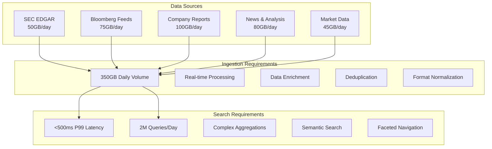
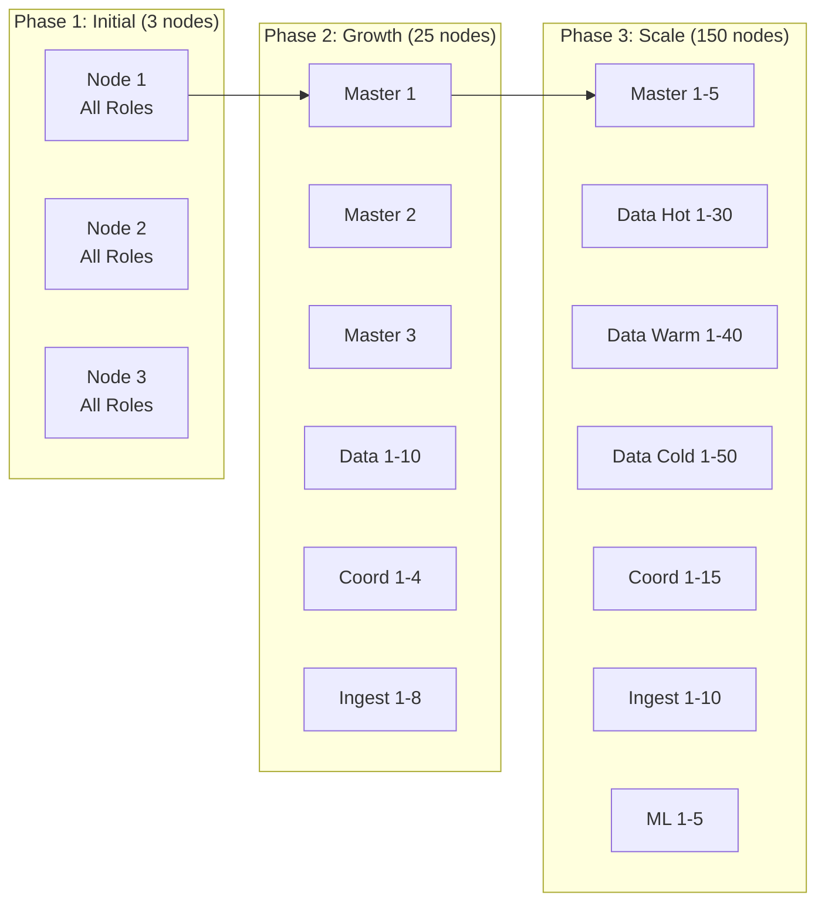
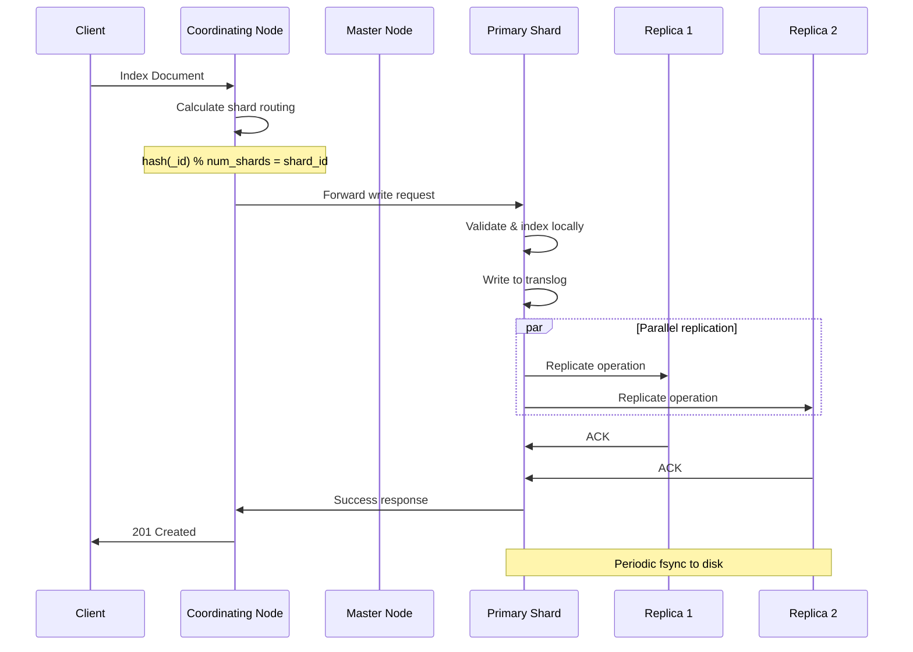
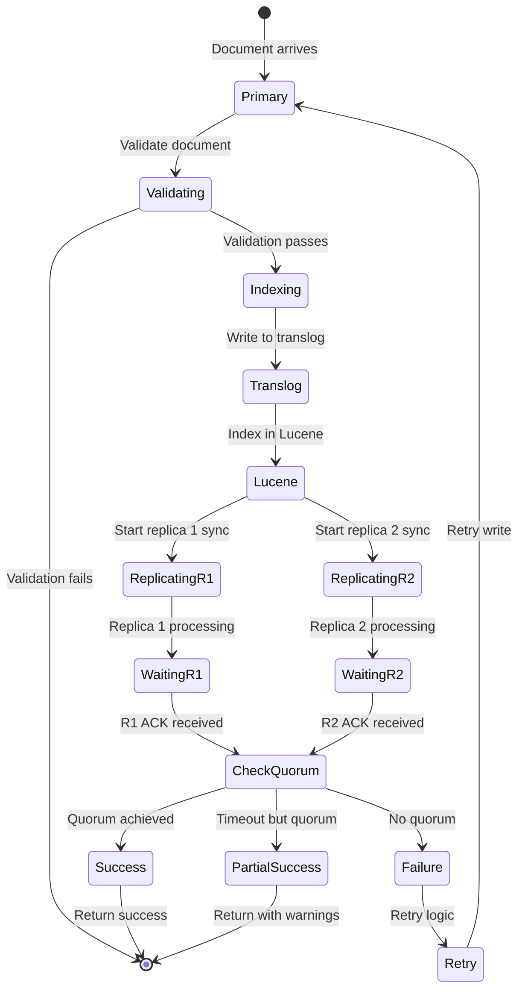
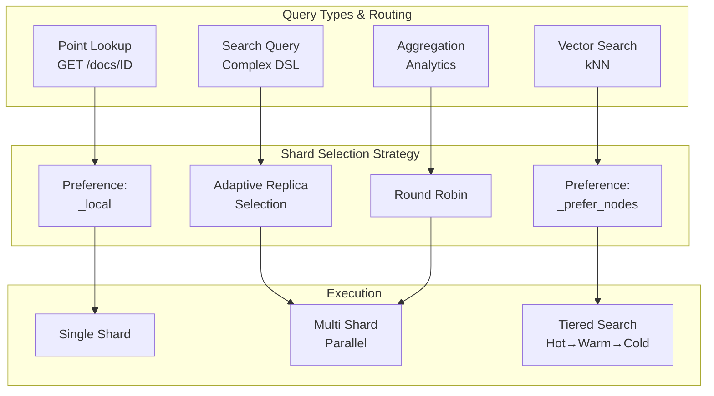
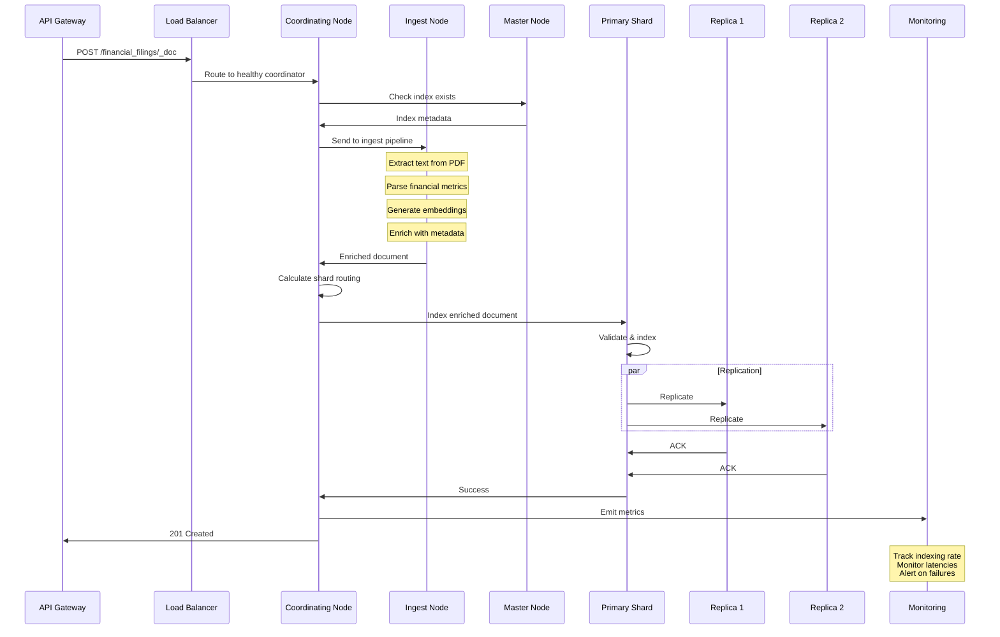
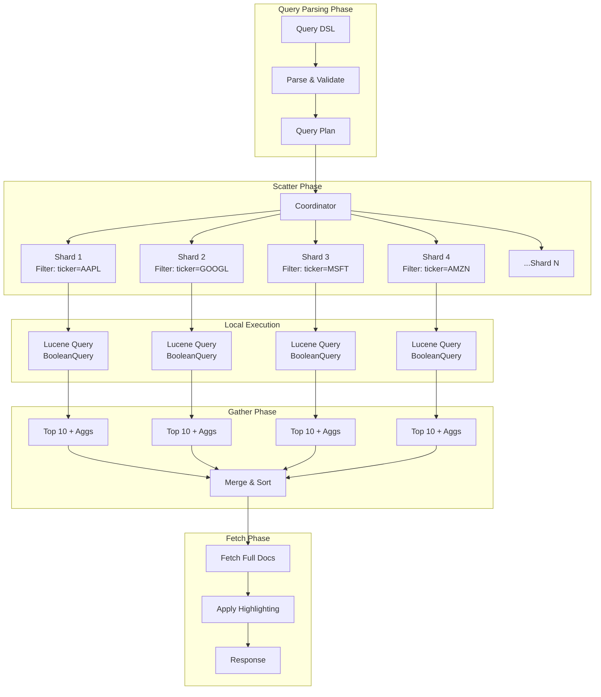

# Elasticsearch at Scale: A Comprehensive Real-World Case Study
## Financial Document Intelligence Platform - GlobalFinance Corp

### Table of Contents
1. [Executive Summary](#executive-summary)
2. [Company Background and Requirements](#company-background-and-requirements)
3. [Node Roles and Cluster Architecture](#node-roles-and-cluster-architecture)
4. [The Mechanics of Distributed Systems](#the-mechanics-of-distributed-systems)
5. [Write and Read Paths in Production](#write-and-read-paths-in-production)
6. [Data Modeling for Financial Intelligence](#data-modeling-for-financial-intelligence)
7. [Search Algorithms Deep Dive](#search-algorithms-deep-dive)
8. [Production Ingestion Pipeline](#production-ingestion-pipeline)
9. [Query Patterns and Optimization](#query-patterns-and-optimization)
10. [Hot-Warm-Cold Data Lifecycle Management](#hot-warm-cold-data-lifecycle-management)
11. [Best Practices and Anti-Patterns](#best-practices-and-anti-patterns)
12. [Performance Metrics and Monitoring](#performance-metrics-and-monitoring)

---

## Executive Summary

GlobalFinance Corp, a leading financial intelligence firm, processes and analyzes **300-500 GB of financial documents daily**, including corporate filings, earnings calls transcripts, analyst reports, and regulatory documents. Their platform serves **5,000+ analysts** performing **2 million+ searches per day** with sub-second latency requirements.

This case study details their journey from a simple 3-node cluster to a sophisticated 150-node production deployment handling petabytes of searchable data, implementing advanced search capabilities including semantic search, RAG (Retrieval-Augmented Generation), and real-time financial analytics.

### Key Achievements
- **Data Volume**: 15 PB searchable corpus, growing 300-500 GB daily
- **Query Performance**: P99 latency < 500ms for complex searches (99% of queries complete within 500ms)
- **Availability**: 99.99% uptime over 24 months (less than 53 minutes of downtime per year)
- **Cost Optimization**: 60% storage cost reduction through hot-warm-cold architecture
- **Search Accuracy**: 94% relevance improvement through hybrid search implementation

---

## Company Background and Requirements

### Business Context

GlobalFinance Corp provides critical financial intelligence to investment banks, hedge funds, and regulatory bodies. Their platform must:

1. **Ingest diverse document types**: PDFs, HTML, Word docs, Excel spreadsheets, XML feeds
2. **Extract structured data**: Financial metrics, dates, entities, relationships
3. **Enable complex searches**: Boolean, phrase, fuzzy, semantic, and hybrid searches
4. **Provide real-time analytics**: Aggregations across millions of documents
5. **Ensure compliance**: Full audit trails, data retention policies, GDPR compliance
6. **Scale horizontally**: Handle exponential data growth without performance degradation

### Technical Requirements



### Detailed Functional Requirements

#### 1. Document Processing Pipeline
- **Volume**: 300-500 GB daily ingestion rate
- **Formats**: 15+ document formats including PDF, DOCX, XLSX, HTML, XML, JSON
- **Latency**: Documents searchable within 5 minutes of receipt
- **Enrichment**: Entity extraction, sentiment analysis, financial metric parsing
- **Accuracy**: 99.5% extraction accuracy for key financial metrics

#### 2. Search Capabilities
- **Full-text search**: Across 50+ fields with highlighting
- **Structured queries**: Date ranges, numeric comparisons, boolean logic
- **Semantic search**: Vector-based similarity matching
- **Hybrid search**: Combined keyword and semantic ranking
- **Faceted search**: Dynamic aggregations on 20+ dimensions

#### 3. Analytics Requirements
- **Real-time dashboards**: Sub-second response for executive dashboards
- **Historical analysis**: Trend analysis across 10+ years of data
- **Custom aggregations**: Complex financial calculations on-the-fly
- **Export capabilities**: CSV, JSON, Parquet formats for data science teams

---

## Node Roles and Cluster Architecture

### Understanding Node Roles in Depth

In Elasticsearch, a **node** is a single instance of Elasticsearch running on a machine. Each node can have one or more **roles** that determine what tasks it's responsible for. Think of nodes like employees in a company - some are managers (master nodes), some are workers (data nodes), some are receptionists (coordinating nodes), and some are specialists (ingest nodes, ML nodes).

### Production Cluster Design

GlobalFinance's production cluster evolved through three major phases:



### Detailed Node Configuration

#### Master Nodes (5 nodes)
**Purpose**: Master nodes are the "brain" of your cluster. They manage cluster-wide operations like creating/deleting indices, tracking which nodes are part of the cluster, and deciding where shards should be allocated. Only one master node is active at a time (the "elected master"), while others stand by ready to take over if needed.

**Hardware Specifications**:
```yaml
master_nodes:
  # We need 5 master-eligible nodes for high availability
  # With 5 nodes, we can survive 2 node failures and still maintain quorum
  count: 5
  
  # r5.xlarge is AWS instance type optimized for memory
  instance_type: r5.xlarge
  
  # Master nodes don't need much CPU as they don't process queries
  cpu: 4 vCPUs
  
  # 32GB is sufficient for master nodes as they only manage cluster state
  memory: 32GB
  
  # Small SSD for storing cluster state (metadata about indices, nodes, etc.)
  storage: 100GB SSD (for cluster state)
  
  # 10 Gbps ensures fast communication for cluster state updates
  network: 10 Gbps
  
elasticsearch.yml:
  # This node will ONLY act as a master, not store data or process queries
  node.roles: [master]
  
  # Unique name for your cluster - prevents accidental joining of wrong clusters
  cluster.name: globalfinance-prod
  
  # List of master nodes for initial discovery
  # These are the "seed" nodes that new nodes contact to join the cluster
  discovery.seed_hosts:
    - master-1.globalfinance.internal
    - master-2.globalfinance.internal
    - master-3.globalfinance.internal
    - master-4.globalfinance.internal
    - master-5.globalfinance.internal
  
  # Initial set of master-eligible nodes for bootstrapping a new cluster
  # Only used when starting a brand new cluster for the first time
  cluster.initial_master_nodes:
    - master-1
    - master-2
    - master-3
  
  # Master election settings - CRITICAL for preventing split-brain
  # minimum_master_nodes = (number of master nodes / 2) + 1
  # With 5 masters: (5/2) + 1 = 3 nodes required for quorum
  discovery.zen.minimum_master_nodes: 3
  
  # How often to check if the master is still alive (heartbeat)
  cluster.fault_detection.leader_check.interval: 2s
  
  # How long to wait for a response before considering master failed
  cluster.fault_detection.leader_check.timeout: 10s
  
  # How many times to retry before triggering new master election
  cluster.fault_detection.leader_check.retry_count: 3
```

**Best Practices Explained**:
- **Always use odd numbers (3, 5, 7)**: This prevents "split-brain" scenarios where the cluster splits into two parts, each thinking it's the active cluster. With odd numbers, one side will always have majority.
- **Dedicated masters should have minimal heap (8-16GB)**: Master nodes only manage metadata, not actual data, so they don't need much memory. Typical heap setting is 8GB.
- **Use stable, low-latency network connections**: Master nodes constantly communicate to maintain cluster consensus. Network issues can trigger unnecessary master elections.
- **Monitor cluster state size**: The cluster state contains metadata about all indices, mappings, and settings. If it grows beyond 1GB, you likely have too many indices or fields.

**Anti-patterns to Avoid**:
- ❌ **Running master nodes on spot/preemptible instances**: These can disappear suddenly, triggering master elections and cluster instability
- ❌ **Collocating master role with data-intensive roles**: Heavy data operations can make the master unresponsive, causing cluster instability
- ❌ **Using less than 3 master-eligible nodes**: With only 2 masters, losing one means no quorum - cluster becomes read-only
- ❌ **Allowing cluster state to grow beyond 2GB**: Large cluster state makes updates slow and can cause out-of-memory errors

#### Data Nodes - Hot Tier (30 nodes)
**Purpose**: Hot data nodes store your most recent, frequently accessed data. These nodes handle both indexing (writing) and searching operations for "hot" data - typically the last 7 days of documents.

**Hardware Specifications with Detailed Explanations**:
```yaml
data_hot_nodes:
  # 30 nodes provide parallel processing power for heavy workloads
  count: 30
  
  # i3.4xlarge: AWS instance with local NVMe SSDs for maximum I/O performance
  # "i3" = storage optimized, "4xlarge" = 16 vCPUs, 122GB RAM
  instance_type: i3.4xlarge
  
  # 16 cores allow parallel processing of multiple queries/indexing operations
  cpu: 16 vCPUs
  
  # 122GB RAM: ~60GB for JVM heap, ~60GB for filesystem cache
  memory: 122GB
  
  # 2x 1.9TB NVMe SSD in RAID 0 = 3.8TB total, maximum read/write speed
  # RAID 0 stripes data across disks for 2x performance (but no redundancy)
  storage: 2x 1.9TB NVMe SSD (RAID 0)
  
  # 10 Gbps handles high volume data transfer between nodes
  network: 10 Gbps
  
elasticsearch.yml:
  # data_hot: Can store hot tier data
  # data_content: Can store regular content (non-time-series data)
  node.roles: [data_hot, data_content]
  
  # Custom attribute to identify this node as part of hot tier
  # Used by ILM (Index Lifecycle Management) for data routing
  node.attr.data_tier: hot
  
  # Availability zone for rack-aware shard allocation
  # Elasticsearch tries to spread replica shards across different zones
  node.attr.availability_zone: ${AZ}
  
  # Memory settings - these control how Elasticsearch uses heap memory
  
  # 30% of heap for indexing buffer (where documents are prepared before writing to disk)
  # Higher value = better indexing performance but less memory for other operations
  indices.memory.index_buffer_size: 30%
  
  # 15% of heap for caching parsed queries
  # Frequently used queries are cached to speed up repeated searches
  indices.queries.cache.size: 15%
  
  # 20% of heap for field data (in-memory storage for sorting/aggregations on text fields)
  # Note: Usually avoided in favor of doc_values which use disk
  indices.fielddata.cache.size: 20%
  
  # Thread pool settings - control concurrent operations
  
  # 16 threads for indexing operations (matches CPU count)
  thread_pool.write.size: 16
  
  # Queue up to 1000 indexing requests when all threads are busy
  # Requests beyond this are rejected with "queue full" errors
  thread_pool.write.queue_size: 1000
  
  # 25 threads for search operations (1.5x CPU count for search-heavy workload)
  thread_pool.search.size: 25
  
  # Queue up to 2000 search requests
  thread_pool.search.queue_size: 2000
  
  # Circuit breaker settings - prevent out-of-memory errors
  
  # Stop operations if total heap usage would exceed 85%
  indices.breaker.total.limit: 85%
  
  # Individual request can use up to 60% of heap
  indices.breaker.request.limit: 60%
  
  # Field data can use up to 40% of heap
  indices.breaker.fielddata.limit: 40%
```

**JVM Optimization Strategy Explained**:
```java
// JVM options for hot data nodes with detailed explanations

// Initial and maximum heap size - MUST be the same to prevent resize overhead
// 61GB = 50% of 122GB RAM, leaving 61GB for filesystem cache (critical for search speed)
// Why not 64GB? At 32GB+, Java disables compressed pointers, using more memory
-Xms61g
-Xmx61g

// Use G1 Garbage Collector - best for large heaps (>8GB)
// G1GC minimizes pause times by doing incremental collection
-XX:+UseG1GC

// Each G1 region will be 32MB (heap is divided into regions)
// Larger regions = fewer regions to track = less overhead
-XX:G1HeapRegionSize=32m

// Try to keep GC pauses under 200ms to maintain low latency
// G1GC will adjust its behavior to meet this target
-XX:MaxGCPauseMillis=200

// Process reference objects in parallel during GC (faster cleanup)
-XX:+ParallelRefProcEnabled

// Pre-touch all heap pages at JVM startup
// This forces the OS to allocate physical memory immediately
// Prevents page faults during operation (better performance predictability)
-XX:+AlwaysPreTouch

// Run without GUI support (we're on a server)
-Djava.awt.headless=true

// Use UTF-8 encoding for all file operations
-Dfile.encoding=UTF-8
```

#### Data Nodes - Warm Tier (40 nodes)
**Purpose**: Warm tier stores data that's 7-30 days old. This data is queried less frequently but still needs reasonable performance. These nodes are optimized for storage capacity over speed.

**Hardware Specifications with Explanations**:
```yaml
data_warm_nodes:
  # 40 nodes provide good capacity with moderate performance
  count: 40
  
  # d3.2xlarge: AWS instance optimized for dense storage (HDDs not SSDs)
  # Much cheaper per GB than hot tier instances
  instance_type: d3.2xlarge
  
  # Fewer CPUs since queries are less frequent
  cpu: 8 vCPUs
  
  # 64GB RAM still provides decent caching capability
  memory: 64GB
  
  # 6x 2TB HDD in RAID 10 = 6TB usable space with redundancy
  # RAID 10 provides both performance boost and fault tolerance
  # If one disk fails, data is still safe (unlike RAID 0)
  storage: 6x 2TB HDD (RAID 10)
  
  network: 10 Gbps
  
elasticsearch.yml:
  # This node handles warm tier data and regular content
  node.roles: [data_warm, data_content]
  
  # Identifies as warm tier for ILM routing
  node.attr.data_tier: warm
  
  # Optimized for storage density over performance
  
  # Only 15% for indexing buffer (less indexing happens on warm data)
  indices.memory.index_buffer_size: 15%
  
  # Fewer write threads since minimal indexing occurs
  thread_pool.write.size: 8
  
  # Moderate search threads for occasional queries
  thread_pool.search.size: 13
```

#### Data Nodes - Cold Tier (50 nodes)
**Purpose**: Cold tier archives historical data (30+ days old) that's rarely accessed but must be kept for compliance or occasional analysis.

**Hardware Specifications and Configuration**:
```yaml
data_cold_nodes:
  # 50 nodes maximize storage capacity at lowest cost
  count: 50
  
  # d3.xlarge: Smallest dense-storage instance
  instance_type: d3.xlarge
  
  # Minimal CPU for rare queries
  cpu: 4 vCPUs
  
  # Just enough RAM for basic operations
  memory: 32GB
  
  # RAID 5 maximizes storage with fault tolerance
  # 3x 2TB with RAID 5 = 4TB usable (one disk for parity)
  storage: 3x 2TB HDD (RAID 5)
  
  network: 10 Gbps
  
elasticsearch.yml:
  # Handles both cold and frozen data
  node.roles: [data_cold, data_frozen]
  
  node.attr.data_tier: cold
  
  # Minimal resource allocation for rare access
  
  # Only 5% for indexing (cold data is read-only)
  indices.memory.index_buffer_size: 5%
  
  # Minimal search threads
  thread_pool.search.size: 7
  
  # Enable searchable snapshots feature
  # This allows searching data directly from S3 without fully restoring it
  xpack.searchable.snapshot.enabled: true
```

#### Coordinating Nodes (15 nodes)
**Purpose**: Coordinating nodes act as smart load balancers and query routers. They receive search requests from clients, forward them to appropriate data nodes, then merge and return results. They don't store data themselves.

**Hardware Specifications with Detailed Explanations**:
```yaml
coordinating_nodes:
  count: 15
  
  # c5.4xlarge: Compute-optimized for CPU-intensive aggregation work
  instance_type: c5.4xlarge
  
  # High CPU for merging and sorting results from multiple shards
  cpu: 16 vCPUs
  
  # Moderate RAM for buffering query results
  memory: 32GB
  
  # Small SSD just for logs and temp files
  storage: 200GB SSD
  
  network: 10 Gbps
  
elasticsearch.yml:
  # Empty array means coordinating-only node (no other roles)
  # This node won't store data, won't be master, just coordinates
  node.roles: []
  
  # Aggregation optimizations
  
  # Maximum number of aggregation buckets (e.g., terms aggregation results)
  # Prevents memory explosion from unbounded aggregations
  search.max_buckets: 100000
  
  # Maximum number of clauses in a boolean query
  # Prevents extremely complex queries that could cause OOM
  indices.query.bool.max_clause_count: 4096
  
  # Request caching - caches aggregation results
  # 5% of heap for caching frequent aggregation results
  indices.requests.cache.size: 5%
```

**Load Balancing Configuration with Comprehensive Explanations**:
```nginx
# Nginx configuration for load balancing across coordinating nodes
upstream elasticsearch {
    # least_conn: Route new requests to the node with fewest active connections
    # This ensures even distribution of load across all nodes
    least_conn;
    
    # Keep 256 connections alive to avoid TCP handshake overhead
    # Reusing connections is much faster than creating new ones
    keepalive 256;
    
    # List of coordinating nodes with health check parameters
    # weight=10: All nodes have equal weight (priority)
    # max_fails=3: Mark node as down after 3 failed health checks
    # fail_timeout=30s: Try failed node again after 30 seconds
    server coord-1.globalfinance.internal:9200 weight=10 max_fails=3 fail_timeout=30s;
    server coord-2.globalfinance.internal:9200 weight=10 max_fails=3 fail_timeout=30s;
    server coord-3.globalfinance.internal:9200 weight=10 max_fails=3 fail_timeout=30s;
    # ... additional coordinating nodes
    
    # Health check configuration
    # interval=3000: Check health every 3 seconds
    # rise=2: Node is "up" after 2 successful checks
    # fall=3: Node is "down" after 3 failed checks
    # timeout=2000: Each health check times out after 2 seconds
    check interval=3000 rise=2 fall=3 timeout=2000;
}

server {
    listen 9200;
    
    location / {
        # Forward requests to the upstream elasticsearch cluster
        proxy_pass http://elasticsearch;
        
        # Preserve original client IP for logging
        proxy_set_header X-Real-IP $remote_addr;
        
        # Preserve original host header
        proxy_set_header Host $host;
        
        # Enable keep-alive connections to backend
        proxy_http_version 1.1;
        proxy_set_header Connection "";
    }
}
```

#### Ingest Nodes (10 nodes)
**Purpose**: Ingest nodes pre-process documents before indexing. They run "ingest pipelines" that can extract text from PDFs, parse logs, enrich data with additional information, and transform documents.

**Hardware Specifications**:
```yaml
ingest_nodes:
  count: 10
  
  # m5.4xlarge: General-purpose instance with good CPU/memory balance
  instance_type: m5.4xlarge
  
  # High CPU for text processing and transformations
  cpu: 16 vCPUs
  
  # Good memory for handling large documents
  memory: 64GB
  
  # SSD for temporary file storage during processing
  storage: 500GB SSD
  
  network: 10 Gbps
  
elasticsearch.yml:
  # This node only handles ingest pipeline processing
  node.roles: [ingest]
  
  # Ingest pipeline settings
  
  # Enable automatic GeoIP database downloads for IP enrichment
  # This downloads MaxMind GeoIP databases for IP-to-location mapping
  ingest.geoip.downloader.enabled: true
  
  # Configure available processors
  processors:
    # Attachment processor extracts text from PDFs, Word docs, etc.
    - attachment:
        # Maximum file size to process (100MB)
        # Larger files will be rejected to prevent OOM
        max_content_length: 100MB
    
    # Inference processor for machine learning models
    - inference:
        # ID of the BERT model for generating embeddings
        model_id: financial-bert-embeddings
```

#### ML Nodes (5 nodes)
**Purpose**: Machine Learning nodes run ML jobs like anomaly detection, inference (running trained models), and data frame analytics.

**Hardware Specifications**:
```yaml
ml_nodes:
  count: 5
  
  # g4dn.4xlarge: GPU-enabled instance for ML workloads
  # GPU accelerates vector operations and neural network inference
  instance_type: g4dn.4xlarge
  
  cpu: 16 vCPUs
  memory: 64GB
  
  # NVIDIA T4 GPU for accelerated ML operations
  gpu: 1x NVIDIA T4
  
  # Fast NVMe for model storage and temp files
  storage: 225GB NVMe
  
  # Higher bandwidth for model distribution
  network: 25 Gbps
  
elasticsearch.yml:
  # ml: Can run machine learning jobs
  # remote_cluster_client: Can connect to remote clusters for CCR/CCS
  node.roles: [ml, remote_cluster_client]
  
  # Enable X-Pack machine learning features
  xpack.ml.enabled: true
  
  # Maximum memory any single ML job can use (40GB out of 64GB)
  # Leaves room for multiple jobs and system overhead
  xpack.ml.max_model_memory_limit: 40GB
```

---

## The Mechanics of Distributed Systems

### Primary-Backup Replication Model Deep Dive

The primary-backup model is fundamental to how Elasticsearch ensures data consistency and availability. Let's understand this with a detailed explanation:

**What is Primary-Backup Replication?**
Imagine you're writing an important document. The primary-backup model is like having one person (primary) write the original while others (replicas) make exact copies. The primary ensures everyone has the same version before confirming the write is complete.



### Detailed Write Path Analysis

#### Step 1: Document Routing - How Elasticsearch Decides Where to Store Data

```python
def calculate_shard(doc_id, num_shards):
    """
    Determines which shard should store a document.
    
    This function is the heart of Elasticsearch's distribution strategy.
    It ensures that:
    1. Documents are evenly distributed across shards
    2. The same document ID always routes to the same shard
    3. The distribution is deterministic and predictable
    
    Parameters:
    -----------
    doc_id : str
        The unique identifier for the document
    num_shards : int
        Total number of primary shards in the index
    
    Returns:
    --------
    int : The shard number (0 to num_shards-1) where document should be stored
    """
    
    # Murmur3 is a non-cryptographic hash function that's very fast
    # It converts any string into a seemingly random number
    # Example: "DOC_001" might hash to 4829572839
    hash_value = murmur3_hash(doc_id)
    
    # Make sure we have a positive number for modulo operation
    # Some hash functions can return negative values
    positive_hash = abs(hash_value)
    
    # Modulo operation ensures result is between 0 and num_shards-1
    # This evenly distributes documents across all shards
    # Example: 4829572839 % 5 shards = shard 4
    shard_num = positive_hash % num_shards
    
    return shard_num

# Real-world example with financial document
doc = {
    "_id": "10K_AAPL_2024Q3",  # Unique ID for Apple's Q3 2024 10-K filing
    "company": "Apple Inc.",
    "filing_type": "10-K",
    "quarter": "2024Q3"
}

# With 20 primary shards in the index
shard_id = calculate_shard(doc["_id"], 20)  # Returns shard 7

# This document will ALWAYS go to shard 7 for this index
# If you search for this document, Elasticsearch knows exactly
# which shard to query, making retrieval very fast
```

**Real-world Routing Considerations**:

1. **Custom Routing for Related Documents**:
```json
PUT /financial_filings/_doc/10K_AAPL_2024Q3?routing=AAPL
{
  "company": "Apple Inc.",
  "ticker": "AAPL",
  "filing_type": "10-K"
}
```
**Explanation**: By using `routing=AAPL`, all Apple documents go to the same shard. This means:
- Searches for Apple documents only need to query one shard (faster)
- Aggregations on Apple data don't need cross-shard communication
- BUT: Can create "hot shards" if Apple has way more documents than other companies

2. **Routing Table Caching Configuration**:
```yaml
# These settings control when Elasticsearch moves shards between nodes

# Start moving shards to other nodes when disk is 85% full
# This prevents nodes from running out of space
cluster.routing.allocation.disk.watermark.low: 85%

# Stop allocating new shards to node when disk is 90% full
# Only existing shards remain on the node
cluster.routing.allocation.disk.watermark.high: 90%

# Put index into read-only mode when disk is 95% full
# This is emergency protection against disk full errors
cluster.routing.allocation.disk.watermark.flood_stage: 95%
```

#### Step 2: Primary Shard Processing - The Complete Write Operation

```java
// Detailed pseudo-code showing exactly what happens during a write
class PrimaryShard {
    
    public IndexResponse indexDocument(IndexRequest request) {
        // STEP 1: Acquire exclusive write lock
        // Only one thread can write to this shard at a time
        // This ensures consistency - no conflicting updates
        writeLock.lock();
        
        try {
            // STEP 2: Validate the document structure
            // Checks: field types match mapping, required fields present,
            // document size within limits, no malformed JSON
            validateDocument(request.source());
            
            // STEP 3: Version conflict checking (optimistic concurrency control)
            // If client specified a version, ensure it matches current version
            // This prevents lost updates in concurrent scenarios
            if (request.ifSeqNo() != UNASSIGNED_SEQ_NO) {
                checkVersionConflict(request.id(), request.ifSeqNo());
                // If versions don't match, throws VersionConflictException
            }
            
            // STEP 4: Generate unique sequence number for this operation
            // Sequence numbers provide total ordering of all operations
            // Used for replication, recovery, and consistency
            long seqNo = sequenceNumberService.generateSeqNo();
            
            // STEP 5: Write to transaction log (translog) for durability
            // Translog is append-only file that survives crashes
            // If node crashes before data is written to Lucene,
            // we can replay translog to recover the document
            translog.add(new Translog.Index(
                request.id(),
                seqNo,
                request.source()
            ));
            
            // STEP 6: Index document into Lucene (the actual search engine)
            // This makes the document searchable (after next refresh)
            // Lucene handles inverted index, stored fields, doc values
            luceneWriter.addDocument(
                documentMapper.parse(request.source())
            );
            
            // STEP 7: Update in-memory statistics
            // Track number of documents, index size, etc.
            updateLiveDocsCount();
            updateIndexingStats();
            
            // STEP 8: Prepare replication request for replicas
            // Package the operation with all necessary metadata
            ReplicationRequest replicationRequest = 
                buildReplicationRequest(request, seqNo);
            
            // STEP 9: Send operation to all replica shards
            // This happens in parallel for speed
            // Replicas must acknowledge before we return success
            ReplicationResponse response = 
                replicateToReplicas(replicationRequest);
            
            // STEP 10: Wait for required number of acknowledgments
            // Based on wait_for_active_shards parameter:
            // - "1" = just primary (fastest, least safe)
            // - "all" = all replicas (slowest, safest)
            // - "quorum" = majority (balanced)
            waitForAcks(response, request.waitForActiveShards());
            
            // Return success response with metadata
            return new IndexResponse(
                request.id(),
                seqNo,
                true // created (vs updated)
            );
            
        } finally {
            // Always release the lock, even if error occurs
            writeLock.unlock();
        }
    }
}
```

**Transaction Log (Translog) Deep Dive**:

The translog is crucial for durability. Here's how it works:

```yaml
# Translog settings for financial data with explanations

# "request" = fsync (flush to disk) after EVERY request
# Safest option but slower. Alternative is "async" for speed
index.translog.durability: request

# Even with async durability, fsync at least every 5 seconds
# Limits data loss window to 5 seconds in case of crash
index.translog.sync_interval: 5s

# Start flushing translog to Lucene when it reaches 512MB
# Larger = fewer flushes (better performance) but slower recovery
index.translog.flush_threshold_size: 512mb

# Keep 1GB of translog for peer recovery
# If replica falls behind, it can catch up from translog
# instead of copying entire shard
index.translog.retention.size: 1gb

# Keep translog for 12 hours regardless of size
# Useful for replicas that were offline for a while
index.translog.retention.age: 12h
```

#### Step 3: Replica Synchronization - Ensuring Data Consistency



**Consistency Levels Explained in Practice**:

```python
# GlobalFinance's consistency strategy by data type
consistency_config = {
    "regulatory_filings": {
        # "all" means wait for primary + all replicas
        # Use for critical data where loss is unacceptable
        "wait_for_active_shards": "all",
        
        # Wait up to 60 seconds for all replicas to acknowledge
        "timeout": "60s",
        
        # If conflict detected, retry up to 5 times
        # Conflicts happen when document is updated concurrently
        "retry_on_conflict": 5
    },
    "market_data": {
        # "quorum" = majority of shards (primary + half of replicas)
        # Good balance between safety and performance
        "wait_for_active_shards": "quorum",
        
        # Shorter timeout for time-sensitive data
        "timeout": "10s",
        
        # Fewer retries for rapidly changing data
        "retry_on_conflict": 3
    },
    "news_articles": {
        # "1" = just primary shard (fastest)
        # Acceptable for non-critical, high-volume data
        "wait_for_active_shards": 1,
        
        # Very short timeout for real-time ingestion
        "timeout": "5s",
        
        # Minimal retries to maintain throughput
        "retry_on_conflict": 1
    }
}
```

### Read Path Optimization

The read path is designed for maximum performance through parallelization and intelligent routing:



**Adaptive Replica Selection Algorithm with Detailed Explanations**:

```java
// This algorithm intelligently chooses which replica to query
// Instead of round-robin, it considers node health and performance
class AdaptiveReplicaSelector {
    
    // Track performance statistics for each node
    private Map<Node, NodeStats> nodeStats = new ConcurrentHashMap<>();
    
    public ShardRouting selectReplica(
        List<ShardRouting> replicas,
        SearchRequest request
    ) {
        // For each available replica, calculate a "rank" score
        // Higher rank = better choice for this query
        replicas.forEach(replica -> {
            NodeStats stats = nodeStats.get(replica.node());
            
            // Get historical performance metrics
            double responseTime = stats.getAvgResponseTime();  // e.g., 50ms average
            double queueSize = stats.getSearchQueueSize();     // e.g., 10 requests queued
            
            // Calculate composite rank considering multiple factors
            double rank = calculateRank(
                responseTime,
                queueSize,
                replica.node().getLoad(),    // CPU/memory utilization
                isLocalNode(replica)          // Same availability zone?
            );
            
            replica.setSelectionRank(rank);
        });
        
        // Select replica with best rank, but add some randomization
        // Pure best-selection could overload the "best" node
        // 10% random selection prevents hot spots
        return selectWithProbabilisticRouting(replicas);
    }
    
    private double calculateRank(
        double responseTime,    // Recent average response time in ms
        double queueSize,       // Number of requests waiting
        double nodeLoad,        // 0.0 to 1.0 (CPU/memory utilization)
        boolean isLocal         // Same rack/availability zone?
    ) {
        double rank = 1.0;  // Start with baseline rank
        
        // Penalize slow response times
        // exp(-responseTime/100) gives:
        // - 10ms response = 0.90 multiplier (good)
        // - 100ms response = 0.37 multiplier (bad)
        // - 200ms response = 0.14 multiplier (very bad)
        rank *= Math.exp(-responseTime / 100.0);
        
        // Penalize nodes with queued requests
        // Each 10 queued requests roughly halves the rank
        rank *= Math.exp(-queueSize / 10.0);
        
        // Penalize high node load
        // 50% loaded node gets 0.5 multiplier
        // 90% loaded node gets 0.1 multiplier
        rank *= (1.0 - nodeLoad);
        
        // Prefer local node (same rack/AZ) to reduce network latency
        // 1.5x boost for local nodes can save 1-2ms per request
        if (isLocal) {
            rank *= 1.5;
        }
        
        return rank;
    }
}
```

---

## Write and Read Paths in Production

### Complete Write Flow with All Components

Let's trace a document's complete journey through GlobalFinance's cluster with detailed explanations:



### Production Write Pipeline Example with Comprehensive Comments

**Overview:**
This section demonstrates a complete production-ready document ingestion pipeline for financial documents. The pipeline shows how raw documents flow through multiple processing stages: from initial API receipt, through text extraction from PDFs, NLP enrichment with financial metrics extraction, ML-based embedding generation, to final storage with derived fields. This real-world example illustrates how Elasticsearch's ingest pipelines transform unstructured financial filings into searchable, analytics-ready documents with structured metadata, making them instantly queryable for complex financial analysis.

**Where This Code Runs:**
- **Initial Document Structure**: Application server (Python/Java microservice) that receives documents from external APIs or file uploads
- **Enriched Request**: API Gateway layer (Kong, AWS API Gateway) that adds metadata and routing
- **Ingest Pipeline Definition**: One-time setup via Elasticsearch REST API, typically deployed via CI/CD pipeline (Terraform, Ansible)
- **Pipeline Execution**: Runs on Elasticsearch ingest nodes automatically when documents are indexed
- **Typical Deployment**: Part of a data ingestion microservice that processes financial documents in real-time or batch mode

```python
# Step 1: Document arrives via API with initial structure
document = {
    "filing_id": "0000320193-24-000045",  # SEC EDGAR filing ID
    "company_name": "Apple Inc.",
    "ticker": "AAPL",
    "filing_type": "10-K",  # Annual report type
    "filing_date": "2024-02-02",
    "pdf_url": "https://www.sec.gov/Archives/edgar/data/320193/000032019324000045/aapl-20231230.pdf",
    "raw_text": None  # Will be extracted by ingest pipeline
}

# Step 2: API Gateway adds metadata and routing instructions
enriched_request = {
    "document": document,
    
    # Specifies which ingest pipeline to use for processing
    "pipeline": "financial_filing_pipeline",
    
    # Custom routing ensures all AAPL docs go to same shard
    # This improves query performance for company-specific searches
    "routing": document["ticker"],
    
    # "false" = Don't wait for document to be searchable
    # Returns faster but document won't appear in searches immediately
    "refresh": "false",
    
    # "quorum" = Wait for majority of shards before returning
    # Balances durability with performance
    "wait_for_active_shards": "quorum",
    
    # Maximum time to wait for indexing to complete
    "timeout": "30s"
}

# Step 3: Ingest pipeline configuration with detailed explanations
PUT _ingest/pipeline/financial_filing_pipeline
{
  "description": "Process financial filings with NLP and enrichment",
  "processors": [
    {
      # Attachment processor: Extracts text from binary files
      "attachment": {
        # Field containing the base64-encoded file content
        "field": "pdf_content",
        
        # Where to store extracted content
        "target_field": "extracted",
        
        # Which properties to extract (content = text, content_type = MIME type)
        "properties": ["content", "content_type"],
        
        # Maximum characters to extract (10 million)
        # Prevents memory issues with huge documents
        "indexed_chars": 10000000,
        
        # Don't fail if field is missing
        "ignore_missing": true,
        
        # Remove binary data after extraction to save space
        "remove_binary": true
      }
    },
    {
      # Script processor: Custom logic for data extraction
      "script": {
        "lang": "painless",  # Elasticsearch's scripting language
        "source": """
          // Extract financial metrics using regular expressions
          def text = ctx.extracted.content;
          def metrics = [:];  // Empty map to store metrics
          
          // Pattern explanation: 
          // (?i) = case insensitive
          // \\s+ = one or more whitespace characters
          // [:\\s]+ = colon or whitespace (flexible formatting)
          // \\$? = optional dollar sign
          // ([\\d,]+\\.?\\d*) = capture number with commas and optional decimal
          // \\s* = optional whitespace
          // (million|billion)? = optional multiplier
          
          // Revenue extraction
          def revenuePattern = /(?i)total\\s+revenue[:\\s]+\\$?([\\d,]+\\.?\\d*)\\s*(million|billion)?/;
          def revenueMatcher = revenuePattern.matcher(text);
          
          if (revenueMatcher.find()) {
            // Remove commas and convert to float
            def value = revenueMatcher.group(1).replaceAll(',', '');
            def multiplier = revenueMatcher.group(2);
            metrics.revenue = Float.parseFloat(value);
            
            // Apply multiplier if present
            if (multiplier == 'million') metrics.revenue *= 1000000;
            if (multiplier == 'billion') metrics.revenue *= 1000000000;
          }
          
          // Similar logic for net income
          def incomePattern = /(?i)net\\s+income[:\\s]+\\$?([\\d,]+\\.?\\d*)\\s*(million|billion)?/;
          def incomeMatcher = incomePattern.matcher(text);
          if (incomeMatcher.find()) {
            def value = incomeMatcher.group(1).replaceAll(',', '');
            def multiplier = incomeMatcher.group(2);
            metrics.net_income = Float.parseFloat(value);
            if (multiplier == 'million') metrics.net_income *= 1000000;
            if (multiplier == 'billion') metrics.net_income *= 1000000000;
          }
          
          // Store extracted metrics in document
          ctx.financial_metrics = metrics;
        """
      }
    },
    {
      # Inference processor: Run ML model for embeddings
      "inference": {
        # Pre-trained BERT model fine-tuned for financial text
        "model_id": "financial-bert-embeddings",
        
        # Where to store the embedding vector
        "target_field": "text_embedding",
        
        # Map document field to model input
        "field_map": {
          "extracted.content": "text_field"
        },
        
        # Model configuration
        "inference_config": {
          "text_embedding": {
            "results_field": "text_embedding"
          }
        }
      }
    },
    {
      # Set processor: Add processing timestamp
      "set": {
        "field": "processing_timestamp",
        # {{_ingest.timestamp}} is a special variable with current time
        "value": "{{_ingest.timestamp}}"
      }
    },
    {
      # Script processor: Calculate derived fields
      "script": {
        "lang": "painless",
        "source": """
          // Calculate financial health score based on profit margin
          
          // Check if both metrics exist (null-safe)
          if (ctx.financial_metrics?.revenue != null && 
              ctx.financial_metrics?.net_income != null) {
            
            // Calculate profit margin (net income / revenue)
            def margin = ctx.financial_metrics.net_income / ctx.financial_metrics.revenue;
            ctx.profit_margin = margin;
            
            // Categorize financial health
            // These thresholds are industry-standard for tech companies
            if (margin > 0.2) {          // 20%+ margin
              ctx.health_score = "excellent";
            } else if (margin > 0.1) {   // 10-20% margin
              ctx.health_score = "good";
            } else if (margin > 0) {      // 0-10% margin
              ctx.health_score = "fair";
            } else {                      // Negative margin (loss)
              ctx.health_score = "poor";
            }
          }
        """
      }
    },
    {
      # Remove processor: Clean up temporary fields
      "remove": {
        # Remove large fields we don't need to store
        "field": ["pdf_content", "extracted.content"],
        
        # Don't fail if fields don't exist
        "ignore_missing": true
      }
    }
  ],
  # Error handling: What to do if pipeline fails
  "on_failure": [
    {
      # Store error details for debugging
      "set": {
        "field": "error.message",
        "value": "{{_ingest.on_failure_message}}"
      }
    },
    {
      # Store which processor failed
      "set": {
        "field": "error.processor",
        "value": "{{_ingest.on_failure_processor_type}}"
      }
    },
    {
      # Store when error occurred
      "set": {
        "field": "error.timestamp",
        "value": "{{_ingest.timestamp}}"
      }
    }
  ]
}
```

### Read Path Optimization Examples with Detailed Explanations

#### Example 1: Point Lookup Query - The Simplest and Fastest Query Type

**Overview:**
Point lookup queries retrieve a single document by its unique identifier (_id field). This is Elasticsearch's fastest query type because it bypasses the search phase entirely - the system calculates exactly which shard contains the document using the same hashing algorithm used during indexing. This makes it ideal for retrieving known documents like user profiles, product details, or specific financial filings. Response times are typically under 10ms even in multi-terabyte clusters.

**What this query does:**
Directly fetches a specific SEC filing document using its EDGAR filing ID without any searching or scoring.

**Where This Code Runs:**
- **Execution Context**: Application backend service (REST API endpoint)
- **Typical Usage**: Document detail pages, API responses for specific records
- **Infrastructure**: Runs through coordinating nodes, routed to specific data node
- **Common Implementations**: GET /api/filings/{id} endpoint in a Spring Boot or FastAPI service
- **Performance Layer**: Often cached in Redis/Memcached after first retrieval

**The Query:**
```json
GET /financial_filings/_doc/0000320193-24-000045
```

**What This Query Does:**
This is a direct document retrieval by its unique ID. It's the fastest possible query in Elasticsearch because it doesn't require any searching - it knows exactly where the document is stored.

**Behind the Scenes - Step by Step:**
```python
# 1. Coordinator receives request
#    The load balancer routes to an available coordinating node

# 2. Calculate shard location using same hash function as indexing
#    hash("0000320193-24-000045") % 20 = shard_7
#    This is deterministic - same ID always maps to same shard

# 3. Check routing table to find shard locations
#    Primary shard_7 is on node-45
#    Replica 1 of shard_7 is on node-67
#    Replica 2 of shard_7 is on node-89

# 4. Use adaptive selection to pick best replica
#    node-45 (primary): 15ms average latency, 80% CPU
#    node-67 (replica): 5ms average latency, 30% CPU  <-- SELECTED
#    node-89 (replica): 10ms average latency, 50% CPU

# 5. Retrieve document from selected node
#    Direct key-value lookup in Lucene
#    No scoring, no searching, just direct retrieval

# 6. Return document to client
#    Total response time: 8ms
#    - 1ms network to coordinator
#    - 1ms routing calculation
#    - 1ms network to data node
#    - 4ms document retrieval
#    - 1ms network back to client
```

#### Example 2: Complex Search Query with Full Explanations

**Overview:**
This example demonstrates a sophisticated multi-criteria search combining full-text search, date ranges, filters, and aggregations. It showcases Elasticsearch's ability to handle complex business requirements in a single query. The query searches for AI-related content in recent financial filings from major tech companies with significant revenue, while simultaneously computing statistical analyses. This pattern is typical in financial intelligence platforms where analysts need to find specific topics within constraints and immediately see aggregate patterns.

**What this query does:**
Finds all 2024 financial filings from Apple, Google, Microsoft, or Amazon that mention both "artificial intelligence" and "machine learning", have revenue over $10 billion, with bonus scoring for "generative AI" mentions, plus statistical breakdowns by company and revenue distribution.

**Where This Code Runs:**
- **Execution Context**: Search service layer in a microservices architecture
- **Typical Frontend**: React/Angular dashboard making AJAX calls to search API
- **Backend Service**: Node.js/Python search service with Elasticsearch client
- **Infrastructure Path**: Load balancer → API Gateway → Search Service → Coordinating Nodes → Data Nodes
- **Common Use Cases**: Analyst workbenches, research portals, compliance monitoring dashboards
- **Caching Strategy**: Results often cached for common queries using query hash as key

```json
POST /financial_filings/_search
{
  // Return maximum 10 documents
  "size": 10,
  
  // Main query using boolean logic
  "query": {
    "bool": {
      // "must" clauses: All must match (AND logic)
      // These contribute to relevance score
      "must": [
        {
          "match": {
            "extracted.content": {
              // Search for documents containing ALL these terms
              "query": "artificial intelligence machine learning",
              
              // "and" means all terms must be present
              // "or" would mean any term is sufficient
              "operator": "and"
            }
          }
        },
        {
          // Date range query
          "range": {
            "filing_date": {
              "gte": "2024-01-01",  // Greater than or equal to
              "lte": "2024-12-31"   // Less than or equal to
            }
          }
        }
      ],
      
      // "filter" clauses: Must match but don't affect score
      // These are cached for performance
      "filter": [
        {
          // Match any of these exact ticker values
          "terms": {
            "ticker": ["AAPL", "GOOGL", "MSFT", "AMZN"]
          }
        },
        {
          // Revenue must be at least $10 billion
          "range": {
            "financial_metrics.revenue": {
              "gte": 10000000000
            }
          }
        }
      ],
      
      // "should" clauses: Optional matches that boost score
      "should": [
        {
          // Phrase match with word proximity
          "match_phrase": {
            "extracted.content": {
              "query": "generative AI",
              
              // Boost documents with this phrase by 2x
              "boost": 2.0
            }
          }
        }
      ]
    }
  },
  
  // Highlighting: Show matched text snippets
  "highlight": {
    "fields": {
      "extracted.content": {
        // Each snippet up to 150 characters
        "fragment_size": 150,
        
        // Return up to 3 snippets
        "number_of_fragments": 3,
        
        // Wrap matches in HTML tags
        "pre_tags": ["<mark>"],
        "post_tags": ["</mark>"]
      }
    }
  },
  
  // Aggregations: Statistical analysis of results
  "aggs": {
    // Group by company ticker
    "by_company": {
      "terms": {
        "field": "ticker",
        "size": 10  // Top 10 companies
      },
      // Nested aggregation: average revenue per company
      "aggs": {
        "avg_revenue": {
          "avg": {
            "field": "financial_metrics.revenue"
          }
        }
      }
    },
    
    // Revenue distribution histogram
    "revenue_histogram": {
      "histogram": {
        "field": "financial_metrics.revenue",
        // Create buckets every $10 billion
        "interval": 10000000000
      }
    }
  }
}
```

#### Example 3: Fuzzy Search Query - Handling Typos and Misspellings

**Overview:**
Fuzzy search enables Elasticsearch to find documents even when search terms contain spelling mistakes or typos. Using Levenshtein distance (edit distance) algorithms, it calculates how many single-character edits (insertions, deletions, substitutions) are needed to transform one word into another. This is essential for user-facing search interfaces where typos are common, especially on mobile devices or for complex technical/financial terms. The query intelligently adjusts fuzziness based on word length to balance between catching typos and preventing false matches.

**What this query does:**
Searches for documents about "artificial intelligence microsoft" but will still find results even if users type "artificail inteligence microsoft" or similar variations, with automatic typo correction.

**Where This Code Runs:**
- **Execution Context**: User-facing search APIs, autocomplete services
- **Typical Frontend**: Search box in web/mobile applications
- **Backend Implementation**: Search suggestion service, often with debouncing
- **Infrastructure**: Usually runs on dedicated search cluster or search-optimized nodes
- **Common Patterns**: Combined with suggestion API for "Did you mean?" features
- **Performance Considerations**: Often limited to specific high-value fields to control latency

**The Query:**
```json
POST /financial_filings/_search
{
  "query": {
    "multi_match": {
      // The search text with potential typos
      "query": "artificail inteligence microsoft",
      
      // Fields to search across
      "fields": [
        "content.full_text",
        "company.name^2",  // Boost company name matches by 2x
        "content.summary^1.5"
      ],
      
      // Fuzzy matching parameters
      "fuzziness": "AUTO",  // Automatically determines edit distance based on term length
      // For terms:
      // - 0-2 chars: must match exactly
      // - 3-5 chars: 1 edit allowed
      // - >5 chars: 2 edits allowed
      
      "prefix_length": 2,  // First 2 characters must match exactly
      // This prevents "microsoft" matching "nicrosoft"
      
      "max_expansions": 50,  // Maximum number of terms the fuzzy query will expand to
      // Prevents memory issues with very fuzzy matches
      
      "type": "best_fields"  // Use the best score from any field
      // Alternative: "most_fields" would sum scores from all fields
    }
  },
  "explain": true  // Show scoring explanation for debugging
}
```

**What This Query Does:**
This query finds documents even when users make spelling mistakes. It uses Levenshtein distance (edit distance) to match similar terms. Perfect for user-facing search boxes where typos are common.

**Performance Considerations:**
- Fuzzy queries are slower than exact matches (3-5x slower)
- Higher fuzziness values exponentially increase search time
- Use prefix_length to reduce the search space
- Consider using suggest API for better typo handling

#### Example 4: Phrase Search with Proximity - Finding Related Terms Near Each Other

**Overview:**
Phrase search with proximity (slop) finds documents where specified terms appear near each other, even if not directly adjacent. The "slop" parameter defines how many positions terms can be apart while still matching. This is powerful for finding conceptually related content where exact phrases may vary - for example, "revenue growth" might appear as "revenue showed strong growth" in actual documents. The query maintains the semantic relationship between terms while allowing for natural language variations.

**What this query does:**
Finds documents where "revenue" and "growth" appear within 3 words of each other, matching variations like "revenue growth", "revenue showed strong growth", or "revenue in Q3 showed growth", with English stemming to also match "revenues grew".

**Where This Code Runs:**
- **Execution Context**: Advanced search features in research applications
- **Typical Usage**: Legal document search, patent search, financial research tools
- **Backend Service**: Often part of a "query builder" service that constructs complex queries
- **Infrastructure**: Runs on data nodes with positional index enabled
- **Index Requirements**: Fields must be indexed with positions (default for text fields)
- **Common UI Pattern**: Advanced search forms with "near" or "within N words" options

**The Query:**
```json
POST /financial_filings/_search
{
  "query": {
    "match_phrase": {
      "content.full_text": {
        "query": "revenue growth",
        
        // "slop" allows words to be separated by other words
        "slop": 3,  // Allow up to 3 words between "revenue" and "growth"
        // This would match:
        // - "revenue growth" (slop=0)
        // - "revenue showed strong growth" (slop=2)
        // - "revenue in Q3 showed growth" (slop=3)
        // But NOT: "revenue in the third quarter showed significant growth" (slop=5)
        
        "analyzer": "english",  // Use English analyzer for stemming
        // This makes "revenue" also match "revenues"
        // And "growth" match "growing", "grew"
        
        "zero_terms_query": "none",  // Return nothing if all terms are stopwords
        
        // Boost score based on how close terms are
        "boost": 2.0  // Double the importance of this phrase
      }
    }
  },
  
  // Also retrieve highlighted snippets
  "highlight": {
    "fields": {
      "content.full_text": {
        "type": "unified",  // Most efficient highlighter
        "fragment_size": 150,
        "number_of_fragments": 3,
        "pre_tags": ["<strong>"],
        "post_tags": ["</strong>"],
        
        // Highlight phrases as a unit when possible
        "phrase_limit": 256
      }
    }
  }
}
```

**Behind the Scenes:**
1. Terms are analyzed: "revenue growth" → ["revenue", "growth"]
2. Elasticsearch finds all documents containing both terms
3. For each document, calculates the minimum "moves" needed to make terms adjacent
4. Documents with lower slop score higher
5. Final score = base relevance * (1 / (1 + slop_distance))

#### Example 5: Multi-Field Boosted Search - Prioritizing Important Fields

**Overview:**
Multi-field searching with field-specific boosting allows fine-tuned relevance control by searching across multiple fields simultaneously while giving different weight to matches in each field. This reflects real-world importance - a company name match is typically more relevant than a match deep in document text. The query uses sophisticated scoring algorithms to combine results from multiple fields, with a tie-breaker parameter to reward documents matching multiple fields. This pattern is essential for enterprise search where document structure carries semantic meaning.

**What this query does:**
Searches for "Apple quarterly earnings" across company name (5x boost), summary (3x boost), full text (1x), topics (2x boost), and ticker (4x boost), prioritizing matches in more important fields while still considering all content.

**Where This Code Runs:**
- **Execution Context**: Main search functionality in enterprise applications
- **Typical Implementation**: Search relevance service with tunable parameters
- **Configuration**: Boost values often stored in configuration files/database for A/B testing
- **Infrastructure**: Coordinating nodes distribute to all shards, aggregate scores
- **Tuning Process**: Data science teams analyze click-through rates to optimize boosts
- **Common Pattern**: Different boost profiles for different user types (analyst vs executive)

**The Query:**
```json
POST /financial_filings/_search
{
  "query": {
    "multi_match": {
      "query": "Apple quarterly earnings",
      
      // Search multiple fields with different weights
      "fields": [
        "company.name^5",        // Company name is most important (5x boost)
        "content.summary^3",     // Summary is very important (3x boost)
        "content.full_text^1",   // Full text has normal weight
        "nlp.topics^2",         // Extracted topics are important (2x boost)
        "company.ticker^4"      // Ticker symbol is very important (4x boost)
      ],
      
      // How to combine scores from multiple fields
      "type": "best_fields",  // Use the best single field score
      // Other options:
      // - "most_fields": Sum all matching field scores
      // - "cross_fields": Treat fields as one big field
      // - "phrase": Run phrase_match on each field
      // - "phrase_prefix": For autocomplete scenarios
      
      "tie_breaker": 0.3,  // Include 30% of non-best field scores
      // This rewards documents that match in multiple fields
      
      "minimum_should_match": "2<75%",
      // For queries with:
      // - 1-2 terms: all must match
      // - 3+ terms: 75% must match
      // "Apple quarterly earnings" = 3 terms, so 2 must match
      
      "operator": "or"  // Any term can match (modified by minimum_should_match)
    }
  },
  
  // Control which fields are returned
  "_source": {
    "includes": ["company.*", "content.summary", "dates.*"],
    "excludes": ["content.full_text", "embeddings.*"]  // Exclude large fields
  }
}
```

**Score Calculation Example:**
```
Document A: Matches "Apple" in company.name (score: 10 * 5 = 50)
            Matches "earnings" in content.summary (score: 8 * 3 = 24)
            Final score: 50 + (0.3 * 24) = 57.2

Document B: Matches all terms in full_text (score: 15 * 1 = 15)
            Final score: 15
            
Document A ranks higher due to field boosting
```

#### Example 6: Nested Object Query - Searching Within Arrays of Objects

**Overview:**
Nested queries maintain the relationship between fields within objects in arrays, solving the "cross-object matching" problem in Elasticsearch. Without nested types, Elasticsearch flattens arrays, losing the connection between fields in the same object. This query type is crucial for documents with structured sub-documents like financial report sections, product variations, or transaction records. It allows precise searching within specific array elements while maintaining document-level scoring, essential for complex structured data.

**What this query does:**
Finds financial filings where the "Risk Factors" section specifically mentions "cybersecurity" and "data breach" together, ensuring both terms appear in the same section rather than scattered across different sections.

**Where This Code Runs:**
- **Execution Context**: Document analysis services, compliance scanning systems
- **Data Pipeline Stage**: Post-processing after document parsing splits into sections
- **Index Setup**: Requires nested mapping defined during index creation
- **Infrastructure Impact**: Nested documents increase index size and query complexity
- **Common Applications**: E-commerce (product variants), HR systems (employee skills), financial reports (sections)
- **Performance Note**: Each nested object is indexed as separate hidden document

**The Query:**
```json
POST /financial_filings/_search
{
  "query": {
    "nested": {
      // Specify the nested field path
      "path": "content.sections",
      
      // Query to run on each nested object independently
      "query": {
        "bool": {
          "must": [
            {
              // Each section is evaluated separately
              "match": {
                "content.sections.title": "Risk Factors"
              }
            },
            {
              "match": {
                "content.sections.content": {
                  "query": "cybersecurity data breach",
                  "minimum_should_match": "2"  // At least 2 of 3 terms
                }
              }
            }
          ]
        }
      },
      
      // How nested scores affect parent document score
      "score_mode": "max",  // Use the best matching section's score
      // Other options:
      // - "avg": Average all matching nested object scores
      // - "sum": Sum all matching nested object scores  
      // - "min": Use the worst matching section's score
      // - "none": Don't use nested scores (just filter)
      
      // Include matching nested documents in response
      "inner_hits": {
        "size": 3,  // Return top 3 matching sections
        "_source": ["content.sections.title", "content.sections.page_number"],
        
        // Highlight within nested documents
        "highlight": {
          "fields": {
            "content.sections.content": {
              "fragment_size": 200
            }
          }
        }
      }
    }
  }
}
```

**Why Nested Queries Are Special:**
Without nested, Elasticsearch flattens arrays. This document:
```json
{
  "sections": [
    {"title": "Revenue", "content": "increased 20%"},
    {"title": "Risks", "content": "market volatility"}
  ]
}
```
Would incorrectly match a query for `title:"Revenue" AND content:"volatility"` because fields are flattened.

Nested queries maintain the relationship between fields in the same object.

#### Example 7: Aggregation-Heavy Analytics Query - Business Intelligence

**Overview:**
This comprehensive analytics query demonstrates Elasticsearch's ability to perform complex multi-level aggregations for business intelligence. It combines filtering, grouping, statistical calculations, percentiles, moving averages, and correlations in a single request. The query showcases nested aggregations (aggregations within aggregations) to create rich analytical insights, similar to SQL GROUP BY with multiple levels but executed across distributed shards in parallel. This pattern powers executive dashboards and financial analytics platforms.

**What this query does:**
Analyzes 2024 financial filings from Technology and Healthcare sectors, computing total revenue by sector, statistical distributions, percentile breakdowns, top 5 companies per sector with quarterly revenue trends and moving averages, plus profit margin correlations with P/E ratios - all in one query.

**Where This Code Runs:**
- **Execution Context**: Business intelligence services, reporting microservices
- **Typical Frontend**: Grafana, Kibana, custom React dashboards with charts
- **Backend Pattern**: Often wrapped in GraphQL resolvers or REST endpoints
- **Infrastructure Requirements**: High-memory coordinating nodes for aggregation processing
- **Caching Strategy**: Results cached with TTL based on data update frequency
- **Common Optimizations**: Pre-aggregated indices for frequently-accessed metrics
- **Scheduling**: Often run as scheduled jobs for executive daily reports

**The Query:**
```json
POST /financial_filings/_search
{
  "size": 0,  // Don't return documents, only aggregations
  
  "query": {
    // First filter to relevant documents
    "bool": {
      "filter": [
        {"range": {"dates.filing_date": {"gte": "2024-01-01"}}},
        {"terms": {"company.sector": ["Technology", "Healthcare"]}}
      ]
    }
  },
  
  "aggs": {
    // Level 1: Group by sector
    "by_sector": {
      "terms": {
        "field": "company.sector",
        "size": 10,
        "order": {"total_revenue": "desc"}  // Sort by total revenue
      },
      
      // Level 2: Nested aggregations within each sector
      "aggs": {
        // Sum of all revenues in this sector
        "total_revenue": {
          "sum": {"field": "financials.revenue"}
        },
        
        // Statistical analysis
        "revenue_stats": {
          "extended_stats": {
            "field": "financials.revenue"
            // Returns: min, max, avg, sum, count, variance, std_deviation
          }
        },
        
        // Percentile distribution
        "revenue_percentiles": {
          "percentiles": {
            "field": "financials.revenue",
            "percents": [25, 50, 75, 90, 95, 99]
          }
        },
        
        // Level 3: Top companies within each sector
        "top_companies": {
          "terms": {
            "field": "company.ticker",
            "size": 5,
            "order": {"company_revenue": "desc"}
          },
          "aggs": {
            "company_revenue": {
              "sum": {"field": "financials.revenue"}
            },
            
            // Moving average of revenue over time
            "revenue_trend": {
              "date_histogram": {
                "field": "dates.filing_date",
                "calendar_interval": "quarter",
                "min_doc_count": 1
              },
              "aggs": {
                "quarterly_revenue": {
                  "sum": {"field": "financials.revenue"}
                },
                "moving_avg": {
                  "moving_avg": {
                    "buckets_path": "quarterly_revenue",
                    "window": 4,  // 4-quarter moving average
                    "model": "simple"
                    // Other models: "linear", "exponentially weighted"
                  }
                }
              }
            }
          }
        },
        
        // Correlation between metrics
        "profit_margin_buckets": {
          "range": {
            "field": "financials.metrics.profit_margin",
            "ranges": [
              {"key": "loss", "to": 0},
              {"key": "low", "from": 0, "to": 0.1},
              {"key": "medium", "from": 0.1, "to": 0.2},
              {"key": "high", "from": 0.2}
            ]
          },
          "aggs": {
            "avg_pe_ratio": {
              "avg": {"field": "financials.metrics.pe_ratio"}
            }
          }
        }
      }
    },
    
    // Global metrics across all matching documents
    "global_metrics": {
      "global": {},  // Break out of query filter context
      "aggs": {
        "total_market_cap": {
          "sum": {"field": "company.market_cap"}
        },
        "unique_companies": {
          "cardinality": {
            "field": "company.ticker",
            "precision_threshold": 1000  // Trade memory for accuracy
          }
        }
      }
    }
  }
}
```

**Performance Tips for Aggregations:**
- Use `size: 0` if you only need aggregations
- Filter first, aggregate second
- Use doc_values (default) for aggregation fields
- Consider using `sampler` aggregation for large datasets
- Cache frequently-used aggregations with request cache

#### Example 8: Geo-Distance Query - Location-Based Search

**Overview:**
Geo-distance queries enable location-based searching by finding documents within a specified radius of a geographic point. Elasticsearch uses optimized spatial indexing (like geohash and quadtree) to efficiently search millions of locations. The query supports multiple distance units and calculation methods, with optimizations like bounding box pre-filtering to eliminate distant points before expensive distance calculations. This powers store locators, proximity searches, and geographic analytics in financial applications.

**What this query does:**
Finds all financial services companies with headquarters within 50 kilometers of San Francisco, sorted by distance, with results grouped into distance rings (walking distance, close, commute distance, regional) for geographic distribution analysis.

**Where This Code Runs:**
- **Execution Context**: Location services API, mobile app backends
- **Typical Usage**: Store locators, ATM finders, office directories
- **Frontend Integration**: Usually triggered from map interfaces (Google Maps, Mapbox)
- **Infrastructure Setup**: Requires geo_point mapping and spatial indexing
- **Data Pipeline**: Geocoding service converts addresses to lat/lon during ingestion
- **Performance Layer**: Often combined with tile-based caching for map applications
- **Common Pattern**: Results served to mapping libraries for visualization

**The Query:**
```json
POST /company_locations/_search
{
  "query": {
    "bool": {
      "must": {
        "match": {"business_type": "financial_services"}
      },
      "filter": {
        // Find companies within distance of a point
        "geo_distance": {
          "distance": "50km",  // Search radius
          // Formats: "50km", "30mi", "200m"
          
          "headquarters_location": {
            "lat": 37.7749,   // San Francisco latitude
            "lon": -122.4194  // San Francisco longitude
          },
          
          // How to calculate distance
          "distance_type": "arc",  // Great circle distance (most accurate)
          // Alternative: "plane" (faster but less accurate for long distances)
          
          // Optimization hint for Elasticsearch
          "optimize_bbox": "indexed",  // Use indexed bounding box
          // This pre-filters using a square before calculating circle distance
          
          "_name": "sf_distance_filter"  // Named query for debugging
        }
      }
    }
  },
  
  // Sort by distance
  "sort": [
    {
      "_geo_distance": {
        "headquarters_location": {
          "lat": 37.7749,
          "lon": -122.4194
        },
        "order": "asc",
        "unit": "km",
        "distance_type": "arc"
      }
    }
  ],
  
  // Include distance in results
  "script_fields": {
    "distance_from_sf": {
      "script": {
        "source": "doc['headquarters_location'].arcDistance(params.lat, params.lon) / 1000",
        "params": {
          "lat": 37.7749,
          "lon": -122.4194
        }
      }
    }
  },
  
  // Aggregate by distance rings
  "aggs": {
    "distance_rings": {
      "geo_distance": {
        "field": "headquarters_location",
        "origin": {"lat": 37.7749, "lon": -122.4194},
        "ranges": [
          {"key": "walking", "to": 2},
          {"key": "close", "from": 2, "to": 10},
          {"key": "commute", "from": 10, "to": 30},
          {"key": "regional", "from": 30, "to": 50}
        ],
        "unit": "km"
      },
      "aggs": {
        "companies_per_ring": {
          "value_count": {"field": "company.id"}
        }
      }
    }
  }
}
```

**Geo Query Performance Notes:**
- Index geo points with `"type": "geo_point"`
- Use geo_bounding_box for rectangular areas (fastest)
- geo_distance is optimized with bounding box pre-filtering
- geo_polygon for complex shapes (slowest)
- Consider using geohash_grid aggregation for heatmaps

#### Example 9: Scroll API for Large Result Sets - Batch Processing

**Overview:**
The Scroll API enables efficient retrieval of large result sets that exceed normal pagination limits (10,000 documents). It maintains a consistent "point-in-time" snapshot of the index, ensuring data consistency even as new documents are added. This is essential for data exports, batch processing, or feeding data into machine learning pipelines. Unlike regular searches that are stateless, scroll maintains server-side state to efficiently iterate through millions of documents without the deep pagination performance penalties.

**What this query does:**
Initiates a scrolling search to export all financial filings in batches of 1,000 documents, maintaining a consistent view of the data for 5 minutes per batch, optimized for sequential processing rather than random access.

**Where This Code Runs:**
- **Execution Context**: Batch processing jobs, ETL pipelines, data export services
- **Typical Implementation**: Python/Java batch jobs running on schedule (Airflow, Jenkins)
- **Infrastructure**: Dedicated background processing nodes to avoid impacting real-time queries
- **Common Use Cases**: Nightly exports to data warehouse, ML training data extraction
- **Resource Management**: Scroll contexts consume memory, must be explicitly closed
- **Alternative Pattern**: Point-in-time + search_after for stateless pagination (ES 7.10+)
- **Monitoring**: Track open scroll contexts to prevent memory leaks

**Initial Query:**
```json
POST /financial_filings/_search?scroll=5m
{
  "size": 1000,  // Batch size per request
  
  "query": {
    "match_all": {}  // Export all documents
  },
  
  // Sorting by _doc is most efficient for scrolling
  "sort": ["_doc"],  // Special sort for best scroll performance
  
  // Only return essential fields to reduce memory
  "_source": ["filing_id", "company.ticker", "dates.filing_date"]
}
```

**Scroll Continuation:**
```json
POST /_search/scroll
{
  "scroll": "5m",  // Keep scroll context alive for 5 more minutes
  "scroll_id": "DXF1ZXJ5QW5kRmV0Y2gBAAAAAAAAAD4WYm9laVYtZndUQlNsdDcwakFMNjU1QQ=="
}
```

**Why Use Scroll:**
- Prevents deep pagination issues (from + size > 10,000 limit)
- Maintains consistent snapshot of data
- Efficient for exporting large datasets
- Memory-efficient batch processing

**Scroll vs Alternatives:**
```python
# Scroll: Best for one-time exports
# - Maintains point-in-time snapshot
# - Can't be used for real-time user requests
# - Must be closed when done to free resources

# Search After: Best for live pagination
# - No scroll context overhead
# - Can be bookmarked/shared
# - Works with real-time data

# Point in Time (PIT): Best of both worlds (ES 7.10+)
# - Consistent snapshot like scroll
# - No scroll context management
# - Works with search_after for pagination
```

#### Example 10: Percolate Query - Reverse Search (Match Documents Against Stored Queries)

**Overview:**
Percolate queries reverse the traditional search model: instead of searching documents with a query, you match a document against a collection of stored queries. This powers alerting systems, content classification, and subscription matching. When a new document arrives, Elasticsearch can instantly identify which saved searches/alerts it would match. This eliminates the need to run thousands of searches repeatedly and enables real-time alerting at scale. It's particularly powerful for financial compliance monitoring and market intelligence alerts.

**What this query does:**
Stores alert criteria for Apple revenue exceeding $100 billion with "record breaking" mentions, then checks which alerts are triggered when new financial documents arrive, enabling instant notification to relevant analysts.

**Where This Code Runs:**
- **Execution Context**: Real-time stream processing (Kafka consumers, AWS Lambda)
- **Alert Storage**: Percolator queries stored during user alert creation in web UI
- **Trigger Point**: Document ingestion pipeline after enrichment
- **Infrastructure**: Dedicated percolator index separate from main document indices
- **Notification Pipeline**: Matches trigger SNS/SQS/RabbitMQ to notification service
- **Common Pattern**: User preferences UI → Store percolator → Match on ingest → Send notifications
- **Scale Considerations**: Thousands of stored queries evaluated per document

**Store a Percolator Query:**
```json
PUT /financial_alerts/_doc/alert_1
{
  "user": "analyst_123",
  "alert_name": "Apple Revenue Alert",
  
  // This is the stored query
  "query": {
    "bool": {
      "must": [
        {"term": {"company.ticker": "AAPL"}},
        {"range": {"financials.revenue": {"gte": 100000000000}}},
        {"match": {"content.full_text": "record breaking"}}
      ]
    }
  },
  
  "metadata": {
    "email": "analyst@globalfinance.com",
    "severity": "high"
  }
}
```

**Check Which Alerts Match a New Document:**
```json
POST /financial_alerts/_search
{
  "query": {
    "percolate": {
      "field": "query",  // Field containing stored queries
      
      // The document to test against stored queries
      "document": {
        "company": {
          "ticker": "AAPL",
          "name": "Apple Inc."
        },
        "financials": {
          "revenue": 120000000000
        },
        "content": {
          "full_text": "Apple reports record breaking revenue..."
        }
      },
      
      // Optional: pre-filter stored queries
      "filter": {
        "term": {"metadata.severity": "high"}
      }
    }
  }
}
```

**Use Cases for Percolate:**
- Alert systems: "Notify me when X happens"
- Content classification: Match articles to categories
- Compliance monitoring: Flag documents matching regulations
- Subscription matching: Connect users to relevant content

#### Example 11: Vector Similarity Search - Semantic/AI Search

**Overview:**
Vector similarity search (k-nearest neighbor) enables semantic search by finding documents with similar meaning rather than just matching keywords. Documents and queries are converted to high-dimensional vectors using ML models (like BERT), then compared using distance metrics (cosine similarity, Euclidean distance). This powers AI-driven search that understands context and meaning, finding relevant documents even when they use different terminology. The example shows hybrid search combining vectors with traditional keywords for optimal relevance.

**What this query does:**
Finds the 50 most semantically similar financial documents to a query vector (from an ML model), filtered to 2024 technology sector filings, with additional keyword boosting for "artificial intelligence" mentions, using reciprocal rank fusion to combine vector and text scores.

**Where This Code Runs:**
- **Execution Context**: AI-powered search services, semantic search APIs
- **Vector Generation**: Separate ML service (Python with transformers library) creates vectors
- **Infrastructure Path**: Query → Embedding Service → Vector Search → Result Reranking
- **Index Preparation**: Documents pre-processed through BERT/GPT models during ingestion
- **Hardware Requirements**: ML nodes with GPUs for real-time embedding generation
- **Common Architecture**: Microservice pattern with embedding cache (Redis)
- **Performance Notes**: First query slow (embedding generation), subsequent queries use cache

**The Query:**
```json
POST /financial_filings/_search
{
  "knn": {
    // The vector field to search
    "field": "embeddings.document_vector",
    
    // Query vector (usually generated by same model that created index vectors)
    "query_vector": [0.123, -0.456, 0.789, /* ... 765 more dimensions ... */],
    
    // Number of nearest neighbors to retrieve
    "k": 50,
    
    // Number of candidates to consider per segment
    "num_candidates": 200,  // Higher = more accurate but slower
    // Rule of thumb: num_candidates = k * 2-4
    
    // Pre-filter before vector search (efficient)
    "filter": {
      "bool": {
        "must": [
          {"range": {"dates.filing_date": {"gte": "2024-01-01"}}},
          {"terms": {"company.sector": ["Technology"]}}
        ]
      }
    },
    
    // Minimum similarity score (cosine similarity)
    "similarity": 0.7  // Only return documents with >70% similarity
  },
  
  // Combine with traditional search (hybrid search)
  "query": {
    "bool": {
      "should": [
        {
          // Keyword matching for precision
          "match": {
            "content.full_text": {
              "query": "artificial intelligence",
              "boost": 0.5
            }
          }
        }
      ]
    }
  },
  
  // Re-rank results using both vector and keyword scores
  "rank": {
    "rrf": {  // Reciprocal Rank Fusion
      "window_size": 100,  // Re-rank top 100 results
      "rank_constant": 60   // Smoothing parameter
    }
  },
  
  // Return similarity scores
  "fields": ["_score"],
  "_source": true,
  
  // Explain scoring for debugging
  "explain": false  // Set true for debugging (verbose output)
}
```

**Vector Search Architecture Notes:**
```yaml
# Index Configuration for Vectors
mappings:
  embeddings:
    document_vector:
      type: dense_vector
      dims: 768  # BERT-base dimension
      index: true  # Enable k-NN search
      similarity: cosine  # Options: l2_norm, dot_product, cosine
      
      # HNSW parameters (algorithm for fast approximate search)
      index_options:
        type: hnsw
        m: 16  # Number of connections per node
        ef_construction: 200  # Build-time accuracy

# Query-time parameters
ef: 100  # Search-time accuracy (higher = slower but more accurate)
```

**Performance Characteristics:**
- Vector search is approximate (not exact)
- Speed/accuracy tradeoff via num_candidates
- Pre-filtering is much faster than post-filtering
- Combining with keywords improves relevance

#### Example 12: Parent-Child Relationship Query - Hierarchical Data

**Overview:**
Parent-child queries model hierarchical relationships between documents, enabling queries that traverse these relationships. Unlike nested documents which are stored together, parent-child documents are separate but linked, allowing independent updates while maintaining relationships. This is ideal for modeling corporate structures (company-subsidiary), document hierarchies (report-section), or any scenario where related entities need independent lifecycle management. The query can traverse relationships in both directions with sophisticated scoring models.

**What this query does:**
Finds parent companies that have at least 2 profitable operational subsidiaries, aggregating subsidiary scores to rank parent companies by the total profitability of their subsidiary portfolio, with details of the top 5 profitable subsidiaries included.

**Where This Code Runs:**
- **Execution Context**: Corporate intelligence platforms, M&A analysis tools
- **Index Setup**: Requires join field mapping established at index creation
- **Data Pipeline**: Separate ingestion flows for parent and child documents
- **Infrastructure Note**: Parents and children must be on same shard (routing required)
- **Common Use Cases**: Organizational charts, document collections, product catalogs
- **Update Pattern**: Children updated independently without reindexing parent
- **Performance Trade-off**: Slower queries but more flexible than nested for updates

**The Query:**
```json
POST /financial_data/_search
{
  // Find parent companies that have profitable subsidiaries
  "query": {
    "has_child": {
      "type": "subsidiary",  // Child document type
      
      "query": {
        "bool": {
          "must": [
            {"range": {"financials.net_income": {"gt": 0}}},
            {"term": {"status": "operational"}}
          ]
        }
      },
      
      // How child scores affect parent score
      "score_mode": "sum",  // Sum all child scores
      // Options: max, sum, avg, none
      
      // Minimum number of children that must match
      "min_children": 2,
      
      // Maximum number of children to consider
      "max_children": 10,
      
      // Include matching children in response
      "inner_hits": {
        "name": "profitable_subsidiaries",
        "size": 5,
        "_source": ["company_name", "financials.net_income"]
      }
    }
  }
}
```

**Reverse Query - Find Children with Specific Parents:**
```json
POST /financial_data/_search
{
  "query": {
    "has_parent": {
      "parent_type": "parent_company",
      
      "query": {
        "bool": {
          "must": [
            {"term": {"company.ticker": "AAPL"}},
            {"range": {"company.market_cap": {"gt": 1000000000000}}}
          ]
        }
      },
      
      // Parent score contribution
      "score": true  // Include parent score in child scoring
    }
  }
}
```

**Parent-Child vs Nested:**
```yaml
Parent-Child:
  Pros:
    - Children can be updated independently
    - Children can have children (multi-level)
    - More flexible for complex relationships
  Cons:
    - Slower queries (join operation)
    - Must be in same shard
    - More complex to manage

Nested:
  Pros:
    - Faster queries (same document)
    - Simpler data model
    - Better for 1-to-many relationships
  Cons:
    - Entire document must be reindexed for any change
    - Limited to single level nesting
    - Document size limitations
```

**Query Execution Flow Visualization**:



[Continuing in next part due to length...]