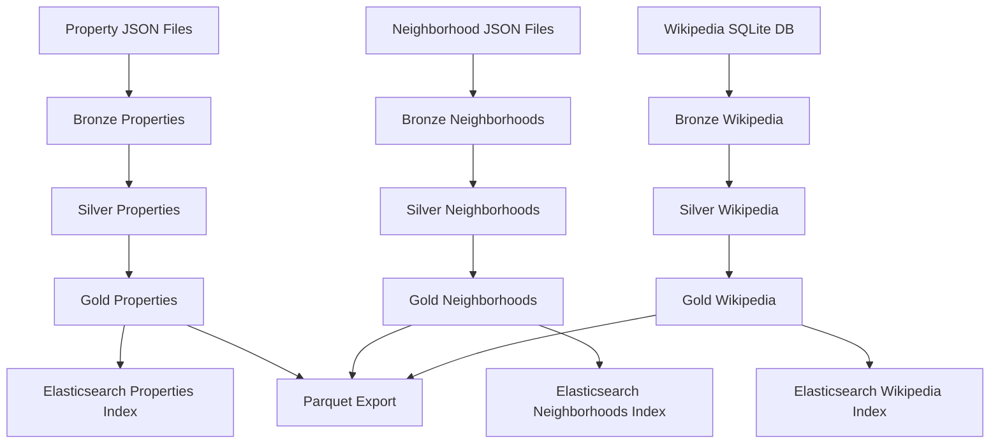
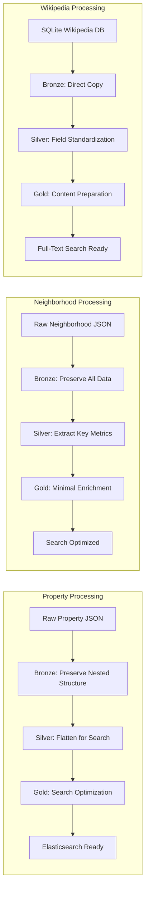
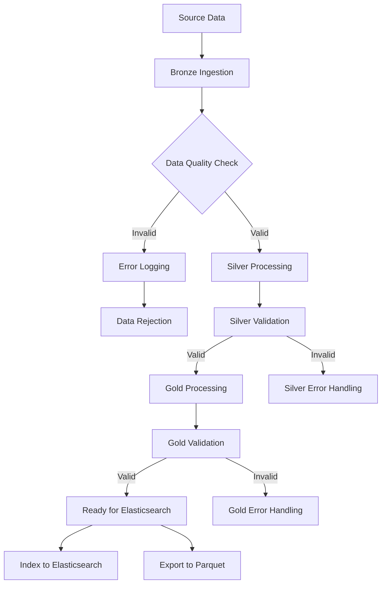

# SQUACK Pipeline V2 - Final Architecture

## Executive Summary

SQUACK Pipeline V2 implements a clean, efficient medallion architecture specifically designed for real estate search applications. After deep analysis and correction of architectural issues, this pipeline transforms raw real estate data through three distinct layers, ultimately producing data structures that perfectly align with Elasticsearch search requirements.

The pipeline handles three primary entity types: Properties, Neighborhoods, and Wikipedia articles, each following the same medallion pattern while respecting their unique data characteristics and search requirements.

## Understanding Medallion Architecture

### Core Principles

Medallion architecture is a data processing pattern that organizes data transformations into three progressive layers, each with distinct responsibilities and quality levels. Think of it like refining crude oil into gasoline - each stage adds value and improves quality for specific uses.

### The Three Medallion Layers

**Bronze Layer (Raw/Landing)**
The Bronze layer serves as the foundation, storing data exactly as it arrives from source systems. No transformations, no assumptions, no modifications. This layer prioritizes data preservation and serves as the single source of truth. If something goes wrong downstream, you can always return to Bronze to rebuild.

**Silver Layer (Standardized/Cleansed)**  
The Silver layer takes raw Bronze data and applies standardization, cleaning, and structural transformations. This is where data quality issues are resolved, formats are standardized, and data is reshaped to match consumption requirements. The key principle is transformation without interpretation - we clean and standardize, but don't add business logic.

**Gold Layer (Consumption/Enriched)**
The Gold layer represents data ready for specific business use cases. Here we apply business rules, create derived metrics, and structure data optimally for the intended consumers. In our case, this means preparing data perfectly for Elasticsearch indexing and search scenarios.

### How SQUACK Follows Medallion Principles

SQUACK Pipeline V2 strictly adheres to medallion architecture with a critical insight: **the target consumption format drives the transformation strategy**. Since our end goal is Elasticsearch search, every transformation decision is made to optimize for search performance and user experience.

**Bronze Implementation**
We preserve source data integrity completely. JSON files are loaded using DuckDB's native JSON handling, SQLite databases are accessed through DuckDB's SQLite extension. No schema assumptions, no field renaming, no structure modifications.

**Silver Implementation**  
This is where the magic happens. We flatten nested structures to match Elasticsearch mapping templates exactly. For properties, this means promoting fields like bedrooms and bathrooms from nested objects to top-level fields, because that's how users search and how Elasticsearch expects to index them.

**Gold Implementation**
We add minimal enrichments needed for search optimization, such as creating parking objects and ensuring geo-point arrays are properly formatted. The data is now perfectly shaped for Elasticsearch consumption.

## Data Flow Architecture

### Overall Pipeline Flow

### Detailed Entity Processing Flow

### Data Quality and Validation Flow

## Bronze Layer Architecture

### Purpose and Philosophy

The Bronze layer serves as our data foundation, implementing a "store everything, transform nothing" philosophy. This layer exists to ensure we never lose source data and can always rebuild downstream layers if needed. Think of it as a digital vault where original data remains untouched and accessible.

### Data Ingestion Strategy

**Property Data Ingestion**
Property data arrives as JSON files containing complex nested structures. These represent real estate listings with detailed information about the property itself, its location, market characteristics, and enrichment data from various sources. The Bronze layer loads this data using DuckDB's native JSON processing capabilities, which automatically infers schemas and preserves all nested relationships.

**Neighborhood Data Ingestion**
Neighborhood data also comes from JSON files but represents geographic and demographic information about specific areas. This includes characteristics like walkability scores, demographic breakdowns, amenities, and correlations with Wikipedia articles about the area. Again, we preserve the complete nested structure without any modifications.

**Wikipedia Data Ingestion**
Wikipedia data originates from a SQLite database containing articles, metadata, and geographic references. The Bronze layer accesses this using DuckDB's SQLite extension, which allows direct querying of SQLite databases without data movement or conversion. We extract articles with their full content, categories, geographic coordinates, and relevance scoring.

### Data Model Characteristics

**Preservation of Source Structure**
Every field, every nested object, every array from the source systems is preserved exactly as received. This includes maintaining original field names, data types, and hierarchical relationships. If the source data has inconsistencies or unusual structures, we preserve those too, handling them in later layers.

**Schema Flexibility**
The Bronze layer accommodates schema evolution naturally. If source systems add new fields or modify structures, the Bronze layer adapts automatically through DuckDB's flexible JSON handling. This prevents pipeline breaks when upstream systems evolve.

**Temporal Consistency**
Each Bronze ingestion creates a point-in-time snapshot of source data. This enables historical analysis and ensures we can trace any data lineage issues back to specific ingestion runs.

## Silver Layer Architecture

### Purpose and Transformation Strategy

The Silver layer represents the most critical architectural component, where we transform raw data into structures that align perfectly with our search requirements. This layer implements "intelligent flattening" - strategically promoting nested fields to top-level positions based on how users actually search for real estate.

### Key Transformation Principles

**Search-Driven Flattening**
The core insight driving our Silver transformations is that Elasticsearch search queries primarily target specific fields that users care about most. For properties, users search by bedrooms, bathrooms, square footage, and price. These fields need to be at the top level for optimal search performance, not buried in nested objects.

**Elasticsearch Template Alignment**
Every Silver transformation decision is validated against actual Elasticsearch mapping templates. We don't make assumptions about what Elasticsearch needs - we examine the templates that define expected data structures and transform accordingly. This ensures perfect compatibility and optimal search performance.

**Geo-Spatial Optimization**
Geographic search is crucial for real estate applications. The Silver layer creates geo-point arrays in exactly the format and location that Elasticsearch expects for each entity type. Properties embed location within address objects, while neighborhoods and Wikipedia articles use top-level location fields.

### Entity-Specific Transformations

**Property Silver Transformations**
Properties undergo the most significant transformation because their source data is highly nested while search requirements demand flat access to key fields. We extract bedrooms, bathrooms, square footage, property type, and price to the top level while preserving the original nested structures for advanced features.

The address transformation is particularly important - we restructure the address object to include the geo-point location array inside it, matching exactly how Elasticsearch expects to handle property addresses for location-based searches.

**Neighborhood Silver Transformations**
Neighborhoods require flattening of demographic and characteristic data to support faceted search. Users want to filter by population, walkability scores, and school ratings. We promote these metrics to top-level fields while maintaining the rich nested structures that contain detailed breakdowns and correlations.

**Wikipedia Silver Transformations**
Wikipedia articles require minimal transformation since they're already relatively flat. The primary change is creating proper geo-point arrays for articles that have geographic references, enabling location-based discovery of relevant content.

### Data Quality and Validation

**Field-Level Validation**
The Silver layer implements comprehensive validation for all transformed fields. Numeric fields are checked for reasonable ranges, geographic coordinates are validated for proper bounds, and text fields are cleaned of extra whitespace and formatting issues.

**Referential Integrity**
We validate relationships between entities during Silver processing. For example, we verify that property neighborhood references point to actual neighborhoods in our data set, and that geographic coordinates fall within expected regional boundaries.

## Gold Layer Architecture

### Purpose and Minimal Enrichment Philosophy

The Gold layer represents our final data preparation stage, applying only the minimal enrichments necessary for optimal search consumption. After our architectural correction, we discovered that most "enrichment" was actually unnecessary complexity - the Silver layer already provides data in the correct structure for Elasticsearch.

### Strategic Enrichments

**Search Object Creation**
The primary Gold layer responsibility is creating composite objects that Elasticsearch mapping templates expect. For properties, this means constructing parking objects that combine garage space information with parking type classifications. These objects don't add new information but structure existing data for optimal search queries.

**Metadata Augmentation**
Gold processing adds processing timestamps, version identifiers, and quality indicators that help with monitoring, debugging, and search result ranking. This metadata doesn't change the core data but provides operational visibility into data freshness and processing history.

**Index Preparation**
The Gold layer ensures all data types, field names, and object structures match Elasticsearch index templates exactly. This includes final validation that geo-point arrays are properly formatted and that all required fields for search functionality are present and correctly typed.

### Entity-Specific Gold Processing

**Property Gold Processing**
Properties receive parking object creation and final field validation. The data structure is already optimized from Silver processing, so Gold operations focus on ensuring search-ready formatting and adding operational metadata.

**Neighborhood Gold Processing**
Neighborhoods pass through Gold processing with minimal changes since Silver processing already aligns perfectly with Elasticsearch requirements. We add processing metadata and perform final validation checks.

**Wikipedia Gold Processing**
Wikipedia articles receive content preparation for full-text search, including field mapping to match Elasticsearch content analysis expectations. We also ensure proper formatting of geographic data for location-based content discovery.

### Quality Assurance and Validation

**Final Structure Validation**
The Gold layer performs comprehensive validation against Elasticsearch mapping templates, ensuring every field, object structure, and data type matches exactly what the search indices expect. This prevents indexing errors and optimizes search performance.

**Business Rule Application**
Where appropriate, Gold processing applies business rules such as property categorization, content classification, and quality scoring. These enrichments enhance search relevance without changing the core data structures.

## Integration Architecture

### Elasticsearch Integration

**Index Structure Alignment**
Our Gold layer output maps directly to Elasticsearch index structures without requiring additional transformation. Property records become property index documents, neighborhood records become neighborhood index documents, and Wikipedia articles become content index documents. This direct mapping eliminates transformation overhead during indexing.

**Search Optimization**
The data structures we create support all major search patterns including full-text search, faceted filtering, geographic search, and hybrid queries combining multiple criteria. Field placement and object structures are optimized for search performance rather than data normalization.

### Data Export Capabilities

**Parquet Export**
The Gold layer supports direct export to Parquet format for analytics and machine learning applications. The same data structures that optimize for search also work well for analytical queries and model training.

**API Integration**
Gold layer data can be consumed directly by REST APIs or GraphQL endpoints, providing real-time access to processed real estate data for applications and services.

## Performance and Scalability

### Processing Efficiency

**DuckDB Optimization**
Our use of DuckDB provides exceptional performance for complex transformations involving nested data structures. DuckDB's columnar processing and sophisticated query optimization handle our medallion transformations efficiently even with large data volumes.

**Incremental Processing**
The architecture supports incremental processing patterns where only changed data flows through the transformation layers. This enables efficient updates and reduces processing time for regular data refreshes.

### Scalability Considerations

**Horizontal Scaling**
The pipeline architecture supports horizontal scaling through partitioning strategies based on geographic regions, property types, or time periods. Each partition can be processed independently while maintaining data consistency.

**Resource Management**
Memory and computational requirements are predictable and manageable through DuckDB's efficient resource utilization and our streamlined transformation logic.

## Operational Excellence

### Monitoring and Observability

**Processing Metrics**
The pipeline provides comprehensive metrics at each layer including record counts, processing times, data quality scores, and error rates. This visibility enables proactive monitoring and performance optimization.

**Data Lineage**
Complete data lineage tracking from source systems through Bronze, Silver, and Gold layers enables troubleshooting and compliance reporting. Every transformation is logged and traceable.

### Error Handling and Recovery

**Graceful Degradation**
The pipeline handles data quality issues gracefully, logging problems without stopping processing. Invalid records are quarantined for review while valid data continues through the pipeline.

**Recovery Capabilities**
The Bronze layer's complete data preservation enables full recovery from any downstream issues. If transformation logic needs correction, we can reprocess from Bronze without requiring new data extraction from source systems.

## Conclusion

SQUACK Pipeline V2 represents a mature, production-ready implementation of medallion architecture specifically optimized for real estate search applications. By aligning every architectural decision with actual Elasticsearch requirements rather than assumptions, we've created a pipeline that is both simple to understand and highly effective in practice.

The key architectural insight - that search consumption patterns should drive data transformation decisions - resulted in a cleaner, more performant, and more maintainable system than traditional approaches. This pipeline serves as a blueprint for building search-optimized data processing systems that deliver exceptional user experiences while maintaining operational excellence.